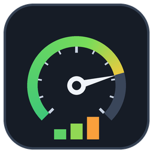
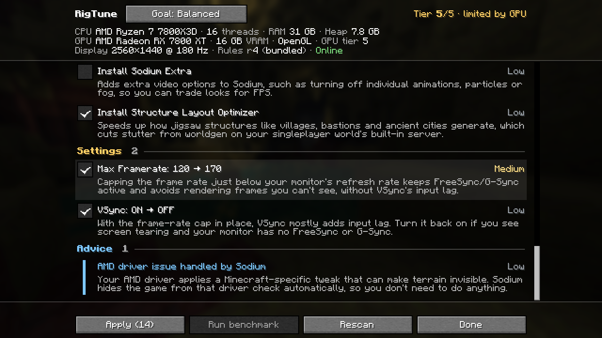
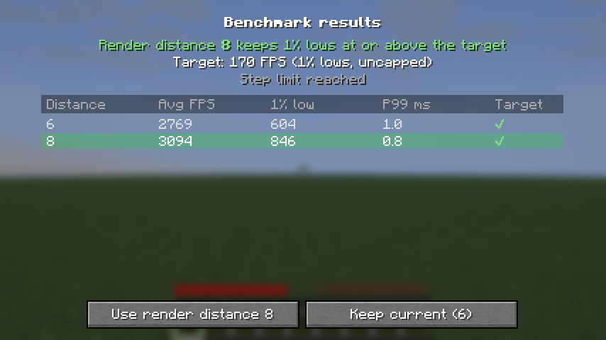
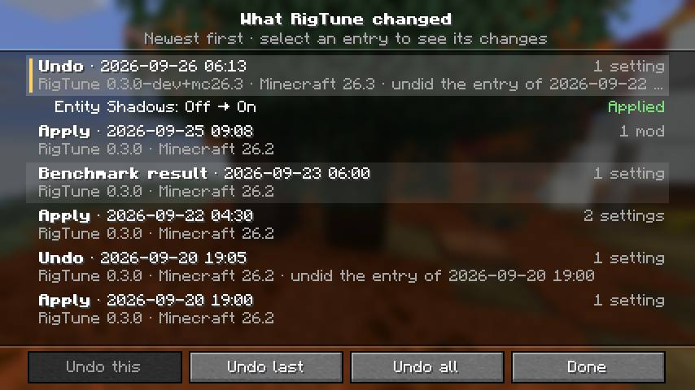
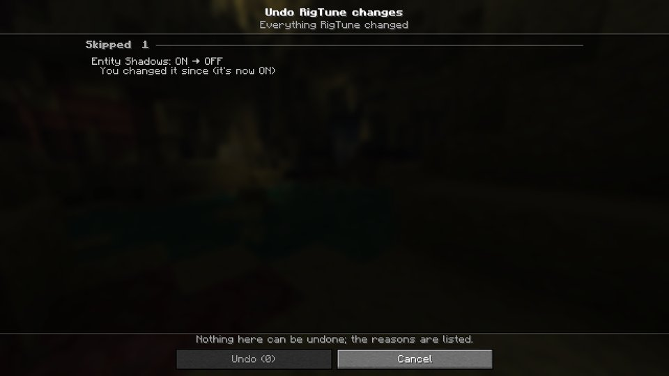

<p align="center"></p>

<h1 align="center">RigTune</h1>

<p align="center">A Fabric mod that reads your PC's hardware and recommends the performance mods, mod settings and video settings that suit it. An in-game benchmark then tunes your render distance to your monitor.</p>

<p align="center">Minecraft Java 26.2 / 26.3 · Fabric · client-side</p>

---

## What it does

- **Reads your hardware**: CPU, RAM, the RAM allocated to Minecraft, GPU (model, VRAM, driver, OpenGL or Vulkan), monitor resolution and refresh rate, and whether you're a laptop running on battery.
- **Scans your mods**: it knows which performance mods you already have, which ones are obsolete or conflicting, and which have updates on Modrinth, including your Distant Horizons and Iris settings.
- **Recommends changes**, each with a plain-English reason and an impact rating:
  - performance mods that fit *your* hardware. Nvidium is only suggested on NVIDIA GPUs, and RenderScale only on weak or integrated GPUs.
  - mods to disable: Indium or Starlight on modern Sodium, or C2ME and Moonrise installed together
  - updates for mods you already have
  - vanilla, Sodium, Distant Horizons and Iris settings for your hardware tier and goal (Performance / Balanced / Quality)
  - advice on things outside the game, such as RAM allocation, running on battery, GPU driver workarounds and heavy shaders
- **Knows your launcher**: it recognises the Modrinth App, Prism Launcher, ATLauncher, the CurseForge app and the official Minecraft Launcher, and gives its click steps for changing Minecraft's memory under every memory advice. Other launchers get the general advice.
- **Benchmarks in game**: it measures real frame times (average and 1% lows, with the FPS cap lifted) and tunes render distance, and simulation distance in singleplayer, to your monitor's refresh rate. Each render distance is measured on its own terrain: the benchmark waits for the chunks to load, and a step whose chunks didn't arrive in time doesn't count. A dedicated benchmark world gives repeatable results without needing your own save. Distant Horizons and shaders get a cost report (what they're costing you), rather than being auto-tuned, and if your shader pack is what keeps you below your target, it suggests a lighter profile. A **Measure before / after** mode reports the real gain from any change you make, with a small chart of your recent runs.
- **History and Undo**: every change RigTune makes (settings, mod installs, updates and disables, config changes) is logged. The History screen lists them newest first, with the status of each change and, if one failed at the restart, why. Undo one entry, the last apply or everything, one confirmation screen at a time. Reverts that need a restart are applied the same safe way as Apply.
- **Applies safely**:
  - **Preview** shows exactly what Apply would change, file by file, before you press it
  - video settings take effect immediately
  - mod installs, updates, disables and config changes (Sodium, Distant Horizons, Iris) are staged, then applied by a small helper after Minecraft closes (Windows keeps loaded mods locked)
  - nothing is ever deleted: disabled mods become `.jar.disabled`, so you can re-enable them in your launcher
  - every download is checked against Modrinth's SHA-512 hash
- **Lets you control what leaves your PC**: a settings screen (also reachable from Mod Menu) with separate switches for remote rules, Modrinth lookups/downloads and the startup toast. Turn any of them off and RigTune falls back to on-device advice with no network request.
- **Copy report**: puts a short Markdown summary of your hardware, recommendations and latest benchmark on your clipboard, ready to paste into Discord or an issue. No file paths or user names. **Report a problem** opens a new GitHub issue with your versions and as much of that report as fits filled in (the full report goes on your clipboard), after you confirm the link; nothing is posted until you submit it.
- **Stays up to date without mod updates**: the recommendations come from a rules file in this repo that the mod fetches at startup. A weekly GitHub Action rebuilds it from live Modrinth data and the mod lists of [Fabulously Optimized](https://github.com/Fabulously-Optimized/fabulously-optimized) and [Additive](https://github.com/skywardmc/additive), and opens a PR for a maintainer to review.

## Screenshots










## Install

1. You need Minecraft Java **26.2** or **26.3**, [Fabric Loader](https://fabricmc.net/use/) 0.19.5 or newer, and [Fabric API](https://modrinth.com/mod/fabric-api).
2. Download the jar matching your Minecraft version — `rigtune-<version>+mc26.2.jar` or `rigtune-<version>+mc26.3.jar` — from [Modrinth](https://modrinth.com/mod/rigtune) or [GitHub Releases](https://github.com/chaotix345/rigtune/releases), and put it in your instance's `mods` folder.
3. [Mod Menu](https://modrinth.com/mod/modmenu) is optional; if you have it, RigTune is also listed there.

## Use

Open RigTune from any of these:
- the **RigTune** button on the title screen
- the button in **Options → Video Settings** (it works with Sodium's video screen too)
- **F8** while in a world
- Mod Menu

Review the list, untick anything you don't want, and press **Apply** (or **Preview** first, to see exactly what it would change). If mods or config changed, restart Minecraft; the next launch tells you what was applied. Made a mistake? Open **History…** on the RigTune screen: **Undo this** reverts the selected entry, **Undo last** the last apply and **Undo all** everything RigTune has done, immediately or after a restart. Something wrong? **Report a problem** starts a GitHub issue with your report (see the [FAQ](#what-does-report-a-problem-send)).

To run the benchmark, press **Tools…** on the RigTune screen, then **Benchmark…**. Pick a scene — your current world, or the dedicated benchmark world (no save needed, reachable from the title screen) — and **Tune** or **Measure**. It takes about a minute. Press Esc to cancel; your settings are always restored. In your own world, Tune tests at most 8 render distances above your current one: every distance it tests makes the game load, generate and save that much more of the world.

## Profiles and share codes

<!-- v0.4: filled by the Profiles workstream (docs/v0.4/SPEC.md 4, 12). -->

## Stutter Doctor

<!-- v0.4: filled by the Stutter Doctor workstream (docs/v0.4/SPEC.md 5). -->

## JVM & memory advice

<!-- v0.4: filled by the JVM workstream (docs/v0.4/SPEC.md 6). -->

## RigTune's own footprint

RigTune's heavy work (the hardware scan, the mod scan, loading the rules and the Modrinth lookups) runs on its own background threads, not on the way to the title screen. Each frame it checks one flag; each tick it reads a few fields.

**Launch time.** On one Windows PC (Ryzen 7 7800X3D, RX 7800 XT, Minecraft 26.2), launch to title screen took 14.5 s with RigTune and 14.3 s without it: medians of 10 launches each, with RigTune switched off through Fabric Loader's `-Dfabric.debug.disableModIds=rigtune` and everything else the same. That difference is well inside the roughly 2 s spread between launches.

**Budgets.** Every build runs a footprint check (`FootprintGameTest` in each game-test run, `FrameHookBudgetTest` with the unit tests) that fails when RigTune goes over these budgets (`tools/footprint-budgets.json`). The largest values measured on GitHub's runners (3 runs each of 26.2 OpenGL, 26.3 OpenGL and 26.3 Vulkan, with software rendering) and the budgets set from them:

| What | Largest measured | Budget |
|---|---|---|
| RigTune's startup work on the game's main thread, CPU time | 96 ms | 150 ms |
| The same, wall time (includes waiting while the shared runner is busy) | 184 ms | 368 ms |
| RigTune's call when the game has started, wall time | 70 ms | 141 ms |
| RigTune's background threads in the first 5 s, CPU time | 187 ms | 300 ms |
| Per frame | 6.4 ns, nothing allocated | 13 ns, nothing allocated |
| Per tick | 55 ns, nothing allocated | 111 ns, nothing allocated |
| RigTune's own objects in memory, after a full garbage collection | 55 KB | 107 KB |
| RigTune objects left behind by opening and closing its screens 20 times | none | none |

Most of the startup time is Java loading classes the first time they're used, among them Gson's, which Minecraft loads soon after anyway. On the Windows PC above, the same startup work took 65 ms (62 ms of CPU time).

**Your own launch time.** Tools… shows your last launch time and the median of your last 10, and notes when your mod set changed since the previous launch. The times are kept in `config/rigtune/startup-times.json`, on your PC only. Fabric Loader doesn't time individual mods, so RigTune can't tell you which mod is slow: fewer mods and an SSD help most, and if the launch time jumped after you added a mod, check that mod first.

## Privacy

RigTune has no telemetry. Your hardware details never leave your PC unless you choose to share a report (**Copy report**, **Report a problem**). It makes two kinds of network request, and you can switch each one off in **RigTune → Settings** (or with Mod Menu's config button):

| Switch | What it sends when on | When it's off |
|---|---|---|
| **Network access** (master) | Everything below | No network request of any kind. The RigTune screen says "Offline (network off in settings)". |
| **Rules updates (GitHub)** | A plain download of the rules file from this repository (`rules-v2.json`, or `rules-v1.json` if that fails, from `raw.githubusercontent.com`). | RigTune uses the newer of the rules bundled in the jar and the last downloaded copy. |
| **Modrinth** | To the Modrinth API (`api.modrinth.com`): the SHA-1 hashes of your installed mod jars (to find updates, including RigTune's own), the ids of the mods RigTune might suggest (to check they exist for your version), and your Minecraft version with the loader name `fabric`. When you press Apply or Preview, it also looks up the versions and dependencies of the mods you ticked. From Modrinth's CDN it downloads only the files you choose to install or update, and checks their SHA-512 hashes. | No Modrinth request at all: no lookups, no update checks, no downloads. Mod installs and updates are still listed, as advice to do in your launcher. |
| **Startup suggestions toast** | Nothing (it isn't a network switch) | The "RigTune: N suggestions" toast on the title screen isn't shown. Apply results and warnings still are. |

Every request identifies itself as RigTune and its version (the User-Agent). The switches are stored in `config/rigtune/settings.json`; the first time RigTune 0.2 or newer starts, a one-time toast points at them. With the network off, or when a request fails, RigTune uses the newer of the bundled rules and the last downloaded copy. **Preview** sends nothing beyond the Modrinth lookups above and downloads nothing.

**Copy report** on the RigTune screen puts a Markdown summary on your clipboard for you to paste into Discord or an issue: the versions, your hardware, tier and goal, your launcher's name (if RigTune recognised it), the rules revision, the suggestions' titles and your latest benchmark. It leaves out file paths, user names and world names, and RigTune never sends it anywhere itself. **Report a problem** opens a pre-filled GitHub issue in your browser, only after you confirm the link, and nothing is posted until you submit it (see the [FAQ](#faq)).

**Launcher detection** happens on your PC only. To name your launcher in the memory advice, RigTune reads these system properties and environment variables and no others: `org.prismlauncher.instance.name`, `multimc.instance.title`, `minecraft.launcher.brand`, `INST_ID` and `INST_NAME`. It also looks in the game folder and the folder above it for two small launcher files, reading Prism's `instance.cfg` (only to check it's a Prism instance, next to an `mmc-pack.json`) and CurseForge's `minecraftinstance.json` (only its `isMemoryOverride` value). Nothing about your launcher is sent anywhere; only its name appears in the report, when you copy or share it.

**spark**: if you have the spark profiler installed, RigTune shows how to capture a profile with it. RigTune doesn't run spark or send it anything, but note what spark itself does: `/sparkc profiler stop` uploads the profile, with your player name and UUID, mod list, system details and Java launch arguments, to spark.lucko.me behind a link that anyone who has it can open.

## How the recommendations stay current

```
rules/source/knowledge.json   hand-written knowledge (conditions, reasons, settings per tier)
        │  tools/update_rules.py  (weekly GitHub Action, or run by hand)
        ▼  + Modrinth: project status and which MC versions each mod supports
        ▼  + Fabulously Optimized and Additive: current mod lists
rules/rules-v2.json           what RigTune 0.2+ downloads (bundled copy in src/main/resources)
rules/rules-v1.json           the same rules as RigTune 0.1.x understands them (a conservative subset)
rules/REVIEW.md               new upstream mods and problems for a maintainer to triage
```

The v2 format (and how it stays safe for 0.1.x readers) is documented in [docs/RULES_SCHEMA.md](docs/RULES_SCHEMA.md). See [tools/README.md](tools/README.md) for the maintainer workflow. Pull requests that improve the knowledge are very welcome.

## What has been verified

<!-- v0.4: filled by the rules workstream (docs/v0.4/SPEC.md 2l, external review 3). -->

## FAQ

### Does RigTune work with Quilt?

Not officially, and it isn't tested there. Quilt Loader lists Minecraft 26.2 and 26.3, but Quilt retired the Quilt Standard Libraries and Quilted Fabric API at Minecraft 26.1 ([QuiltMC blog, February 2026](https://quiltmc.org/en/blog/2026-02-03-non-obfuscated-updates/)), and RigTune needs Fabric API. Whether Quilt Loader can load Fabric API itself on 26.x hasn't been confirmed, so RigTune doesn't claim Quilt support. Use [Fabric Loader](https://fabricmc.net/use/).

### What does "Report a problem" send?

RigTune itself sends nothing and makes no network request for it. The button on the RigTune screen:
1. copies the full report (the same text as **Copy report**) to your clipboard;
2. shows Minecraft's own "open this link?" screen with a link to a new issue on this repository. The link fills in the title (your RigTune and Minecraft versions) and as much of the report as fits (always the versions line, usually your hardware, the whole report when it's short), and it's short enough to read in full on that screen. **Cancel** closes it and nothing is opened.

If you choose **Open in Browser**, your browser opens that link, so GitHub receives what's in it (the title and the report text in the link), and shows the issue form with those fields filled in. Paste the full report from your clipboard, say what happened, and review everything: nothing is posted until you submit the issue, which needs a GitHub account. (Minecraft's **Copy to Clipboard** button on the link screen puts the link on your clipboard instead of the report: press **Copy report** again to get the report back.)

## Build from source

You need JDK 25. One source tree builds every supported Minecraft version with [Stonecutter](https://stonecutter.kikugie.dev/); each version has a Gradle project named after it (`:26.2`, `:26.3`).

```sh
./gradlew build                     # every version: jars in versions/<mc>/build/libs, unit tests, game tests compiled
./gradlew :26.3:build               # one version only
./gradlew :26.2:runClientGameTest   # in-game tests for one version (opens a game window); run versions one at a time
./gradlew :26.3:runClientGameTest
python -m unittest discover -s tools/tests
```

CI (`.github/workflows/build.yml`) runs the build and unit tests for every version, the Python tests and the rules checks on every push and pull request. It also runs the client game tests on Linux, one job per version and graphics backend: OpenGL for every folder in `versions/`, plus Vulkan from 26.3 on (so 26.2 OpenGL, 26.3 OpenGL and 26.3 Vulkan today), on Mesa's software renderers under Xvfb. Those jobs use `./gradlew :<mc>:runProductionClientGameTest`, which runs the same tests against the built jar in a production client rather than the development classpath, and keep each job's screenshots, logs and crash reports as artifacts.

The few lines that differ between versions are marked with `//? if >=26.3 {` comments. `src/` is always in the state of one active version, which is what your IDE compiles; the others are generated under `versions/<mc>/build/generated/stonecutter/`. To work on another version, switch the active one, and switch back before committing (CI fails if the sources are committed in a switched state):

```sh
./gradlew "Set active project to 26.3"   # rewrites the version comments in src/ for 26.3
./gradlew "Reset active project"          # back to 26.2, the committed version; git diff should then show only your own edits
```

See [docs/DESIGN.md](docs/DESIGN.md) "Porting to new MC versions" for how to add a future version, and [tools/MC_VERSIONS.md](tools/MC_VERSIONS.md) for the two tools that do most of it (`tools/add_mc_version.py` adds the version, `tools/mc_apidiff.py` checks RigTune's code against its API).

## Translating RigTune

RigTune's screens are English only for now, and translations are welcome.

- **Where the text lives:** [`src/main/resources/assets/rigtune/lang/en_us.json`](src/main/resources/assets/rigtune/lang/en_us.json) holds every piece of text RigTune shows. A translation is a file next to it named after the language code Minecraft uses (the Java Edition column of the [Minecraft Wiki's language list](https://minecraft.wiki/w/Language)), e.g. `de_de.json` or `pt_br.json`, with the same keys and your text as the values. You don't need every key: a missing one shows the English.
- **Keys** are `rigtune.<area>.<thing>`, for example `screen`, `header`, `goal`, `category`, `impact` and `limit` for the main screen, `rec` for the recommendation text RigTune writes itself ("Install %s", "Version %s is available (you have %s)."), `undo` and `history` for the Undo and History screens, `preview`, `benchmark`, `launcher` (the memory steps for each launcher), `download` (why a download was refused), `report` and `share` for the report buttons, `status` and `toast` for messages, `settings` for the settings screen, and `key.rigtune.open` / `key.category.rigtune.rigtune` for the Controls screen. Only the values are translated, never the keys.
- **Arguments:** `%s` is replaced by a value (a mod name, a number, another piece of text) in order. If your language needs them in a different order, number them: `%2$s ... %1$s`. Use exactly the arguments the English uses, no more and no fewer, and write them as `%s` (Minecraft also accepts `%d`, but the English doesn't use it). `%%` is a percent sign (`"1%% low"` shows as "1% low"); a lone `%` makes Minecraft show the text unformatted.
- **Formatting codes:** RigTune's text has no `§` codes; colours and bold come from the code, so leave them out.
- **Try it in game:** put your file in `src/main/resources/assets/rigtune/lang/`, run `./gradlew build` (see "Build from source"), put `versions/<mc>/build/libs/rigtune-<version>+mc<mc>.jar` in a test instance's `mods` folder in place of RigTune and choose your language in Options → Language. Minecraft can also load a lang file from a resource pack (`assets/rigtune/lang/<code>.json` inside the pack), which is quicker for trying out wording; F3 + T reloads resource packs.
- **Check it:** `./gradlew :26.2:test --tests '*LangCheckTest'` fails if your file has a key en_us.json doesn't, different arguments from the English, a `%` Minecraft can't format, or isn't a flat JSON object of strings.
- **Submit** a pull request that adds your one `<code>.json` file. Say whether a native speaker has read it through.

Not translatable yet:
- the recommendation text that comes from the rules: most reasons, and the advice (title and text). It's written in English in [`rules/`](rules/) and downloaded from GitHub, so it stays English on a translated screen, next to RigTune's own translated parts ("Install %s", the notes after a reason);
- mod names, versions, file names, and setting names and values taken from the rules or from the mods themselves;
- error details from outside RigTune's planning: after "Download failed:", a download's own errors (network, redirects, a file whose SHA-512 doesn't match, an unsafe file name); the reason RigTune's apply helper gives for a change that failed at exit (History screen); a setting value the game or a mod's config refuses (Preview); a failed benchmark check's error;
- **Copy report** and **Report a problem**: the report stays English on purpose, so anyone can read it in a bug report.

## Credits

- Mod lists used as input data: [Fabulously Optimized](https://github.com/Fabulously-Optimized/fabulously-optimized) (BSD-3-Clause) and [Additive](https://github.com/skywardmc/additive) (MIT).
- Mod data from the [Modrinth API](https://docs.modrinth.com/api/).
- Driver workaround details come from [Sodium](https://github.com/CaffeineMC/sodium).

## License

[MIT](LICENSE)
