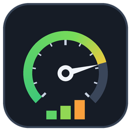

<h1 align="center">RigTune</h1>

A Fabric mod that reads your PC's hardware and recommends the performance mods, mod settings and video settings that suit it. An in-game benchmark then tunes your render distance to your monitor.

  
  
  
  
  

## Features

- **Reads your hardware**: CPU, RAM, the memory given to Minecraft, GPU and driver, OpenGL or Vulkan, your monitor, and whether a laptop is on battery.
- **Recommends changes, each with a reason**: performance mods that fit your hardware, mods to disable, updates, and vanilla, Sodium, Distant Horizons and Iris settings for your tier and goal (Performance, Balanced or Quality).
- **Applies safely**: Preview shows every change first, mod files change only after Minecraft closes, nothing is deleted, and downloads are checked against Modrinth's SHA-512 hash. History and Undo take back any change.
- **Benchmarks in game**: real frame times and 1 % lows, render distance tuned to your refresh rate, a dedicated benchmark world, Measure before/after, and a history that tells you when your 1 % lows drop.
- **Try it (measured)**: one setting, measured before and after against a noise floor, then Keep or Revert.
- **Profiles and share codes**: Max FPS, Balanced, Quality, Battery and Recording, your own profiles, one-click switching, short share codes, and a profile offered when you join a server.
- **Stutter Doctor**: an opt-in monitor that shows where the hitch time went (garbage collection, chunks, game ticks) and offers one-click fixes, checked against your next play sessions.
- **JVM & memory advice**: notes the Java arguments that do nothing or cost you. It never tells you to add GC flags.
- **Knows your launcher**: the Modrinth App's, Prism's, CurseForge's and other launchers' own click steps, and it leaves mod files to the launchers that keep their own list.
- **Stays current without mod updates**: the recommendations come from a rules file in this repository, rebuilt weekly from Modrinth data and the [Fabulously Optimized](https://github.com/Fabulously-Optimized/fabulously-optimized) and [Additive](https://github.com/skywardmc/additive) mod lists.
- **Keyboard and Narrator friendly**, with Minecraft's High Contrast colours.

Everything in detail: [Features](docs/guide/features.md).

## Install

1. You need Minecraft Java **26.2** or **26.3**, [Fabric Loader](https://fabricmc.net/use/) 0.19.5 or newer, and [Fabric API](https://modrinth.com/mod/fabric-api).
2. Download the jar for your Minecraft version (`rigtune-<version>+mc26.2.jar` or `rigtune-<version>+mc26.3.jar`) from [GitHub Releases](https://github.com/chaotix345/rigtune/releases) or [Modrinth](https://modrinth.com/mod/rigtune), and put it in your instance's `mods` folder.
3. Optional: with [Mod Menu](https://modrinth.com/mod/modmenu), RigTune is listed there too.

## Quick start

1. Open RigTune: the **RigTune** button on the title screen, the button in **Options → Video Settings**, **F8** in a world, or Mod Menu.
2. Review the list, untick anything you don't want, and press **Apply** (or **Preview** first, to see exactly what it would change).
3. If mods or config changed, restart Minecraft. The next launch tells you what was applied.
4. Changed your mind? **History…** undoes one entry, the last Apply, or everything.

**Tools…** on the RigTune screen opens the benchmark, Profiles, Stutter Doctor, JVM & memory, Benchmark history and your launch time. More in [Using RigTune](docs/guide/features.md#using-rigtune).

## Launchers that keep their own mod list

The Modrinth App, the CurseForge app, ATLauncher, GDLauncher, and Prism or PolyMC with packwiz metadata keep their own list of an instance's mods. Since 0.5, RigTune leaves mod files to them: installs, updates and disables become advice with that launcher's own steps, and settings still apply in one click. If an older RigTune (0.1-0.4) already changed your mods and the Modrinth App's **Update all** fails, RigTune's notice lists the old copies and the steps to fix them. Details: [Launchers that manage your mods](docs/guide/launchers.md).

## Privacy

RigTune has no telemetry. It makes two kinds of network request, each with its own switch in **RigTune → Settings**: a download of the rules file from this repository, and Modrinth lookups (your mods' hashes, to find updates) plus the downloads you choose. With the network off, it uses the rules bundled in the jar or the last downloaded copy, and makes no request at all. Your hardware details leave your PC only in a report you copy or submit yourself, and everything else it keeps stays in `config/rigtune/`. Details: [Privacy](docs/guide/privacy.md).

## Documentation

- [Features](docs/guide/features.md): everything RigTune does, how to use it, and Try it (measured)
- [Launchers that manage your mods](docs/guide/launchers.md)
- [Profiles and share codes](docs/guide/profiles.md)
- [Stutter Doctor](docs/guide/stutter-doctor.md)
- [JVM & memory advice](docs/guide/jvm-memory.md), including what to do when the game won't start after you pasted Java arguments
- [Privacy](docs/guide/privacy.md)
- [RigTune's own footprint](docs/guide/footprint.md): launch time, per-frame cost, and the budgets CI enforces
- [What has been verified, and known limits](docs/guide/verification.md)
- [FAQ](docs/guide/faq.md)
- [Changelog](CHANGELOG.md)

## Getting help

Something wrong, or a suggestion that looks wrong for your PC? Press **Report a problem** on the RigTune screen: after you confirm, it opens a pre-filled [GitHub issue](https://github.com/chaotix345/rigtune/issues), and nothing is posted until you submit it ([what it sends](docs/guide/faq.md#what-does-report-a-problem-send)). For a security problem, see [SECURITY.md](SECURITY.md).

## Contributing

Pull requests are welcome, especially for the rules (`rules/source/knowledge.json`) and for translations. [CONTRIBUTING.md](CONTRIBUTING.md) covers building from source, how the recommendations stay current, and translating RigTune.

## Credits

- Mod lists used as input data: [Fabulously Optimized](https://github.com/Fabulously-Optimized/fabulously-optimized) (BSD-3-Clause) and [Additive](https://github.com/skywardmc/additive) (MIT).
- Mod data from the [Modrinth API](https://docs.modrinth.com/api/).
- Driver workaround details come from [Sodium](https://github.com/CaffeineMC/sodium).

## License

[MIT](LICENSE)
