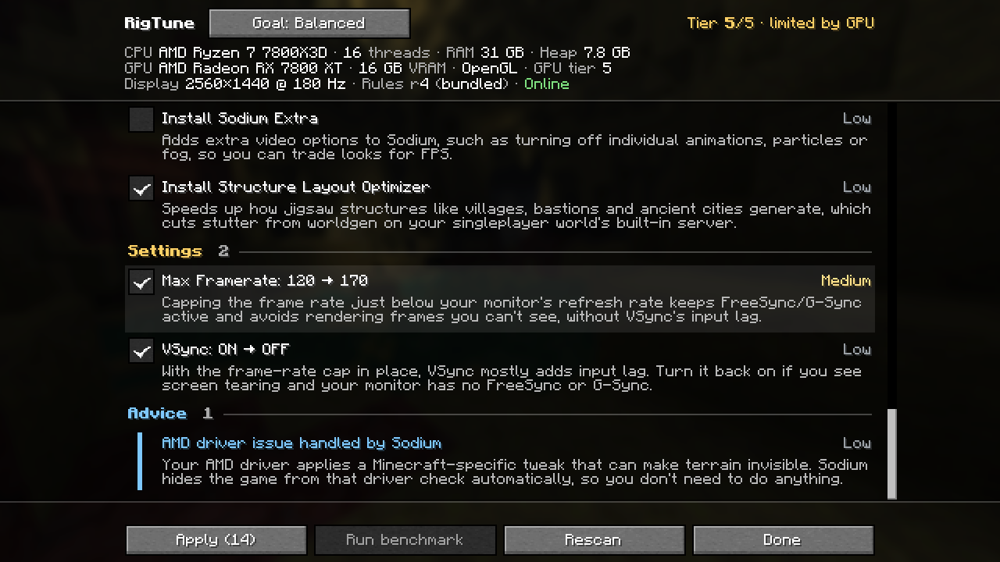
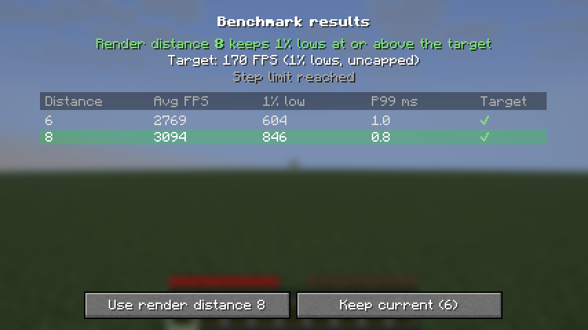
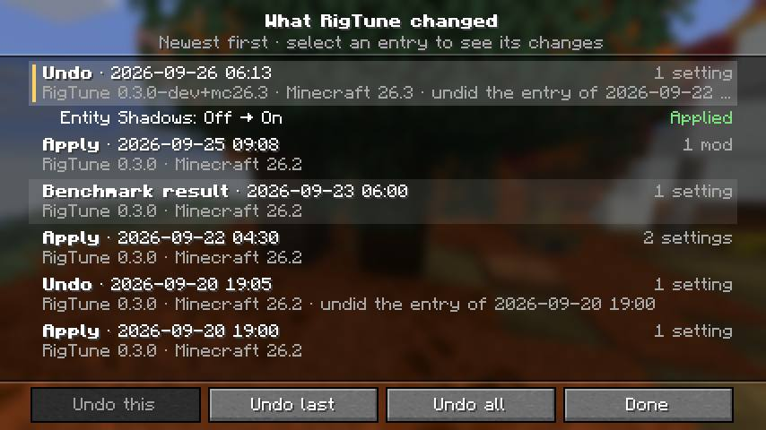
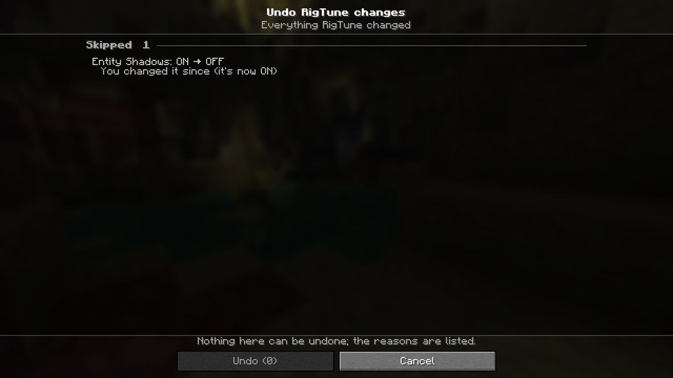
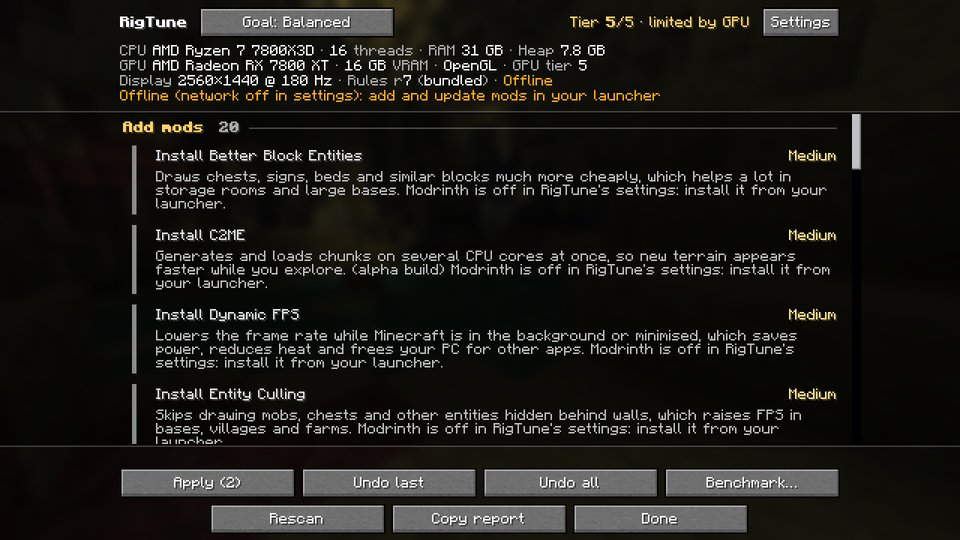

# Features

[← Back to the README](../../README.md)

Everything RigTune does, how to use it, and Try it (measured).

## What it does

- **Reads your hardware**: CPU, RAM, the RAM allocated to Minecraft, GPU (model, VRAM, driver, OpenGL or Vulkan), monitor resolution and refresh rate, and whether you're a laptop running on battery.
- **Scans your mods**: it knows which performance mods you already have, which ones are obsolete or conflicting, and which have updates on Modrinth, including your Distant Horizons and Iris settings.
- **Recommends changes**, each with a plain-English reason and an impact rating:
  - performance mods that fit *your* hardware. Nvidium is only suggested on NVIDIA GPUs, and RenderScale only on weak or integrated GPUs.
  - mods to disable: Indium or Starlight on modern Sodium, or C2ME and Moonrise installed together
  - updates for mods you already have
  - vanilla, Sodium, Distant Horizons and Iris settings for your estimated hardware tier and goal (Performance / Balanced / Quality)
  - advice on things outside the game, such as RAM allocation, running on battery, GPU driver workarounds and known-bad drivers, heavy shaders and Java arguments
- **Knows your launcher**: it recognises the Modrinth App, Prism Launcher, MultiMC, ATLauncher, GDLauncher, the CurseForge app and the official Minecraft Launcher, and gives that launcher's click steps for changing Minecraft's memory, or its Java arguments, under the advice. Other launchers get the general advice. Where the launcher keeps its own list of the instance's mods (the Modrinth App, the CurseForge app, ATLauncher, GDLauncher, and Prism or PolyMC with packwiz metadata), RigTune leaves mod files to it and gives its steps (see [Launchers that manage your mods](launchers.md)).
- **Benchmarks in game**: it measures real frame times (average and 1% lows, with the FPS cap lifted) and tunes render distance, and simulation distance in singleplayer, to your monitor's refresh rate. Each render distance is measured on its own terrain: the benchmark waits for the chunks to load, and a step whose chunks didn't arrive in time doesn't count. A dedicated benchmark world gives repeatable results without needing your own save. Distant Horizons and shaders get a cost report (what they're costing you), rather than being auto-tuned, and if your shader pack is what keeps you below your target, it suggests a lighter profile. A **Measure before / after** mode reports the real gain from any change you make.
- **Keeps a benchmark history**: each run is compared with your earlier runs under the same conditions. When your 1% lows drop below your usual by more than the run-to-run noise, it says so and lists what changed in between as "may be related"; when the conditions differ, it says the cause is unknown. The first run in a new benchmark world, and a run while Distant Horizons was generating terrain, are left out of your usual.
- **Profiles and share codes**: switch all your settings between Max FPS, Balanced, Quality, Battery, Recording, your own settings and profiles you saved or imported, in one click, share a profile as a short code, and have RigTune offer a profile when you join a server (see [Profiles and share codes](profiles.md)).
- **Stutter Doctor**: an opt-in monitor that shows where the time went when the game hitches (garbage collection, chunk loading and building, game ticks, or "not explained") and what may help, with a one-click fix for three settings followed by a before/after comparison of your next play (see [Stutter Doctor](stutter-doctor.md)).
- **Try it (measured)**: one setting at a time, measured before and after, with a noise floor so a small wobble doesn't read as a gain (see [below](#try-it-measured)).
- **JVM & memory**: shows the Java that runs your game and notes Java arguments that do nothing or cost you; it never suggests adding garbage-collector flags (see [JVM & memory advice](jvm-memory.md)).
- **Notices what changed**: one line on the RigTune screen tells you when a server limits your view distance, your GPU or driver changed, a rules update has new recommendations for you, a benchmark shows a drop, your last benchmark needs a rerun, a launch was noticeably slower than your usual, or settings RigTune applied were changed outside the game.
- **History and Undo**: every change RigTune makes (settings, mod installs, updates and disables, config changes) is logged. The History screen lists them newest first, with the status of each change and, if one failed at the restart, why. Undo one entry, the last apply or everything, one confirmation screen at a time. Reverts that need a restart are applied the same safe way as Apply.
- **Applies safely**:
  - **Preview** shows exactly what Apply would change, file by file, before you press it
  - video settings take effect immediately
  - mod installs, updates, disables and config changes (Sodium, Distant Horizons, Iris) are staged, then applied by a small helper after Minecraft closes (Windows keeps loaded mods locked); if the helper is interrupted in the middle of an update, its next run finishes the update or puts the old jar back
  - an update or addition that another installed mod's version requirements don't allow is refused, naming that mod, and a mod and the library it needs are added, updated or undone together
  - nothing is ever deleted: disabled mods become `.jar.disabled`, so you can re-enable them in your launcher
  - every download is checked against Modrinth's SHA-512 hash
- **Lets you control what leaves your PC**: a settings screen (also reachable from Mod Menu) with separate switches for remote rules, Modrinth lookups/downloads and the startup toast. Turn any of them off and RigTune falls back to on-device advice with no network request.
- **Copy report**: puts a short Markdown summary of your hardware, recommendations and latest benchmark on your clipboard, ready to paste into Discord or an issue. No file paths or user names. **Report a problem** opens a new GitHub issue with your versions and as much of that report as fits filled in (the full report goes on your clipboard), after you confirm the link; nothing is posted until you submit it.
- **Works with the keyboard and the Narrator**: every list row, the notice line, Benchmark history's lines and the benchmark result's table and charts can be reached with Tab and the arrow keys and are read aloud, and RigTune's colours follow Minecraft's High Contrast options.
- **Stays up to date without mod updates**: the recommendations come from a rules file in this repo that the mod fetches at startup. A weekly GitHub Action rebuilds it from live Modrinth data and the mod lists of [Fabulously Optimized](https://github.com/Fabulously-Optimized/fabulously-optimized) and [Additive](https://github.com/skywardmc/additive), and opens a PR for a maintainer to review.

## Screenshots

## Using RigTune

Open RigTune from any of these:
- the **RigTune** button on the title screen
- the button in **Options → Video Settings** (it works with Sodium's video screen too)
- **F8** while in a world
- Mod Menu

Review the list, untick anything you don't want, and press **Apply** (or **Preview** first, to see exactly what it would change). If mods or config changed, restart Minecraft; the next launch tells you what was applied. Made a mistake? Open **History…** on the RigTune screen: **Undo this** reverts the selected entry, **Undo last** the last apply and **Undo all** everything RigTune has done, immediately or after a restart. Something wrong? **Report a problem** starts a GitHub issue with your report (see the [FAQ](faq.md#what-does-report-a-problem-send)).

The first time you use RigTune, a notice above the list explains what Apply changes and how to undo it (**How it works…**; **Got it** hides it). After your first Apply, RigTune shows that Apply's changes: what's in effect now, what waits for the next restart (and only then does it ask for one), with **Undo this Apply** and **History…** right there. Neither shows again once you've applied anything, and neither shows if you used RigTune before.

**Tools…** on the RigTune screen opens the rest: **Benchmark…**, **Profiles…**, **Stutter Doctor…**, **JVM & memory…**, **Benchmark history…**, and your last launch time.

To run the benchmark, press **Tools…** on the RigTune screen, then **Benchmark…**. Pick a scene — your current world, or the dedicated benchmark world (no save needed, reachable from the title screen) — and **Tune** or **Measure**. It takes about a minute. Press Esc to cancel; your settings are always restored. In your own world, Tune tests at most 8 render distances above your current one: every distance it tests makes the game load, generate and save that much more of the world.

## Try it (measured)

In **Preview**, with exactly one setting ticked, **Try it (measured)** measures your game, applies the change, measures again in the same place (where you stand, or the benchmark world), and shows how the 1 % lows and the average moved against a noise floor; then you **Keep** it or **Revert** it (History's Undo this). Sodium, Distant Horizons and Iris settings take a restart: RigTune measures first, stages the change, and reminds you to measure again after the restart. When anything else changed between the two runs (another setting, your mods, where you stood, a new benchmark world, Distant Horizons still generating) there's no verdict, and both numbers are shown.

Try it waits until the game has settled, because the first minute in a world is slow and uneven (chunks still loading). Where you stand, Start and Measure now become available once you've played about a minute in that world and dimension (the button says how long is left; changing dimension or respawning starts the minute again). In the benchmark world nothing is refused: the measurement waits until about a minute after the game started, then runs by itself.
