# Phase 5 verification (RigTune 0.2.0), 2026-09-25

The integration build `feat/v0.2.0` @ 5f57eee (WS-E merged), run from the verifier's own worktree on branch `test/p5-verification`. The only changes on this branch are the AC7.3 test mode (`DhConfigSmoke`, gametest source set only, plus one `-PsmokeDh` line in build.gradle) and these docs. Runs (a), (b), (d), (e) and (f) ran before that code was added.

Machine: Ryzen 7 7800X3D, Radeon RX 7800 XT, 32 GB, 2560x1440 @ 180 Hz, Windows 11. Every launch ran under the game-test lock, one client at a time. Paths in the files here are replaced by `<run>`, `<repo>`, `<user instance>`, `<p5>` and `~`.

Mod sets (prepared in the verifier's scratchpad; the user's instance was only read):
- **User set, 26.2**: the 50 jars of the user's Modrinth App instance (without `rigtune-0.1.0.jar`, the 4 `.disabled` jars and the `.rigtune-pending` DH 3.3.2). **noexit**: minus Xaero's World Map and Distant Horizons (`fabric-26.2.jar`, DH 3.3.0), which deadlock the harness on world exit. Their `options.txt` (render distance 32) and `sodium-options.json`, `DistantHorizons.toml`, `iris.properties`.
- **26.3 set**: 17 jars from Modrinth, SHA-512 checked. fabric-api 0.161.0+26.3, Sodium, Lithium, Iris, DH 3.3.2, Mod Menu, Entity Culling, FerriteCore, ImmediatelyFast, More Culling, Dynamic FPS, C2ME, Zoomify, Cloth Config, YACL, plus placeholder-api and fabric-language-kotlin as dependencies. All 15 requested mods have a 26.3 build. **noexit**: minus DH (16 jars).

## Results

| run | what | result | tries |
|---|---|---|---|
| 0 | `./gradlew build` (unit tests, gametest compile) | **PASS**: 784/784 tests on 26.2 and on 26.3 | 1 |
| a | `:26.2:runClientGameTest` (RigTuneClientGameTest, BenchmarkGameTest, UndoGameTest, UiGameTest) | **PASS**, 2m35s, 52 screenshots | 1 |
| a | `:26.3:runClientGameTest` (same 4 classes) | **PASS**, 2m06s, 52 screenshots | 1 |
| b | `:26.2:runProductionSmoke`, user set noexit (48 jars), the user's options and config | **PASS**, 1m08s; world left cleanly with fastquit and Ixeris loaded | 1 |
| d | `:26.3:runProductionSmoke`, 26.3 set noexit (16 jars), the user's options (AC1.4) | **PASS**; 26.3 header shows 2560x1440 @ 180 Hz, F8 works in a world | 1 |
| e | `:26.2:runBenchmarkAutorun` (plain dev client, real in-tick Save and Quit) | **PASS** (after setting `onboardAccessibility:false`, see findings) | 2 |
| e | `:26.3:runBenchmarkAutorun` | **PASS** | 1 |
| f | shader cost report: noexit set + MakeUp-UltraFast 9.5e enabled, `-PsmokeBenchmark` | **PASS**: SHADERS_OFF measured, shaders restored | 1 |
| c | AC7.3: full user set incl. DH 3.3.0, stage from the title screen, helper, relaunch, check | **PASS** (Gradle reports exit -8 after the evidence is written: DH's self-updater, see findings) | 1 + 1 |
| d2 | AC6.4 on 26.3: 26.3 set incl. DH 3.3.2, `-PsmokeBenchmark` | **PASS** (restore); the client was killed at the known DH world-exit hang, as expected | 3 (2 OpenAL crashes) |

The 26.3 OpenAL crash (`NTSTATUS 0xC0000005` about 10 s after start, `d2-26.3-dh/openal-crash-try1.txt`) hit 2 of 6 launches of 26.3.

## (a) Client game tests

Both versions passed every class. About 45 of the 104 screenshots were opened, covering every screen type on both versions: the report at 854x480 and 1280x720 at scale 2 and 3, video settings, benchmark menus, running HUD and results, Undo, settings, network off and Modrinth off, Mod Menu, notices. The rest are the same screens at other sizes or steps. Every production-smoke screenshot (b, c, d, d2, f) was opened. Log excerpts: `a-gametest/`.
- The real report: tier 5/5 limited by GPU, rules r7 (bundled), Online. `Remote rules request returned HTTP 404` is expected: `rules-v2.json` isn't on main until the release.
- The menus, the Undo screens (854x480, 1280x720 at scale 2 and 3), the settings screen, network off and Modrinth off, and Copy report (1467 characters on 26.2, 1399 on 26.3) all fit.
- The benchmark numbers in the harness are meaningless, as documented (tick-synced frames; the benchmark-world Measure started before terrain rendered on 26.2).

| | |
|---|---|
| 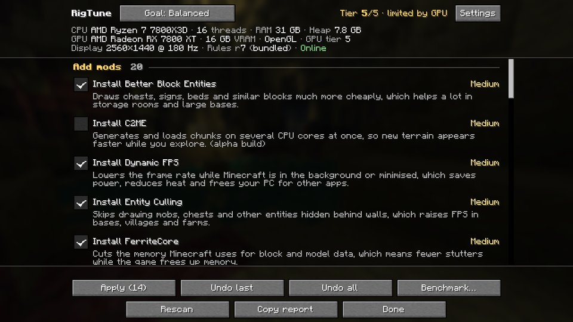 | 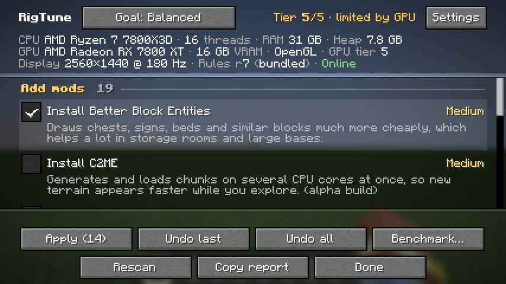 |
| 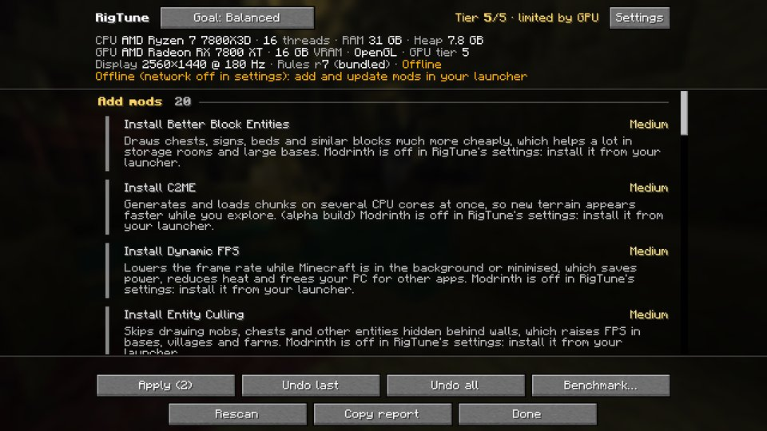 |  |

## (b) Production smoke, 26.2, the user's mods

`b-26.2/rigtune-smoke-report.txt`: online, rules r7, `vanilla.renderDistance: 5 -> 32` restored after the harness reset, 54 top-level mods (48 jars plus loader and harness entries).
- The six mods 0.1.0 installed (bbe, More Culling, Async Logger, FastQuit, Ixeris, Structure Layout Optimizer) are no longer offered, and no updates are pending.
- 6 recommendations, **none ticked**, so Apply is disabled: BadOptimizations, Debugify, Krypton, Sodium Extra, `Render Distance: 32 → 16`, and the AMD/Sodium advice.
- Leaving the world was clean with the 48 jars, including the new fastquit and Ixeris.

| | | |
|---|---|---|
| 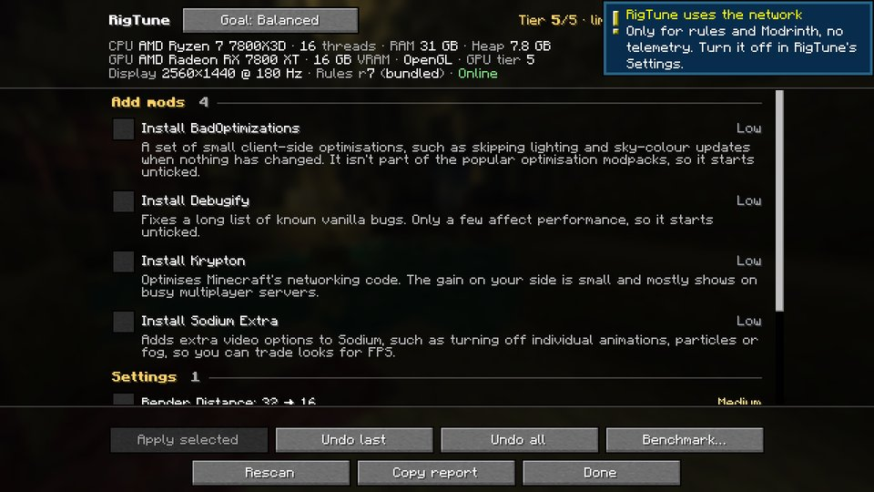 | 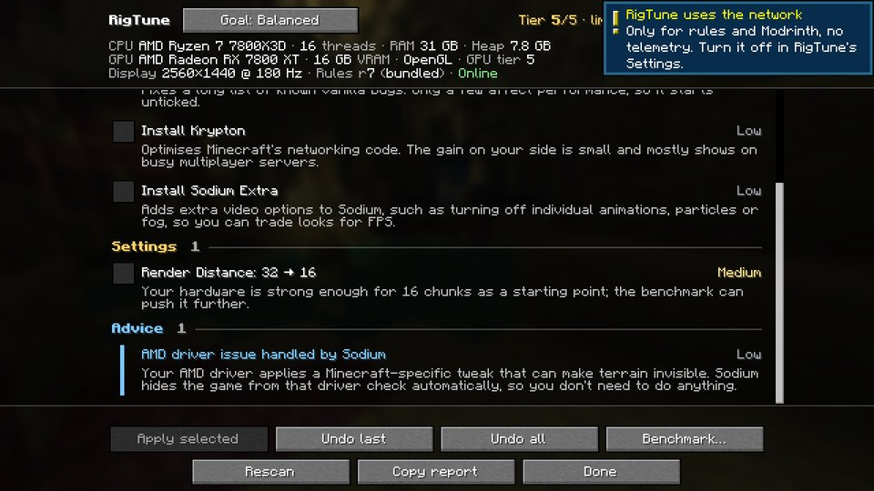 | 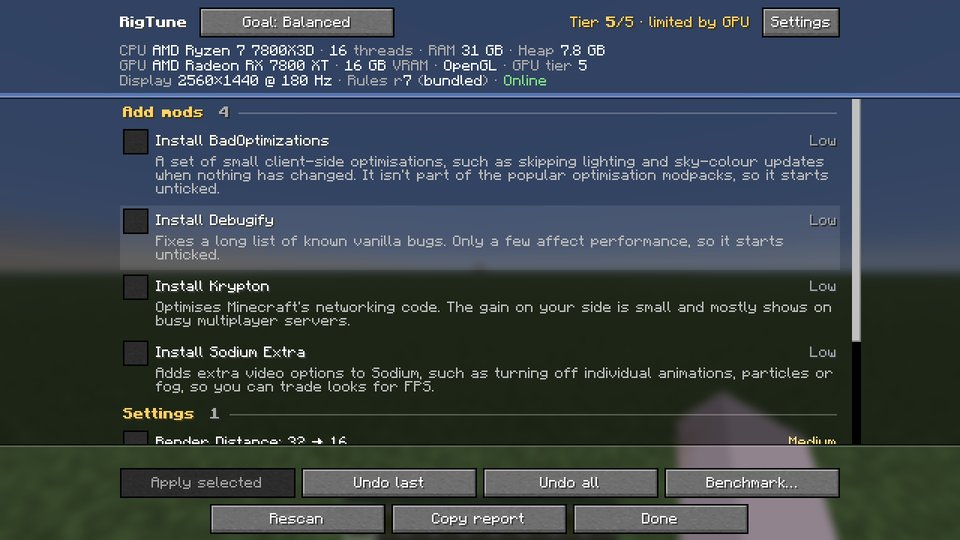 |

## (d) Production smoke, 26.3, representative Modrinth set (AC1.4)

`d-26.3/rigtune-smoke-report.txt`: MC 26.3, 2560x1440 @ 180 Hz, online, 12 recommendations (10 mods, RD 32 → 16, AMD advice), 22 top-level mods. The Ixeris reason carries its 26.3-specific sentence. The ModernFix-mVUS reason does not (finding 3).

| | | |
|---|---|---|
| 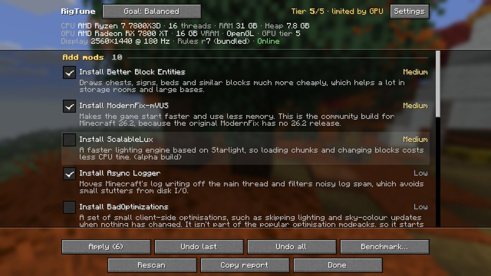 | 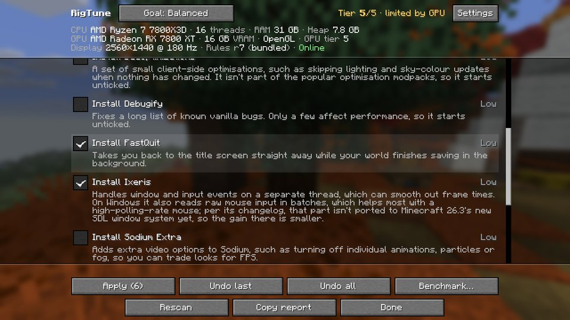 | 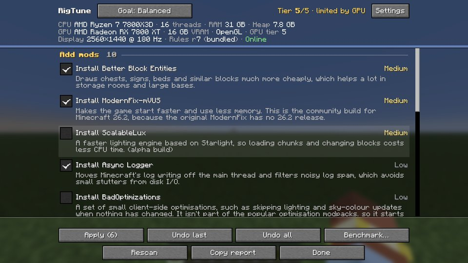 |

## (e) Benchmark autorun (no harness)

`e-autorun/`. Both versions: the save was created, the camera spot was reached (y 127 on 26.2, 133 on 26.3, as in WS-C's runs), the Tune ran, the game left through the in-tick Save and Quit, and the result screen showed; `Dev autorun: ... PASSED`.
- 26.2: RD 16 → chose 12, avg 2358 FPS, 1% low 546, CV 2.3%.
- 26.3: RD 12 → chose 9, avg 2913, 1% low 613, CV 2.3%.

## (f) Iris shader cost report

`f-26.2/`: steps RENDER_DISTANCE, SIMULATION_DISTANCE, REPEAT, SHADERS_OFF, REPEAT.
- Shader cost: 1% low 502 → 601 FPS, avg 676 → 2372 FPS with shaders off.
- Shaders in use before and after; `iris.properties` still says `enableShaders=true`; `benchmark-restore.json` gone.

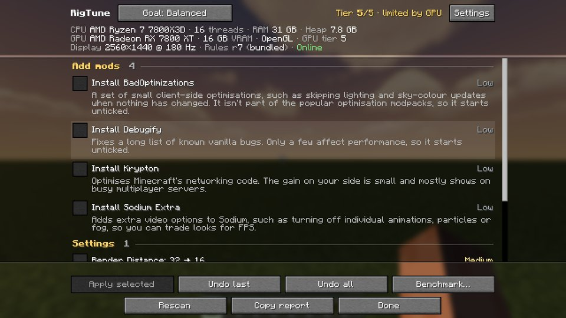

## (c) AC7.3: a staged Distant Horizons patch that DH loads

The user's DH config already matches the tier-5 rules, so the copied TOML had one line changed first (`lodChunkRenderDistanceRadius = 256` → `512`), which makes the tier-5 rule offer `512 → 256`.
1. **Stage** (title screen only; `c-ac73/rigtune-ac73-stage.txt`): the report lists `Distant Horizons: LOD Chunk Render Distance Radius: 512 → 256` next to `Update Distant Horizons 3.3.0 → 3.3.2` (ticked) and `Render Distance: 32 → 12` with DH's reason. RigTune's Apply staged exactly one `PATCH_TOML` op. The harness quit, and `CLIENT_STOPPING` started the helper.
2. **Helper**: it waited for the game to exit, then `OK PATCH_TOML: Patched 1 value(s)` (`helper.log`, `last-apply.json` OK, `history.json` APPLIED). `DistantHorizons.toml.diff` is exactly the one line, with CRLF, tabs and everything else untouched.
3. **Check** on the next launch (`rigtune-ac73-check.txt`, **AC7.3 PASSED**):
   - DH's live value `chunkRenderDistance` = 256.
   - The file's non-default values are live too: `verticalQuality` HIGH and `horizontalQuality` HIGH, where DH's defaults are MEDIUM. So DH really loaded the patched file; a fall-back to defaults would show MEDIUM.
   - No `pending.json` left, and the key is no longer recommended.
4. **DH log**: `Initialising config for [DistantHorizons]` then `[DistantHorizons] Config initialised`, with no config error or warning (`check-latest-log-dh.txt`). The TOML DH re-saved at load is byte-identical to the patched one.

| | |
|---|---|
| 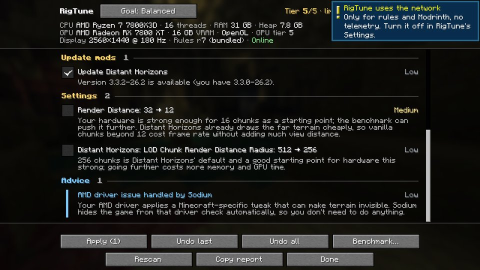 | 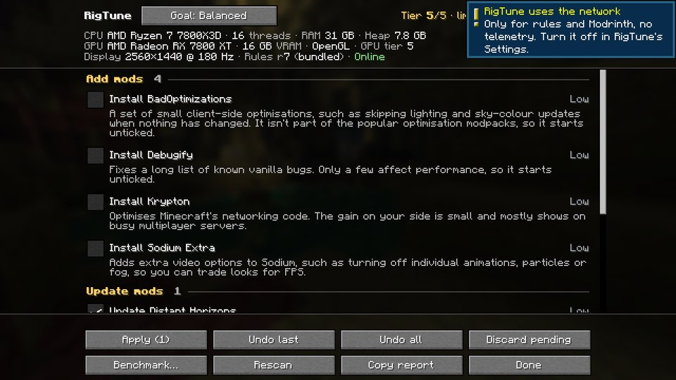 |

## (d2) AC6.4 on 26.3 with Distant Horizons 3.3.2

`d2-26.3-dh/rigtune-benchmark-smoke.txt`: **AC6.4 PASSED**.
- Steps RD ×2, SD ×3, REPEAT, DH_OFF, REPEAT; DH off was seen during the run, and so was the restore marker.
- Afterwards DH is rendering again with no API override, `rendererMode = "DEFAULT"`, and `benchmark-restore.json` is gone.
- The harness then hung at `Closing all [3] databases...` (the documented DH world-exit deadlock) and the client was killed. Nothing was left changed.
- The frame rates of this run are invalid; see finding 4.

## Findings (product; not fixed here)

1. **HIGH (real world): Distant Horizons' own self-updater fights RigTune's DH update.** This, not the Modrinth App or antivirus, is what failed the user's 0.1.0 apply.
   - **What DH does**: the user's DH config has `enableAutoUpdater = true` and `enableSilentUpdates = true`. DH downloads 3.3.2 into `mods/update/DistantHorizons-3.3.2 - 26.2 neo/fabric-26.2.jar` during the session. At exit it can't move it ("Failed to move updated file"), so it starts a `DeleteOnUnlock` JVM with `-cp mods/fabric-26.2.jar`, which keeps the old jar open itself.
   - **Reproduced here**:
     - A rename of `fabric-26.2.jar` failed with `WinError 32 ... being used by another process` while DeleteOnUnlock ran.
     - DeleteOnUnlock was still running 5 min 14 s later (then killed).
     - DH's native "move it manually" dialog in the shutdown path made the client shutdown watchdog end the JVM (exit -8, `stage-crash-thread-dump-excerpt.txt`).
   - **In the user's instance** (read-only; `user-instance-*.txt`): DH logged the same sequence at 09:08:58–59, and RigTune's helper failed `DISABLE_FILE fabric-26.2.jar` at 09:09:04 with the same error.
   - **Consequences**:
     - The 0.2 lock-retry fix (~30 s budget) can't outlast DeleteOnUnlock.
     - If both updaters ever succeed, two DH jars end up in `mods/` (duplicate mod id).
     - RigTune ticks "Update Distant Horizons" by default.
   - **Suggestion**: when `dh.client.advanced.autoUpdater.enableAutoUpdater` is true (or `mods/update/` holds a DH build), don't offer the DH update. Show advice instead ("Distant Horizons updates itself"), and drop the user's pending DH group.
2. **MEDIUM: the DH render-distance clamp and reason ignore DH's rendering switch.** The user's DH has `rendererMode = "DISABLED"`, yet RigTune offers `Render Distance: 32 → 12` because "Distant Horizons already draws the far terrain cheaply". The rule should only apply while DH renders.
3. **LOW: the ModernFix-mVUS reason hard-codes 26.2** ("the community build for Minecraft 26.2, because the original ModernFix has no 26.2 release") and shows on 26.3 as well. Modrinth, checked 2026-09-25: mVUS has `5.27.20+mc26.3`; the original has no 26.3 build either.
4. **LOW: the benchmark doesn't notice Dynamic FPS throttling.**
   - **In (d2)**: every step measured about 1 FPS, and the logged frame limit was 15 instead of the uncapped 260, with throttle reason NONE. That is Dynamic FPS's unfocused-window default: under the 26.3 harness the window apparently doesn't count as focused, while in (f) on 26.2 the same mod let 637 FPS through.
   - **For players**: a focused window is fine, and `pauseOnLostFocus` cancels the run. A player without pause-on-focus-loss, or with a second monitor, would get a garbage result (and RigTune itself recommends Dynamic FPS, ticked).
   - **Suggestion**: mark the run invalid when the window isn't active or the frame limit isn't uncapped.
5. **LOW (UX): the first-launch "RigTune uses the network" toast covers the RigTune screen's tier text and Settings button** while it's shown (b, c, f).
6. **LOW (UX): with Network access OFF, each Add row says "Modrinth is off in RigTune's settings"**, while the Modrinth switch itself still reads ON (greyed). It should name the network switch.
7. **LOW (UX): the Undo screens show the raw key `sodium.performance.use_fog_occlusion: ON → OFF`** where vanilla keys get labels ("Entity Shadows").
8. **LOW (UX): Undo everything shows "You changed it since (it's now ON)"** for a setting that is already back at its pre-RigTune value (a later RigTune apply and undo moved it). The end state is right; the reason is misleading. "Already at its original value" would be clearer.
9. **Dev tooling: `runBenchmarkAutorun` on a fresh run dir waits forever on the accessibility onboarding screen.** `build/run-autorun/options.txt` gets `onboardAccessibility:true`, and DevAutorun only starts from the title screen (it gives up after 10 min). WS-C set the option by hand. Write it in the task, or let DevAutorun continue from the onboarding screen.
10. **Knowledge note**: DH logs "Found [7] C2ME threads. DH needs to use at least the same number of threads as C2ME". The DH thread caps (1/2/4/6 for CPU tiers ≤ 4) may conflict when C2ME is installed.

## Reproduce

Commands and prepared inputs: the verifier's `PLAN.md` (scratchpad `p5/`). The AC7.3 mode is documented in `docs/smoke/README.md`.
