# Phase 5 verification (RigTune 0.3.0, Wave A), 2026-09-26

The integration build `feat/v0.3.0` @ c41bf48 (all of Wave A merged; e26314d adds only a PROGRESS line), run from the verifier's worktree on branch `test/p5-v03`. Product code (`src/main`, `src/client`) is unchanged on this branch. Wave B (the localisation conversion, the Preview screen) isn't in this build; a short re-run follows once it merges.

Test-only changes on this branch (commit 2bcb10a; gametest source set, not in the shipped jar), made after run (a):
- `ProductionSmoke.v03Screens`: in every production smoke, logs the RigTune footer buttons, opens History (screenshot `smoke-history`), presses Report a problem (screenshot `smoke-report-confirm`), presses Cancel, and puts the clipboard back.
- `BenchmarkSmoke` (`-PsmokeBenchmark`): a screenshot of the result screen (`smoke-benchmark-result`); the target FPS and `ShaderAdvice.costPercent` in the evidence file; the sha256 of `config/iris.properties` and every `shaderpacks/*.txt` right before and right after the run, of the bytes and of the lines without `#` comments ("values").

Machine: Ryzen 7 7800X3D, Radeon RX 7800 XT, 32 GB, 2560x1440 @ 180 Hz, Windows 11. Every launch ran under the game-test lock (atomic mkdir, owner.txt, released in the same command); the lock was never busy. Paths in the evidence are replaced by `<repo>`, `<p5>` (the verifier's scratchpad), `<jdk>` and `~`. Evidence: [p5/](p5/). The benchmark autorun (AC3.7) and the MC tooling have their own folders: [benchmark/](benchmark/), [mc-tooling/](mc-tooling/).

Mod sets (copied into the scratchpad; the user's instance was only read):
- **User set, 26.2**: the 50 jars of the user's Modrinth App profile "Fabric 26.2" (every `mods/*.jar` except `rigtune-0.1.0.jar`; not the 4 `.disabled` jars, the `.rigtune-pending` DH 3.3.2 or `mods/update/`), sha256-checked against the source; the same 50 as v0.2's Phase 5. **noexit**: minus Xaero's World Map and Distant Horizons (`fabric-26.2.jar`), which deadlock the harness on world exit (48 jars). Their `options.txt` (render distance 32), `sodium-options.json`, `DistantHorizons.toml`, `iris.properties`.
- **26.3 set**: v0.2's 17-jar Modrinth set (fabric-api 0.161.0+26.3, Sodium, Lithium, Iris, DH 3.3.2, Mod Menu, Entity Culling, FerriteCore, ImmediatelyFast, More Culling, Dynamic FPS, C2ME, Zoomify, Cloth Config, YACL, placeholder-api, fabric-language-kotlin), SHA-512 re-checked against v0.2's manifest. **noexit**: minus DH (16 jars).
- **Shader packs**: v0.2's Modrinth downloads (SHA-512 re-checked): MakeUp-UltraFast 9.5e and Complementary Reimagined r5.9.3 (the user's own pack), plus a copy of the user's `ComplementaryReimagined_r5.9.3.zip.txt`.

## Results

| run | what | result | tries |
|---|---|---|---|
| 0 | `./gradlew build` (both versions) | **PASS**: 1047 tests per version, 0 failures (1 skipped: the FIFO test, Linux only), 1m52s | 1 |
| a | `:26.2:runClientGameTest`, all 7 classes | **PASS**, 3m13s, 79 screenshots | 1 |
| a | `:26.3:runClientGameTest`, all 7 classes | **PASS**, 2m39s, 79 screenshots | 1 |
| b1 | `:26.2:runProductionSmoke`, user set noexit, the user's options and config, no launcher brand | **PASS**, 1m05s | 1 |
| b2 | as b1 with `JAVA_TOOL_OPTIONS=-Dminecraft.launcher.brand=theseus -Xmx2G` (AC5.3 in game) | **PASS**, 1m05s | 1 |
| c | `:26.3:runProductionSmoke`, 26.3 set noexit, the user's options | **PASS on the 6th launch**: tries 1-5 crashed natively (not RigTune: see (c)); try 6 (`ALSOFT_DRIVERS=null`) passed in 1m05s; try 7 (same, with the Modrinth brand) crashed | 7 |
| d | DH config round trip, full user set incl. DH 3.3.0: `-PsmokeDh=stage`, helper, `-PsmokeDh=check` | **PASS** (AC7.3 PASSED), 67 s in all | 1 |
| e | AC8.7: Iris + shader pack, `-PsmokeBenchmark`, advice forced with `-Drigtune.dev.targetFps` | Advice line **PASS** (shown, "about 76%"); byte-identical files **FAIL** (finding 1: Iris re-saves both files with a new date comment, values identical) | 4 |
| f | AC3.5 in game: seeded 0.1.0 `last-apply.json` + `pending.json`, then a relaunch | **PASS**: 2 WARN lines once, History shows "Last attempt failed: … (attempt 1 of 3)", no repeat on the relaunch | 1 |

## (a) Client game tests, local (AC2.4)

All seven classes ran on both versions (RigTuneClientGameTest, BenchmarkGameTest, LauncherGameTest, UndoGameTest, UiGameTest, ReportGameTest, HistoryGameTest); 26.3 started first time. Log excerpts: `p5/a-gametest/`. 14 of the 158 screenshots were opened, from both versions: History (list, failure line, Undo this, after the undo, corrupt state), the launcher line, Report a problem's confirm screen, and the benchmark menu, results and shader advice.
- **History**: the seeded list (Apply, Benchmark result, Apply, Undo, Apply) with the failed STAGED change "Last attempt failed: Gave up after 10 attempt(s): … (attempt 2 of 3)" at 1280x720@2 and 640x480@2; Undo this on the older apply ("Entity Shadows: Off → On" undone, "Render Distance: 5 → 6" skipped "Changed again by a later apply"); the new Undo entry afterwards.
- **Launcher** (AC5.3): "Memory 2.0 GB of 16 GB, set in the Modrinth App" and the green "In the Modrinth App: this instance → Instance settings (gear) → Sync overrides → turn on Custom memory allocation → set the slider." under the ram-low warning; the `launcher-none-*` shots are as in 0.2 (`LauncherGameTest: at start minecraft.launcher.brand=null`).
- **Report a problem**: the vanilla confirm screen with the whole link readable at 640x480@2 (the link ends "(shortened; the full report is on your clipboard)").
- **Benchmark**: the menu's current-world note ("Higher render distances load and save more of this world."), the RD 12 benchmark-world result, the shader-advice screen. Log: the 377-chunk settle at RD 12 (0 missing), fingerprint `floor 117 minecraft:forest; … 4 biomes >= 5%, water 14.7%` and camera y 133 on both versions.
- Harness-only: `bench-menu-world` has the previous step's "benchmark cancelled" toast over the menu title.

| | |
|---|---|
| 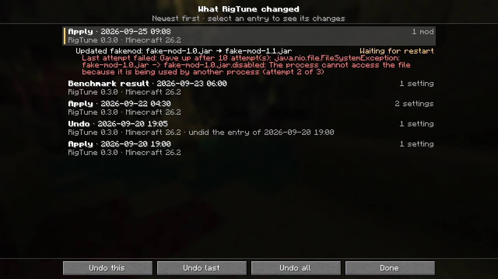 | 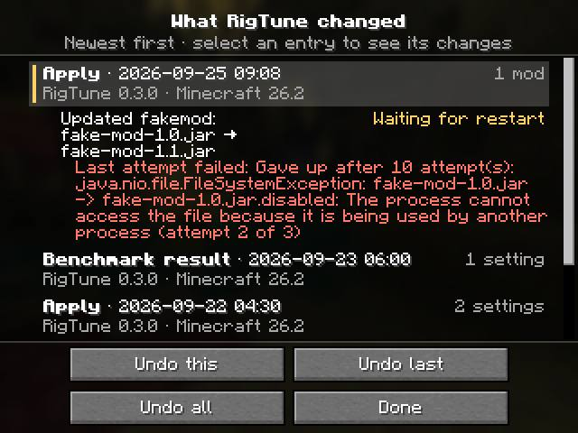 |
| 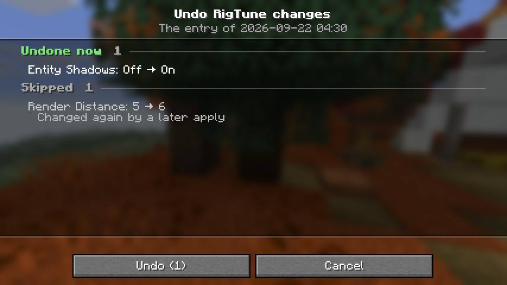 |  |
| 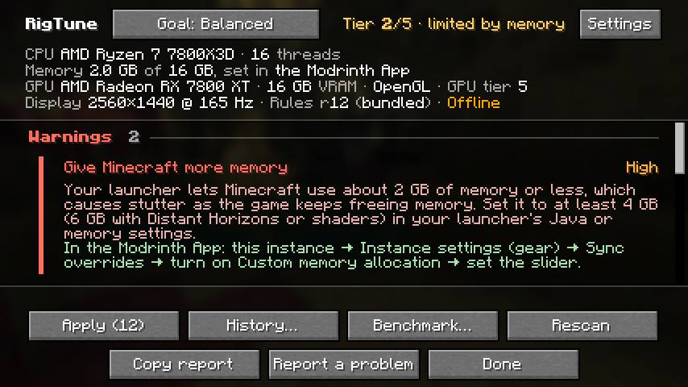 | 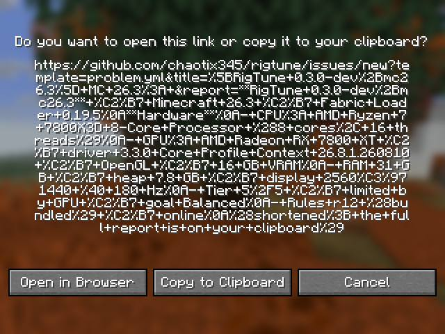 |
| 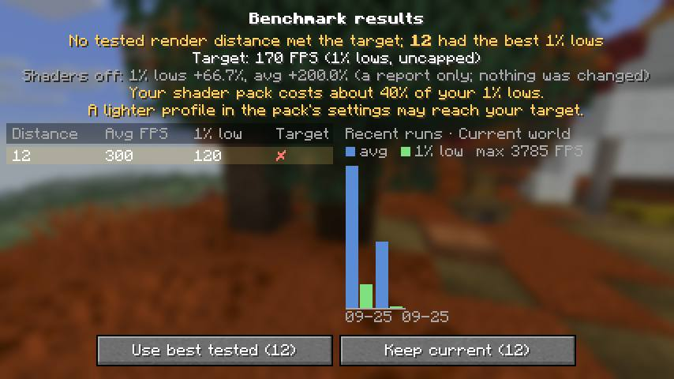 | 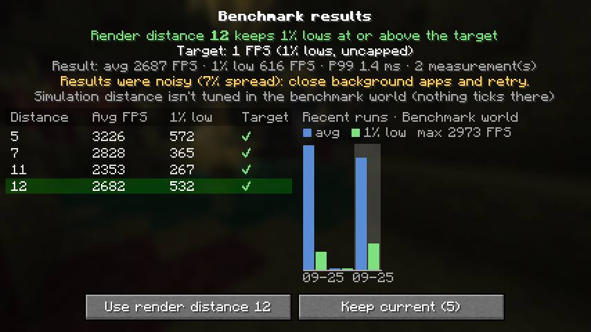 |

## (b) Production smoke, 26.2, the user's mods

`p5/b-26.2/`. Both runs: rules r12 (bundled; the remote file isn't on main until the release), online, `vanilla.renderDistance: 5 -> 32` restored, the world left cleanly.
- **b1, no brand**: `RigTune: launcher not recognised (generic memory advice)`; the header is 0.2's ("CPU … · RAM 31 GB · Heap 7.8 GB"), no launcher named. 7 recommendations: BadOptimizations, Debugify, Krypton, Sodium Extra, Update ModernFix 5.27.19-build.1 → build.2 (ticked), Render Distance 32 → 16, the AMD/Sodium advice. F8 in the world opens RigTune.
- **Footer**: `Settings, Apply (1), History…, Benchmark…, Rescan, Copy report, Report a problem, Done`: **no Preview** (Wave B). History opens with "RigTune hasn't changed anything yet."; Report a problem shows the confirm screen with the link; Cancel returns to RigTune.
- **b2, `theseus` + 2 GB heap**: `RigTune: launcher Modrinth App`; the header reads "Memory 2.0 GB of 31 GB, set in the Modrinth App", and the ram-low warning ("Give Minecraft more memory", High) ends with the Modrinth App steps. With the 2 GB heap the tier is 2/5 (memory) and 9 settings are offered.
- RigTune logged no WARN/ERROR and no exception in either run. The privacy toast is hidden as the RigTune screen opens (it is still sliding out in the first screenshots).

| | | |
|---|---|---|
| 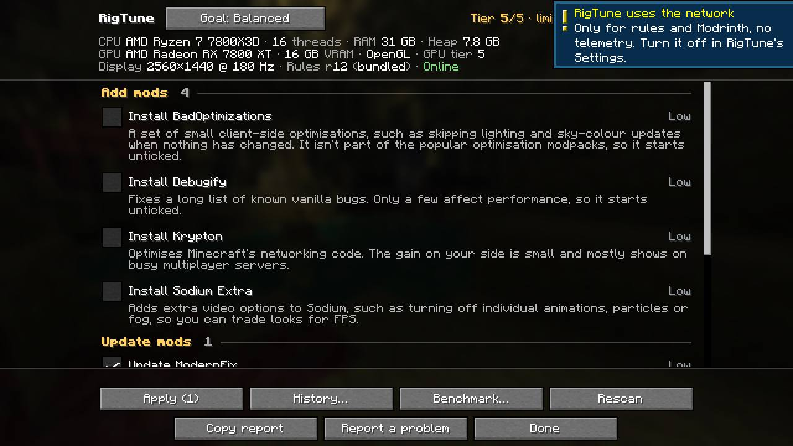 | 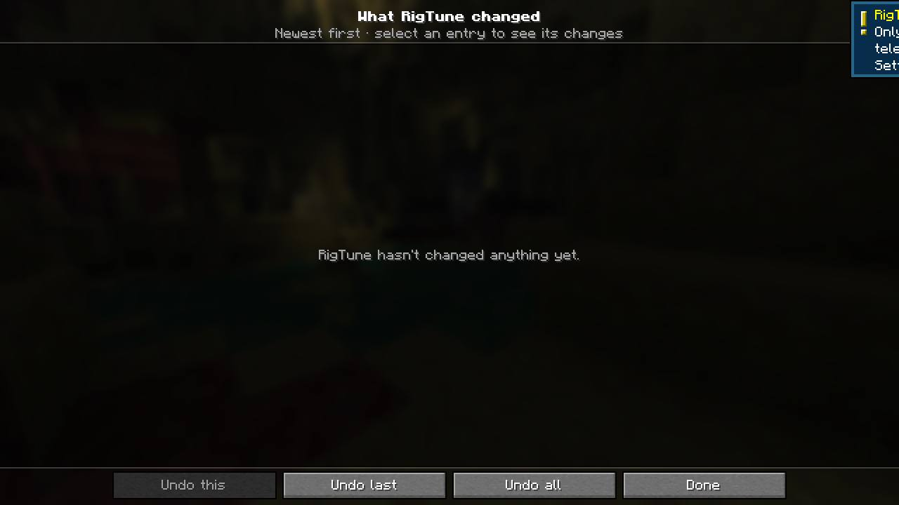 | 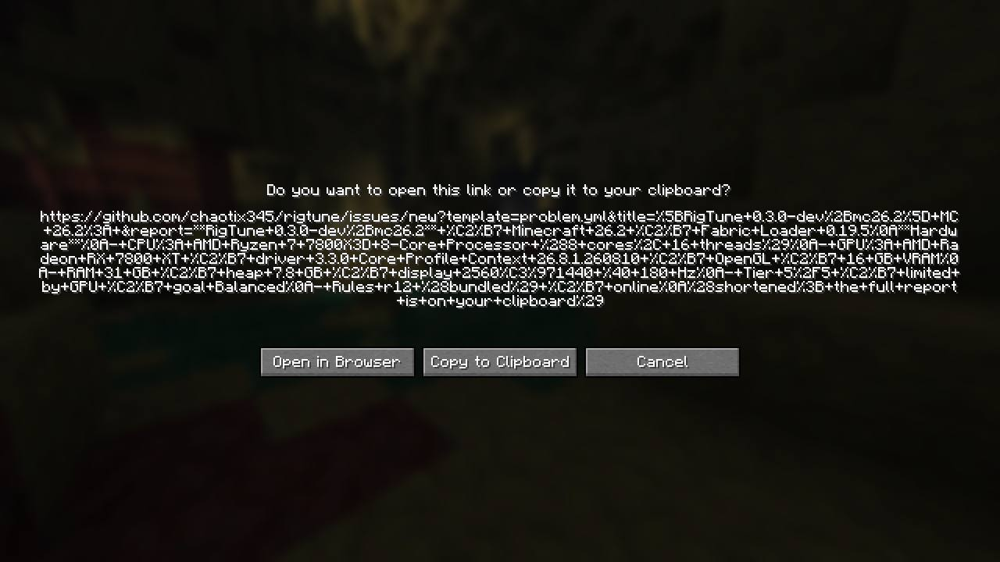 |
| 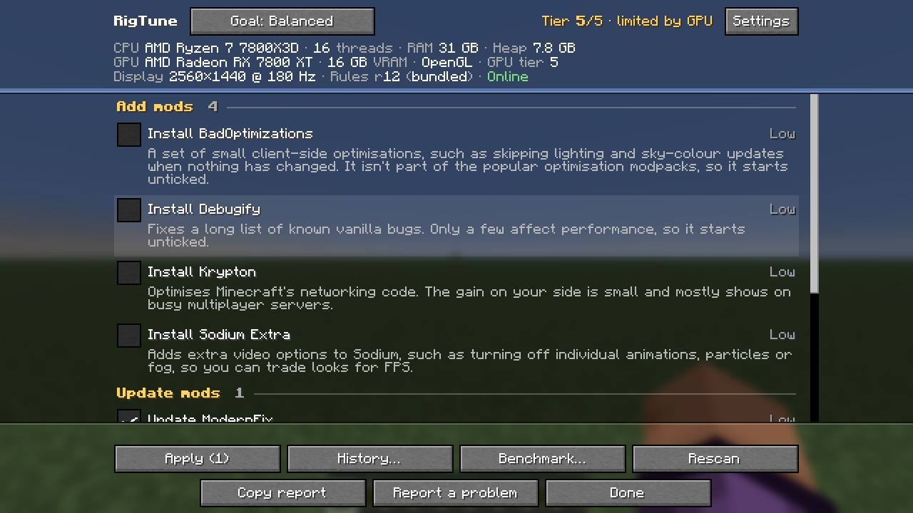 | 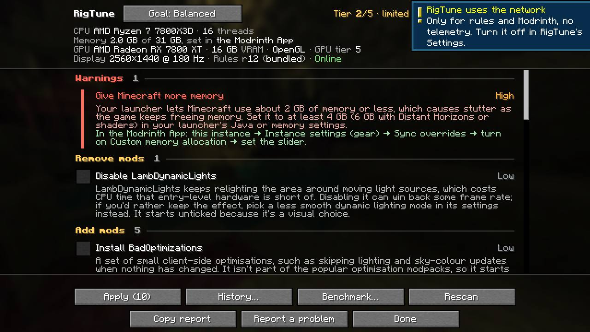 | |

## (c) Production smoke, 26.3, the representative Modrinth set

`p5/c-26.3/`. The passing run (try 6): MC 26.3, 2560x1440 @ 180 Hz, online, rules r12, 12 recommendations as in v0.2 (10 mods, RD 32 → 16, the AMD advice), the ModernFix-mVUS reason version-neutral (v0.2 finding 3 fixed), all 16 jars loaded, footer without Preview, History and Report a problem's confirm screen as on 26.2, F8 in the world, no RigTune WARN/ERROR.
- **The native crash**: tries 2-5 and 7 died with `NTSTATUS 0xC0000005` about 15 s after start, always after "Cached all modded block culling states" and before "OpenAL initialized" (`crashes.txt`); try 1 died with `0xC0000374` (heap corruption) about 8 s after the sound engine had started, right after its Report-confirm screenshot.
- **Not RigTune**: a control (`control-no-rigtune.txt`, `control-init.gradle`: the same 16 jars in a production client with **no RigTune jar and no game-test harness**) crashed 3 of 5 times with `0xC0000005` at the same point. The earlier "OpenAL startup" label is imprecise: with OpenAL Soft's null backend (`ALSOFT_DRIVERS=null`) it passed once (try 6) and crashed once (try 7). Today 6 of 7 RigTune production launches and 3 of 5 control launches of 26.3 crashed (the dev `runClientGameTest` in (a) didn't); no 26.2 launch did (11 today).
- The 26.3 launcher line with the `theseus` brand is therefore shown only by LauncherGameTest in (a), not in a 26.3 production smoke (try 7 crashed).

| | | |
|---|---|---|
| 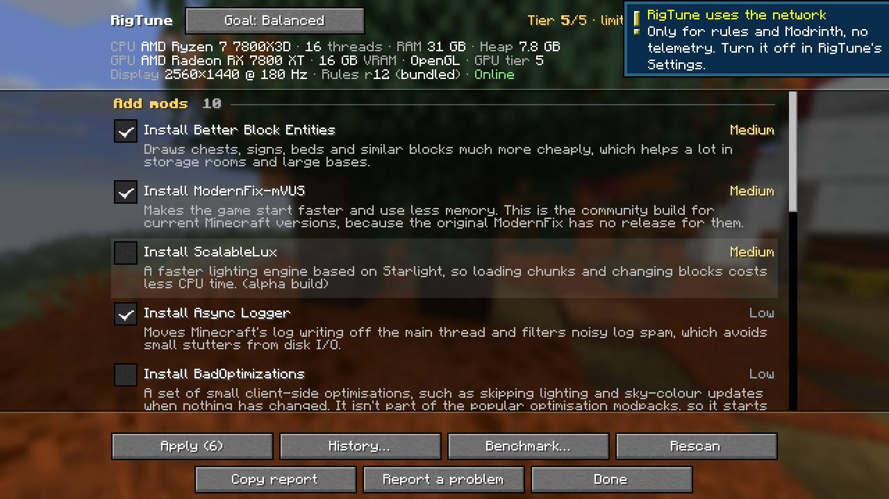 |  | 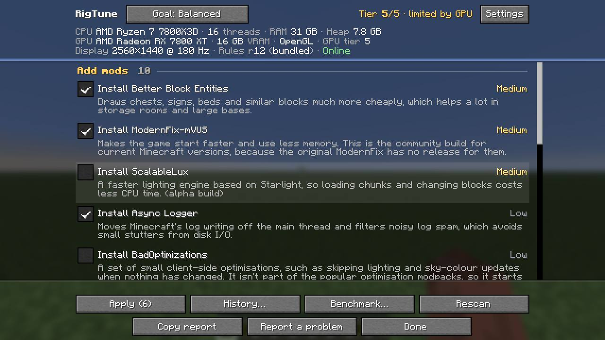 |

## (d) Distant Horizons config round trip (AC7.3)

`p5/d-dh/`. The full user set (50 jars, DH 3.3.0 = `fabric-26.2.jar`), title screen only. The copied TOML has two lines changed: `lodChunkRenderDistanceRadius = 256` → `512` (so the tier-5 rule offers `512 → 256`, as in v0.2) and `enableAutoUpdater = true` → `false`, so DH's own updater doesn't download 3.3.2 and open its shutdown dialog (v0.2's exit -8 and its DeleteOnUnlock JVM); RigTune therefore offers "Update Distant Horizons" (ticked) instead of the "updates itself" advice, and stage mode applies only the `dh.*` setting.
1. **Stage**: one `PATCH_TOML {client.advanced.graphics.quality.lodChunkRenderDistanceRadius=256}`; "Restart Minecraft to finish applying 1 change(s)."
2. **Helper**: `OK PATCH_TOML: Patched 1 value(s) in DistantHorizons.toml` 2.5 s after the game exited; the diff against the TOML at stage time is exactly that one line.
3. **Check** (next launch): **AC7.3 PASSED**: DH's live value 256, the file's non-default `verticalQuality`/`horizontalQuality` HIGH live too (DH's defaults are MEDIUM), `last-apply.json` OK, no `pending.json`, history.json APPLIED, the key no longer recommended; DH's config loaded with no error; DH's re-save at start left the patched TOML byte-identical. The History screen shows "Distant Horizons: LOD Chunk Render Distance Radius: 512 → 256 · Applied".

| | |
|---|---|
| 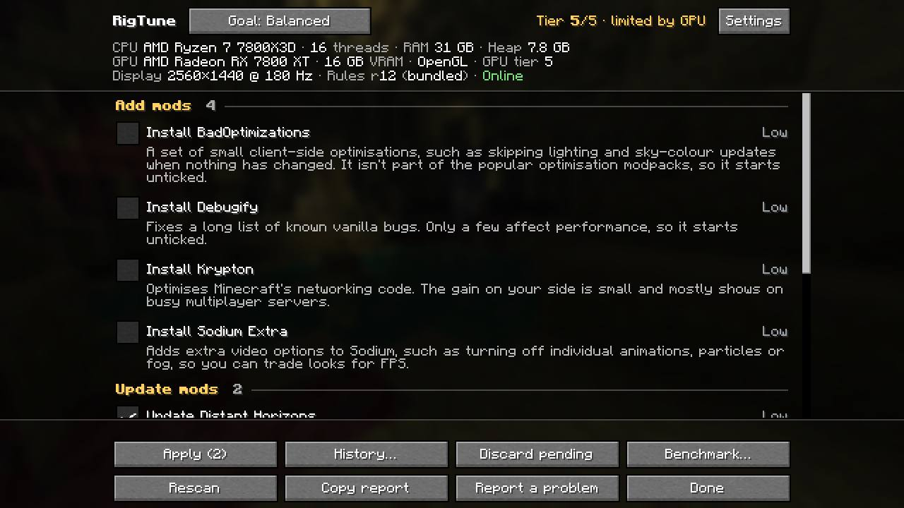 | 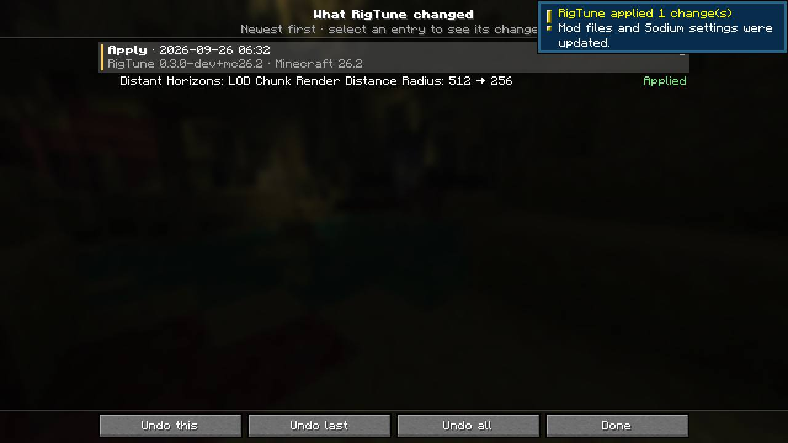 |

## (e) Shader advice and Iris' files (AC8.7)

`p5/e-shaders/`. User set noexit, `-PsmokeBenchmark` (BenchmarkSmoke: a short Tune in the smoke world with the shader cost step). Four runs:

| run | pack / settings | target | chosen RD | shader cost (1% lows on → off) | advice |
|---|---|---|---|---|---|
| calib | MakeUp-UltraFast 9.5e, a `.txt` with the high shadow values | 170 (refresh cap) | 32 | 410 → 699 | none (target met) |
| makeup-550 | same | 550 | 10 | 587 → 616 (4.6%) | none (with shaders the RD 10 step reached 553) |
| cr-500 | Complementary Reimagined, the user's `.txt` | 500 | 17 | 520 → 702 | none (target met with shaders) |
| **cr-heavy-450** | Complementary, its COMPLEMENTARY profile values + `SHADOW_QUALITY=5` in the `.txt` | 450 | 10 (no RD met it) | **154 → 637 (76%)** | **"Your shader pack costs about 76% of your 1% lows." / "A lighter profile in the pack's settings may reach your target."** |

- In the harness MakeUp's 1% lows (with and without shaders) sit near 600 FPS, so no target makes its gap reach 10% at the render distance Tune picks; the advice needed a heavier pack. Every run restored the shaders (`shaders in use after true`, `benchmark-restore.json gone`, AC6.4 PASSED).
- **Iris' files (finding 1)**: in every run the in-game hashes right after the benchmark differ from right before it for `config/iris.properties` and the **active** pack's `.txt`, while the "values" hashes are equal: Iris re-saved both with a new `#<date>` first line when the SHADERS_OFF step turned shaders off and on again (the log shows "Shaders are disabled because enableShaders is set to false in iris.properties" during the step). The inactive pack's `.txt` stayed byte-identical. Iris also re-saves `iris.properties` (new date line) at every game start, benchmark or not (runs b1, b2, d, f), and the active pack's `.txt` when it loads the pack.

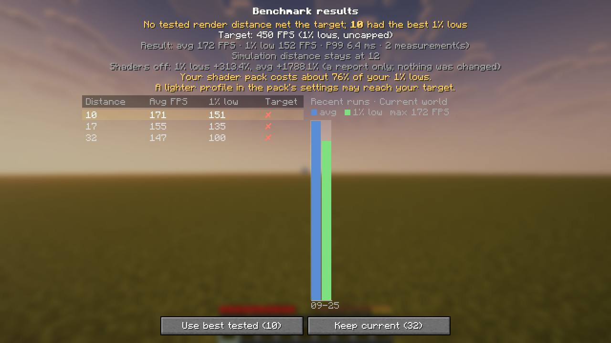

## (f) Failed-op WARN lines and History (AC3.5 in game)

`p5/f-ac35/`. A fresh 26.2 smoke instance (user set noexit) seeded with `config/rigtune/last-apply.json` from `src/test/resources/v010/real-instance/` and `pending.json` from `tools/e2e/seeds/v010-dh/` (both templated read-only copies of the user's real 0.1.0 files; `${INSTANCE}` → the run dir). No history.json, so 0.3.0 made the legacy import.
- **Launch 1**: preLaunch logged "2 staged RigTune change(s) were not applied" and exactly one WARN line per failed op of the run finished 2026-09-24T23:09:01.530708800Z, "attempt 1 of 3": `DISABLE_FILE fabric-26.2.jar: Gave up after 10 attempt(s): java.nio.file.FileSystemException: fabric-26.2.jar -> fabric-26.2.jar.disabled: The process cannot access the file because it is being used by another process` and `ENABLE_FILE distanthorizons (DistantHorizons-3.3.2-26.2-fabric-neoforge.jar): Not applied because disabling fabric-26.2.jar failed`. Paths are cut to file names. `rigtune.json` got `lastWarnedApply`.
- **History**: "Imported from 0.1 · 2026-09-25 09:09" (local time) with the 15 applied files, and both DH rows "Waiting for restart" with "Last attempt failed: … (attempt 1 of 3)".
- **Launch 2** (the seeded `last-apply.json` put back and `pending.json` removed, so the same `finishedAt` is read again): 0 lines naming that run: logged once.
- As expected in a copy without those jars: 5 "Could not read the mod id of …" WARNs from the legacy import (finding 5), the History shows the DH disable and enable as two rows (the missing jar's mod id is unknown), and at exit the helper found `fabric-26.2.jar` "already gone" and failed the enable ("Missing …rigtune-pending"), keeping it in `pending.json` (attempts 2).

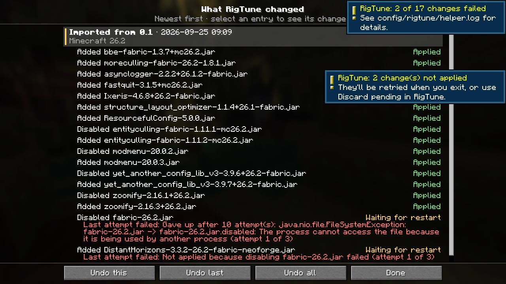

## Findings

1. **MEDIUM: AC8.7's "byte-identical" isn't met.** After a Tune that measures the shader cost, `config/iris.properties` and the active pack's `shaderpacks/<pack>.txt` differ from before the run in their first line only (Iris' `#<date>` comment); every key and value is identical (e runs; `Iris files before/after` lines). Cause: the v0.2 SHADERS_OFF step calls `IrisApi.getConfig().setShadersEnabledAndApply(false/true)` (`client/compat/IrisCompat.java:23`), and Iris persists `iris.properties` on each call (with `enableShaders=false` on disk during the step, which `benchmark-restore.json` covers if the game dies then) and re-saves the pack's option file when it reloads the pack. The advice line itself writes nothing. Iris also re-saves `iris.properties` at every start, so a pre-launch vs post-exit comparison can never be byte-identical. Repro: run (e) (`Reproduce`). Suggested: amend AC8.7 to "values identical" (BenchmarkSmoke now checks exactly that), or accept and record.
2. **LOW (UX): two attempt counts in one failure line.** History and latest.log say "Last attempt failed: Gave up after 10 attempt(s): … (attempt 1 of 3)": the helper's in-run retry count next to the per-exit attempt number. Repro: (a) HistoryGameTest or (f). Suspected: `core/history/ApplyFailures.java` (the reason text is the helper's message as is); drop the "Gave up after N attempt(s): " prefix or word the suffix as "(exit 1 of 3)".
3. **LOW (pre-existing since 0.2): the benchmark chart's date labels are UTC.** Runs at 06:4x on 2026-09-26 AEST are labelled "09-25" (e, a) while History shows local times. `client/ui/BenchmarkResultScreen.java:292-294` takes `createdAt.substring(5, 10)` of the UTC ISO string.
4. **LOW (pre-existing): the apply toast always says "Mod files and Sodium settings were updated."**, also for a Distant Horizons TOML patch (d, `d-check-history.jpg`). `rigtune.toast.applied.body` (en_us.json:147), `client/RigTuneClient.java:187`.
5. **LOW (log noise): the legacy import logs a full `NoSuchFileException` stack trace per missing file** named in 0.1.x's `last-apply.json` (5 in f: jars 0.1.x disabled or replaced that are gone now), once, on the first 0.3 start. `core/apply/ModJars.modIdOf` (ModJars.java:31) via `LegacyImport.applied`. A missing file could be logged without the trace, or at debug.
6. **Environment (not RigTune): the local 26.3 production client crashes natively** (`0xC0000005` before "OpenAL initialized", once `0xC0000374` later) in 6 of 7 production launches today, and in 3 of 5 launches of a control without RigTune or the harness. `ALSOFT_DRIVERS=null` doesn't prevent it. PLAN's "crashes at OpenAL startup, retry up to 5 times" undercounts it today; budget more tries, or run 26.3 smokes in CI.

## Unverified

- The Iris menu path for the shader advice (E-L1): not checked, so the wording stays generic.
- Report a problem's "Open in Browser" (never pressed, by design) and the live GitHub form (problem.yml reaches main with the release PR).
- The `theseus` launcher line in a 26.3 production smoke (try 7 crashed); covered by LauncherGameTest on 26.3 in (a).
- The shader advice with MakeUp-UltraFast (the harness's 1% lows leave less than a 10% gap); shown with the user's own Complementary Reimagined at its heaviest profile.
- Wave B (Preview, the `Text` conversion): re-run pending.

## Reproduce

Scratch inputs (`$P5` = the verifier's scratchpad `p5/`): `usermods-26.2[-noexit]/`, `options.txt`, `userconfig-26.2/` (+ `-dh`, `-shaders`, `-shaders-cr`, `-ac35` variants), `mods-26.3[-noexit]/`, `shaderpacks-run[-cr]/`. Each launch: `L=C:/Dev/Worktrees/.gametest-lock; mkdir $L && printf 'agent: …\nworktree: …\nstarted: …\n' > $L/owner.txt && { <run>; rc=$?; rm -f $L/owner.txt; rmdir $L; exit $rc; }`, then move `versions/<mc>/run` away (prepare never cleans `config/rigtune/`).

```
# (a)
./gradlew :26.2:runClientGameTest ; ./gradlew :26.3:runClientGameTest
# (b)
./gradlew :26.2:runProductionSmoke -PextraModsDir=$P5/usermods-26.2-noexit -PuserOptions=$P5/options.txt -PuserConfigDir=$P5/userconfig-26.2
JAVA_TOOL_OPTIONS="-Dminecraft.launcher.brand=theseus -Xmx2G" ./gradlew :26.2:runProductionSmoke <same>
# (c) retry on NTSTATUS 0xC0000005/0xC0000374; try 6 used ALSOFT_DRIVERS=null
./gradlew :26.3:runProductionSmoke -PextraModsDir=$P5/mods-26.3-noexit -PuserOptions=$P5/options.txt
# control without RigTune: ./gradlew -I p5/c-26.3/control-init.gradle :26.3:runControlProd -PvanillaRunDir=<instance with mods/>
# (d) wait for the helper between the two (pending.json gone)
./gradlew :26.2:runProductionSmoke -PextraModsDir=$P5/usermods-26.2 -PuserOptions=$P5/options.txt -PuserConfigDir=$P5/userconfig-26.2-dh -PsmokeDh=stage
./gradlew :26.2:runProductionSmoke -PextraModsDir=$P5/usermods-26.2 -PuserOptions=$P5/options.txt -PsmokeDh=check
# (e) prepare first, then put the packs in the run dir
./gradlew :26.2:prepareProductionSmoke -PextraModsDir=$P5/usermods-26.2-noexit -PuserOptions=$P5/options.txt -PuserConfigDir=$P5/userconfig-26.2-shaders-cr
mkdir -p versions/26.2/run/shaderpacks && cp $P5/shaderpacks-run-cr/* versions/26.2/run/shaderpacks/
JAVA_TOOL_OPTIONS=-Drigtune.dev.targetFps=450 ./gradlew :26.2:runProductionSmoke <same as prepare> -PsmokeBenchmark
# (f)
./gradlew :26.2:runProductionSmoke -PextraModsDir=$P5/usermods-26.2-noexit -PuserOptions=$P5/options.txt -PuserConfigDir=$P5/userconfig-26.2-ac35
#   then: cp userconfig-26.2-ac35/rigtune/last-apply.json versions/26.2/run/config/rigtune/; rm versions/26.2/run/config/rigtune/pending.json; relaunch without -PuserConfigDir
```

`userconfig-26.2-ac35/rigtune/`: `src/test/resources/v010/real-instance/last-apply.json` and `tools/e2e/seeds/v010-dh/pending.json` with `${INSTANCE}` replaced by `<repo>/versions/26.2/run` (forward slashes).
