# Phase 5 verification (RigTune 0.3.0, Wave A), 2026-09-26

The integration build `feat/v0.3.0` @ c41bf48 (all of Wave A merged; e26314d adds only a PROGRESS line), run from the verifier's worktree on branch `test/p5-v03`. Product code (`src/main`, `src/client`) is unchanged on this branch. Wave B (the localisation conversion, the Preview screen) isn't in this build; a short re-run follows once it merges.

The final runs on the release candidate f77af1a are at the end, in [Final runs (release candidate f77af1a)](#final-runs-release-candidate-f77af1a).

Test-only changes on this branch (commit 2bcb10a; gametest source set, not in the shipped jar), made after run (a):
- `ProductionSmoke.v03Screens`: in every production smoke, logs the RigTune footer buttons, opens History (screenshot `smoke-history`), presses Report a problem (screenshot `smoke-report-confirm`), presses Cancel, and puts the clipboard back.
- `BenchmarkSmoke` (`-PsmokeBenchmark`): a screenshot of the result screen (`smoke-benchmark-result`); the target FPS and `ShaderAdvice.costPercent` in the evidence file; the sha256 of `config/iris.properties` and every `shaderpacks/*.txt` right before and right after the run, of the bytes and of the lines without `#` comments ("values").

Machine: Ryzen 7 7800X3D, Radeon RX 7800 XT, 32 GB, 2560x1440 @ 180 Hz, Windows 11. Every launch ran under the game-test lock (atomic mkdir, owner.txt, released in the same command); the lock was never busy. Paths in the evidence are replaced by `<repo>`, `<p5>` (the verifier's scratchpad), `<jdk>` and `~`. Evidence: [p5/](p5/). The benchmark autorun (AC3.7) and the MC tooling have their own folders: [benchmark/](benchmark/), [mc-tooling/](mc-tooling/).

Mod sets (copied into the scratchpad; the user's instance was only read):
- **User set, 26.2**: the 50 jars of the user's Modrinth App profile "Fabric 26.2" (every `mods/*.jar` except `rigtune-0.1.0.jar`; not the 4 `.disabled` jars, the `.rigtune-pending` DH 3.3.2 or `mods/update/`), sha256-checked against the source; the same 50 as v0.2's Phase 5. **noexit**: minus Xaero's World Map and Distant Horizons (`fabric-26.2.jar`), which deadlock the harness on world exit (48 jars). Their `options.txt` (render distance 32), `sodium-options.json`, `DistantHorizons.toml`, `iris.properties`.
- **26.3 set**: v0.2's 17-jar Modrinth set (fabric-api 0.161.0+26.3, Sodium, Lithium, Iris, DH 3.3.2, Mod Menu, Entity Culling, FerriteCore, ImmediatelyFast, More Culling, Dynamic FPS, C2ME, Zoomify, Cloth Config, YACL, placeholder-api, fabric-language-kotlin), SHA-512 re-checked against v0.2's manifest. **noexit**: minus DH (16 jars).
- **Shader packs**: v0.2's Modrinth downloads (SHA-512 re-checked): MakeUp-UltraFast 9.5e and Complementary Reimagined r5.9.3 (the user's own pack), plus a copy of the user's `ComplementaryReimagined_r5.9.3.zip.txt`.

## Results

| run | what | result | tries |
|---|---|---|---|
| 0 | `./gradlew build` (both versions) | **PASS**: 1047 tests per version, 0 failures (1 skipped: the FIFO test, Linux only), 1m52s | 1 |
| a | `:26.2:runClientGameTest`, all 7 classes | **PASS**, 3m13s, 79 screenshots | 1 |
| a | `:26.3:runClientGameTest`, all 7 classes | **PASS**, 2m39s, 79 screenshots | 1 |
| b1 | `:26.2:runProductionSmoke`, user set noexit, the user's options and config, no launcher brand | **PASS**, 1m05s | 1 |
| b2 | as b1 with `JAVA_TOOL_OPTIONS=-Dminecraft.launcher.brand=theseus -Xmx2G` (AC5.3 in game) | **PASS**, 1m05s | 1 |
| c | `:26.3:runProductionSmoke`, 26.3 set noexit, the user's options | **PASS on the 6th launch**: tries 1-5 crashed natively (not RigTune: see (c)); try 6 (`ALSOFT_DRIVERS=null`) passed in 1m05s; try 7 (same, with the Modrinth brand) crashed | 7 |
| d | DH config round trip, full user set incl. DH 3.3.0: `-PsmokeDh=stage`, helper, `-PsmokeDh=check` | **PASS** (AC7.3 PASSED), 67 s in all | 1 |
| e | AC8.7: Iris + shader pack, `-PsmokeBenchmark`, advice forced with `-Drigtune.dev.targetFps` | Advice line **PASS** (shown, "about 76%"); byte-identical files **FAIL** (finding 1: Iris re-saves both files with a new date comment, values identical) | 4 |
| f | AC3.5 in game: seeded 0.1.0 `last-apply.json` + `pending.json`, then a relaunch | **PASS**: 2 WARN lines once, History shows "Last attempt failed: … (attempt 1 of 3)", no repeat on the relaunch | 1 |

## (a) Client game tests, local (AC2.4)

All seven classes ran on both versions (RigTuneClientGameTest, BenchmarkGameTest, LauncherGameTest, UndoGameTest, UiGameTest, ReportGameTest, HistoryGameTest); 26.3 started first time. Log excerpts: `p5/a-gametest/`. 14 of the 158 screenshots were opened, from both versions: History (list, failure line, Undo this, after the undo, corrupt state), the launcher line, Report a problem's confirm screen, and the benchmark menu, results and shader advice.
- **History**: the seeded list (Apply, Benchmark result, Apply, Undo, Apply) with the failed STAGED change "Last attempt failed: Gave up after 10 attempt(s): … (attempt 2 of 3)" at 1280x720@2 and 640x480@2; Undo this on the older apply ("Entity Shadows: Off → On" undone, "Render Distance: 5 → 6" skipped "Changed again by a later apply"); the new Undo entry afterwards.
- **Launcher** (AC5.3): "Memory 2.0 GB of 16 GB, set in the Modrinth App" and the green "In the Modrinth App: this instance → Instance settings (gear) → Sync overrides → turn on Custom memory allocation → set the slider." under the ram-low warning; the `launcher-none-*` shots are as in 0.2 (`LauncherGameTest: at start minecraft.launcher.brand=null`).
- **Report a problem**: the vanilla confirm screen with the whole link readable at 640x480@2 (the link ends "(shortened; the full report is on your clipboard)").
- **Benchmark**: the menu's current-world note ("Higher render distances load and save more of this world."), the RD 12 benchmark-world result, the shader-advice screen. Log: the 377-chunk settle at RD 12 (0 missing), fingerprint `floor 117 minecraft:forest; … 4 biomes >= 5%, water 14.7%` and camera y 133 on both versions.
- Harness-only: `bench-menu-world` has the previous step's "benchmark cancelled" toast over the menu title.

| | |
|---|---|
|  |  |
|  |  |
|  |  |
|  |  |

## (b) Production smoke, 26.2, the user's mods

`p5/b-26.2/`. Both runs: rules r12 (bundled; the remote file isn't on main until the release), online, `vanilla.renderDistance: 5 -> 32` restored, the world left cleanly.
- **b1, no brand**: `RigTune: launcher not recognised (generic memory advice)`; the header is 0.2's ("CPU … · RAM 31 GB · Heap 7.8 GB"), no launcher named. 7 recommendations: BadOptimizations, Debugify, Krypton, Sodium Extra, Update ModernFix 5.27.19-build.1 → build.2 (ticked), Render Distance 32 → 16, the AMD/Sodium advice. F8 in the world opens RigTune.
- **Footer**: `Settings, Apply (1), History…, Benchmark…, Rescan, Copy report, Report a problem, Done`: **no Preview** (Wave B). History opens with "RigTune hasn't changed anything yet."; Report a problem shows the confirm screen with the link; Cancel returns to RigTune.
- **b2, `theseus` + 2 GB heap**: `RigTune: launcher Modrinth App`; the header reads "Memory 2.0 GB of 31 GB, set in the Modrinth App", and the ram-low warning ("Give Minecraft more memory", High) ends with the Modrinth App steps. With the 2 GB heap the tier is 2/5 (memory) and 9 settings are offered.
- RigTune logged no WARN/ERROR and no exception in either run. The privacy toast is hidden as the RigTune screen opens (it is still sliding out in the first screenshots).

| | | |
|---|---|---|
|  |  |  |
|  |  | |

## (c) Production smoke, 26.3, the representative Modrinth set

`p5/c-26.3/`. The passing run (try 6): MC 26.3, 2560x1440 @ 180 Hz, online, rules r12, 12 recommendations as in v0.2 (10 mods, RD 32 → 16, the AMD advice), the ModernFix-mVUS reason version-neutral (v0.2 finding 3 fixed), all 16 jars loaded, footer without Preview, History and Report a problem's confirm screen as on 26.2, F8 in the world, no RigTune WARN/ERROR.
- **The native crash**: tries 2-5 and 7 died with `NTSTATUS 0xC0000005` about 15 s after start, always after "Cached all modded block culling states" and before "OpenAL initialized" (`crashes.txt`); try 1 died with `0xC0000374` (heap corruption) about 8 s after the sound engine had started, right after its Report-confirm screenshot.
- **Not RigTune**: a control (`control-no-rigtune.txt`, `control-init.gradle`: the same 16 jars in a production client with **no RigTune jar and no game-test harness**) crashed 3 of 5 times with `0xC0000005` at the same point. The earlier "OpenAL startup" label is imprecise: with OpenAL Soft's null backend (`ALSOFT_DRIVERS=null`) it passed once (try 6) and crashed once (try 7). Today 6 of 7 RigTune production launches and 3 of 5 control launches of 26.3 crashed (the dev `runClientGameTest` in (a) didn't); no 26.2 launch did (11 today).
- The 26.3 launcher line with the `theseus` brand is therefore shown only by LauncherGameTest in (a), not in a 26.3 production smoke (try 7 crashed).

| | | |
|---|---|---|
|  |  |  |

## (d) Distant Horizons config round trip (AC7.3)

`p5/d-dh/`. The full user set (50 jars, DH 3.3.0 = `fabric-26.2.jar`), title screen only. The copied TOML has two lines changed: `lodChunkRenderDistanceRadius = 256` → `512` (so the tier-5 rule offers `512 → 256`, as in v0.2) and `enableAutoUpdater = true` → `false`, so DH's own updater doesn't download 3.3.2 and open its shutdown dialog (v0.2's exit -8 and its DeleteOnUnlock JVM); RigTune therefore offers "Update Distant Horizons" (ticked) instead of the "updates itself" advice, and stage mode applies only the `dh.*` setting.
1. **Stage**: one `PATCH_TOML {client.advanced.graphics.quality.lodChunkRenderDistanceRadius=256}`; "Restart Minecraft to finish applying 1 change(s)."
2. **Helper**: `OK PATCH_TOML: Patched 1 value(s) in DistantHorizons.toml` 2.5 s after the game exited; the diff against the TOML at stage time is exactly that one line.
3. **Check** (next launch): **AC7.3 PASSED**: DH's live value 256, the file's non-default `verticalQuality`/`horizontalQuality` HIGH live too (DH's defaults are MEDIUM), `last-apply.json` OK, no `pending.json`, history.json APPLIED, the key no longer recommended; DH's config loaded with no error; DH's re-save at start left the patched TOML byte-identical. The History screen shows "Distant Horizons: LOD Chunk Render Distance Radius: 512 → 256 · Applied".

| | |
|---|---|
|  |  |

## (e) Shader advice and Iris' files (AC8.7)

`p5/e-shaders/`. User set noexit, `-PsmokeBenchmark` (BenchmarkSmoke: a short Tune in the smoke world with the shader cost step). Four runs:

| run | pack / settings | target | chosen RD | shader cost (1% lows on → off) | advice |
|---|---|---|---|---|---|
| calib | MakeUp-UltraFast 9.5e, a `.txt` with the high shadow values | 170 (refresh cap) | 32 | 410 → 699 | none (target met) |
| makeup-550 | same | 550 | 10 | 587 → 616 (4.6%) | none (with shaders the RD 10 step reached 553) |
| cr-500 | Complementary Reimagined, the user's `.txt` | 500 | 17 | 520 → 702 | none (target met with shaders) |
| **cr-heavy-450** | Complementary, its COMPLEMENTARY profile values + `SHADOW_QUALITY=5` in the `.txt` | 450 | 10 (no RD met it) | **154 → 637 (76%)** | **"Your shader pack costs about 76% of your 1% lows." / "A lighter profile in the pack's settings may reach your target."** |

- In the harness MakeUp's 1% lows (with and without shaders) sit near 600 FPS, so no target makes its gap reach 10% at the render distance Tune picks; the advice needed a heavier pack. Every run restored the shaders (`shaders in use after true`, `benchmark-restore.json gone`, AC6.4 PASSED).
- **Iris' files (finding 1)**: in every run the in-game hashes right after the benchmark differ from right before it for `config/iris.properties` and the **active** pack's `.txt`, while the "values" hashes are equal: Iris re-saved both with a new `#<date>` first line when the SHADERS_OFF step turned shaders off and on again (the log shows "Shaders are disabled because enableShaders is set to false in iris.properties" during the step). The inactive pack's `.txt` stayed byte-identical. Iris also re-saves `iris.properties` (new date line) at every game start, benchmark or not (runs b1, b2, d, f), and the active pack's `.txt` when it loads the pack.


## (f) Failed-op WARN lines and History (AC3.5 in game)

`p5/f-ac35/`. A fresh 26.2 smoke instance (user set noexit) seeded with `config/rigtune/last-apply.json` from `src/test/resources/v010/real-instance/` and `pending.json` from `tools/e2e/seeds/v010-dh/` (both templated read-only copies of the user's real 0.1.0 files; `${INSTANCE}` → the run dir). No history.json, so 0.3.0 made the legacy import.
- **Launch 1**: preLaunch logged "2 staged RigTune change(s) were not applied" and exactly one WARN line per failed op of the run finished 2026-09-24T23:09:01.530708800Z, "attempt 1 of 3": `DISABLE_FILE fabric-26.2.jar: Gave up after 10 attempt(s): java.nio.file.FileSystemException: fabric-26.2.jar -> fabric-26.2.jar.disabled: The process cannot access the file because it is being used by another process` and `ENABLE_FILE distanthorizons (DistantHorizons-3.3.2-26.2-fabric-neoforge.jar): Not applied because disabling fabric-26.2.jar failed`. Paths are cut to file names. `rigtune.json` got `lastWarnedApply`.
- **History**: "Imported from 0.1 · 2026-09-25 09:09" (local time) with the 15 applied files, and both DH rows "Waiting for restart" with "Last attempt failed: … (attempt 1 of 3)".
- **Launch 2** (the seeded `last-apply.json` put back and `pending.json` removed, so the same `finishedAt` is read again): 0 lines naming that run: logged once.
- As expected in a copy without those jars: 5 "Could not read the mod id of …" WARNs from the legacy import (finding 5), the History shows the DH disable and enable as two rows (the missing jar's mod id is unknown), and at exit the helper found `fabric-26.2.jar` "already gone" and failed the enable ("Missing …rigtune-pending"), keeping it in `pending.json` (attempts 2).


## Findings

1. **MEDIUM: AC8.7's "byte-identical" isn't met.** After a Tune that measures the shader cost, `config/iris.properties` and the active pack's `shaderpacks/<pack>.txt` differ from before the run in their first line only (Iris' `#<date>` comment); every key and value is identical (e runs; `Iris files before/after` lines). Cause: the v0.2 SHADERS_OFF step calls `IrisApi.getConfig().setShadersEnabledAndApply(false/true)` (`client/compat/IrisCompat.java:23`), and Iris persists `iris.properties` on each call (with `enableShaders=false` on disk during the step, which `benchmark-restore.json` covers if the game dies then) and re-saves the pack's option file when it reloads the pack. The advice line itself writes nothing. Iris also re-saves `iris.properties` at every start, so a pre-launch vs post-exit comparison can never be byte-identical. Repro: run (e) (`Reproduce`). Suggested: amend AC8.7 to "values identical" (BenchmarkSmoke now checks exactly that), or accept and record.
2. **LOW (UX): two attempt counts in one failure line.** History and latest.log say "Last attempt failed: Gave up after 10 attempt(s): … (attempt 1 of 3)": the helper's in-run retry count next to the per-exit attempt number. Repro: (a) HistoryGameTest or (f). Suspected: `core/history/ApplyFailures.java` (the reason text is the helper's message as is); drop the "Gave up after N attempt(s): " prefix or word the suffix as "(exit 1 of 3)".
3. **LOW (pre-existing since 0.2): the benchmark chart's date labels are UTC.** Runs at 06:4x on 2026-09-26 AEST are labelled "09-25" (e, a) while History shows local times. `client/ui/BenchmarkResultScreen.java:292-294` takes `createdAt.substring(5, 10)` of the UTC ISO string.
4. **LOW (pre-existing): the apply toast always says "Mod files and Sodium settings were updated."**, also for a Distant Horizons TOML patch (d, `d-check-history.jpg`). `rigtune.toast.applied.body` (en_us.json:147), `client/RigTuneClient.java:187`.
5. **LOW (log noise): the legacy import logs a full `NoSuchFileException` stack trace per missing file** named in 0.1.x's `last-apply.json` (5 in f: jars 0.1.x disabled or replaced that are gone now), once, on the first 0.3 start. `core/apply/ModJars.modIdOf` (ModJars.java:31) via `LegacyImport.applied`. A missing file could be logged without the trace, or at debug.
6. **Environment (not RigTune): the local 26.3 production client crashes natively** (`0xC0000005` before "OpenAL initialized", once `0xC0000374` later) in 6 of 7 production launches today, and in 3 of 5 launches of a control without RigTune or the harness. `ALSOFT_DRIVERS=null` doesn't prevent it. PLAN's "crashes at OpenAL startup, retry up to 5 times" undercounts it today; budget more tries, or run 26.3 smokes in CI.

## Unverified

- The Iris menu path for the shader advice (E-L1): not checked, so the wording stays generic.
- Report a problem's "Open in Browser" (never pressed, by design) and the live GitHub form (problem.yml reaches main with the release PR).
- The `theseus` launcher line in a 26.3 production smoke (try 7 crashed); covered by LauncherGameTest on 26.3 in (a).
- The shader advice with MakeUp-UltraFast (the harness's 1% lows leave less than a 10% gap); shown with the user's own Complementary Reimagined at its heaviest profile.
- Wave B (Preview, the `Text` conversion): re-run pending.

## Reproduce

Scratch inputs (`$P5` = the verifier's scratchpad `p5/`): `usermods-26.2[-noexit]/`, `options.txt`, `userconfig-26.2/` (+ `-dh`, `-shaders`, `-shaders-cr`, `-ac35` variants), `mods-26.3[-noexit]/`, `shaderpacks-run[-cr]/`. Each launch: `L=C:/Dev/Worktrees/.gametest-lock; mkdir $L && printf 'agent: …\nworktree: …\nstarted: …\n' > $L/owner.txt && { <run>; rc=$?; rm -f $L/owner.txt; rmdir $L; exit $rc; }`, then move `versions/<mc>/run` away (prepare never cleans `config/rigtune/`).

```
# (a)
./gradlew :26.2:runClientGameTest ; ./gradlew :26.3:runClientGameTest
# (b)
./gradlew :26.2:runProductionSmoke -PextraModsDir=$P5/usermods-26.2-noexit -PuserOptions=$P5/options.txt -PuserConfigDir=$P5/userconfig-26.2
JAVA_TOOL_OPTIONS="-Dminecraft.launcher.brand=theseus -Xmx2G" ./gradlew :26.2:runProductionSmoke <same>
# (c) retry on NTSTATUS 0xC0000005/0xC0000374; try 6 used ALSOFT_DRIVERS=null
./gradlew :26.3:runProductionSmoke -PextraModsDir=$P5/mods-26.3-noexit -PuserOptions=$P5/options.txt
# control without RigTune: ./gradlew -I p5/c-26.3/control-init.gradle :26.3:runControlProd -PvanillaRunDir=<instance with mods/>
# (d) wait for the helper between the two (pending.json gone)
./gradlew :26.2:runProductionSmoke -PextraModsDir=$P5/usermods-26.2 -PuserOptions=$P5/options.txt -PuserConfigDir=$P5/userconfig-26.2-dh -PsmokeDh=stage
./gradlew :26.2:runProductionSmoke -PextraModsDir=$P5/usermods-26.2 -PuserOptions=$P5/options.txt -PsmokeDh=check
# (e) prepare first, then put the packs in the run dir
./gradlew :26.2:prepareProductionSmoke -PextraModsDir=$P5/usermods-26.2-noexit -PuserOptions=$P5/options.txt -PuserConfigDir=$P5/userconfig-26.2-shaders-cr
mkdir -p versions/26.2/run/shaderpacks && cp $P5/shaderpacks-run-cr/* versions/26.2/run/shaderpacks/
JAVA_TOOL_OPTIONS=-Drigtune.dev.targetFps=450 ./gradlew :26.2:runProductionSmoke <same as prepare> -PsmokeBenchmark
# (f)
./gradlew :26.2:runProductionSmoke -PextraModsDir=$P5/usermods-26.2-noexit -PuserOptions=$P5/options.txt -PuserConfigDir=$P5/userconfig-26.2-ac35
#   then: cp userconfig-26.2-ac35/rigtune/last-apply.json versions/26.2/run/config/rigtune/; rm versions/26.2/run/config/rigtune/pending.json; relaunch without -PuserConfigDir
```

`userconfig-26.2-ac35/rigtune/`: `src/test/resources/v010/real-instance/last-apply.json` and `tools/e2e/seeds/v010-dh/pending.json` with `${INSTANCE}` replaced by `<repo>/versions/26.2/run` (forward slashes).

## Final runs (release candidate f77af1a)

2026-09-26, 09:00-09:28 AEST. `feat/v0.3.0` @ f77af1a (every v0.3 workstream, the review round 1 fixes and the Phase 5 lows), run from the verifier's worktree on branch `test/p5-final`. Product code is unchanged on this branch. The one test-only change is `ProductionSmoke.preview` (gametest source set, not in the shipped jar). Every production smoke now also checks the Preview button: it presses Preview with the default ticks, then opens a Preview of every appliable item. For each it logs the rows and takes a screenshot. It hashes options.txt, `mods/` and `config/` (RigTune's own caches aside; `pending.json`, `history.json` and `last-apply.json` included) by SHA-256 right before and right after, then writes `rigtune-smoke-preview.txt`. The hashes are taken in game because the game writes options.txt at start and Iris re-saves `iris.properties` at every start (finding 1). A comparison of the files before launch and after exit can't isolate Preview.

- Build: `./gradlew build` (both versions) passed: 1125 tests per version, 0 failures, 1 skipped (the Linux-only FIFO test), 1m48s. Jars: `rigtune-0.3.0-dev+mc26.2.jar` sha256 `17cfe5b84fc59479a1c241a8e70ffb0f8fad1ffd51215754ceae0835fd910b5f`, `rigtune-0.3.0-dev+mc26.3.jar` `b0877c1e85a11a07556a2b28950fc5bae1702eafd6ed855a795a2021fc6e29ce`.
- Released jars were downloaded again with `gh release download`: `rigtune-0.1.0.jar` sha256 `8294d04a6b67e76dcff298366be38f85048ebf19a120baa9e8ed5b08b2e4b950`, `rigtune-0.2.0+mc26.2.jar` `67275e232fe4de9f806dd6496f479d8385d8afabf9a6b93ffe909ce42f657de9`. Both match the published values.
- Mod sets and configs are the early run's scratch copies (above). The 50 user jars were sha256-checked again against the copy, and the user's Modrinth App profile still has the same 50 file names (read only).
- The lock: every launch took `C:/Dev/Worktrees/.gametest-lock` (atomic mkdir, owner.txt `agent: p5-final`, `worktree:`, `started:`) and released it in the same command. The E2E harness takes and releases it itself (`--agent p5-final`). The lock was never busy, and no orphaned client was left after the crashes.

| run | what | result | attempts | duration | evidence |
|---|---|---|---|---|---|
| E1 (AC4.1) | `final-v020-to-030`: released 0.2.0 → this build, `--expect-history own-update` | **PASS 20/20** | 1 | 67 s | [final-v020-to-030](../../smoke/self-update/final-v020-to-030/RESULT.md) |
| E2 (AC4.1) | `final-v010-to-030`: released 0.1.0 → this build, `--legacy-disable --expect-history` | **PASS 21/21** | 1 | 61 s | [final-v010-to-030](../../smoke/self-update/final-v010-to-030/RESULT.md) |
| E3 (AC4.1, H-M2) | `final-v010-seeded-to-030`: as E2, seeded from the user's 0.1.0 DH group (`--seed tools/e2e/seeds/v010-dh`) | **PASS 26/26** | 1 | 69 s | [final-v010-seeded-to-030](../../smoke/self-update/final-v010-seeded-to-030/RESULT.md) |
| E4 (AC4.2, M14 + B-M3) | `undo-after-restart-030`: Undo last after a restart, then Undo this on the older of two Applies | **PASS 43/43** | 1 | 2m34s | [undo-after-restart-030](../../smoke/self-update/undo-after-restart-030/RESULT.md) |
| G1 (AC2.4) | `:26.2:runClientGameTest`, all 8 classes | **PASS**, 87 screenshots | 1 | 3m13s | [final/a-gametest/](final/a-gametest/) |
| G2 (AC2.4) | `:26.3:runClientGameTest`, all 8 classes | **PASS**, 87 screenshots | 1 | 2m44s | [final/a-gametest/](final/a-gametest/) |
| S1 | `:26.2:runProductionSmoke`, user set noexit, the user's options and config, no launcher brand, + Preview | **PASS**; Preview wrote nothing (106 files) | 1 | 1m18s | [final/b-26.2/](final/b-26.2/) |
| S2 | as S1 with `JAVA_TOOL_OPTIONS=-Dminecraft.launcher.brand=theseus -Xmx2G` | **PASS**; Preview wrote nothing (106 files) | 1 | 1m07s | [final/b-26.2/](final/b-26.2/) |
| S3 | `:26.3:runProductionSmoke`, 26.3 set noexit (16 jars), the user's options, + Preview | **PASS on the 3rd launch**. Launches 1 and 2 crashed natively (`0xC0000005`, finding 6). Launch 3 used `ALSOFT_DRIVERS=null`. Preview wrote nothing (35 files) | 3 | 1m32s (the crashes took about 20 s each) | [final/c-26.3/](final/c-26.3/) |

Commands are the ones in Reproduce above and in tools/e2e/README.md "v0.3 runs", with `--work <p5final>/runs --agent p5-final`. `--new-jar` was the 26.2 jar above.

### Self-update E2E (AC4.1, AC4.2)

All four passed on the first run with the unmodified released jars. Rescan wasn't needed in any phase. The kept evidence is the harness's own folder for each run (RESULT.md, checks.json, screenshots, filtered logs).
- **0.2.0 → 0.3.0**: 0.2.0 journaled its own update as one `apply` entry (disable the 0.2.0 jar, enable the new one), and its helper marked it `APPLIED`. 0.3.0 read that journal unchanged: no legacy import, and no status changed by the relaunch. The apply toast reads "RigTune applied 2 change(s)".
- **0.1.0 → 0.3.0**: exactly one `legacy-import` entry, holding the `e2e-legacy` disable as `APPLIED` and nothing of RigTune's own jars.
- **Seeded (H-M2)**: after the 0.1.0 helper, `last-apply.json` has the update's two ops `OK` and the carried-over DH ops `FAILED`. On the first 0.3.0 start:
  - The group is dropped with "Cancelled RigTune's pending change to Distant Horizons: it has an update of its own waiting in mods/update.", and the legacy import marks it `DISCARDED`.
  - latest.log has the reworded 3e line once per failed op: "RigTune's helper couldn't apply a change (run finished …, restart attempt 2 of 3; it's retried at the next exit): DISABLE_FILE fabric-26.2.jar: …".
  - No helper runs at exit, and `mods/` doesn't change at exit. The only change during the session is the DH download becoming `.rigtune-superseded`.
- **Undo**: M14 22/22, then B-M3 on the same instance. The plan for Undo this on the older Apply is one revert needing a restart ("Undone when you restart Minecraft: Disable e2e-first-1.0.0.jar", `e2e-entry-undo-1-plan.png`). After the restart only `e2e-first` is disabled, the journal has one `undo` of that entry, and the newer entry's change stays `APPLIED`.

### Client game tests (AC2.4)

All 8 classes ran on both versions, each on the first try, with no native crash on 26.3: RigTuneClientGameTest, BenchmarkGameTest, LauncherGameTest, UndoGameTest, UiGameTest, ReportGameTest, HistoryGameTest and PreviewGameTest. I opened 10 of the 174 screenshots, 5 from each version:
- **Preview** (26.2 at 1280x720@2, 26.3 at 640x480@2): the canned preview's sections "Written now" (options.txt), "Changed at the next restart" (Sodium/DH/Iris files and keys), "Downloaded now, added at the next restart" and "Renamed to .disabled at the next restart", under "Nothing has been changed or downloaded yet.". Long DH keys wrap inside the column at 640x480. On 26.3 at 640x480@2 the footer is `Apply (7) | Preview | History… / Benchmark… | Rescan | Copy report / Report a problem | Done`, with Preview right after Apply. `preview-real` (the real controller, 26.2) lists the ticked downloads from live Modrinth, and the test checked that it wrote nothing.
- **History**: the seeded list at 1280x720@2 (26.2) and 640x480@2 (26.3). The failed change now reads "Last attempt failed: Gave up after 10 attempt(s): … (try 2 of 3 at restart)" (finding 2's suffix, reworded).
- **Launcher line** (26.3, 854x480@2): the header "Memory 2.0 GB of 16 GB, set in the Modrinth App". Under "Give Minecraft more memory" is the round-1 wording ("Your launcher lets Minecraft use about 2 GB of memory or less … Set it to at least 4 GB …"), then the green Modrinth App steps.
- **Report a problem** (26.2, 640x480@2): the whole link is readable and ends with the URL-encoded "(shortened; the full report is on your clipboard)".
- **Benchmark**: the benchmark-world result on 26.3 (RD 12; the log has the 377-of-377-chunk settle, floor 117 `minecraft:forest` and camera y 133), and the shader advice on 26.2 ("Your shader pack costs about 40% of your 1% lows."). The chart's date labels now read 09-26 at 09:1x AEST, when the UTC date was still 09-25, which confirms finding 3's fix.

| | |
|---|---|
| 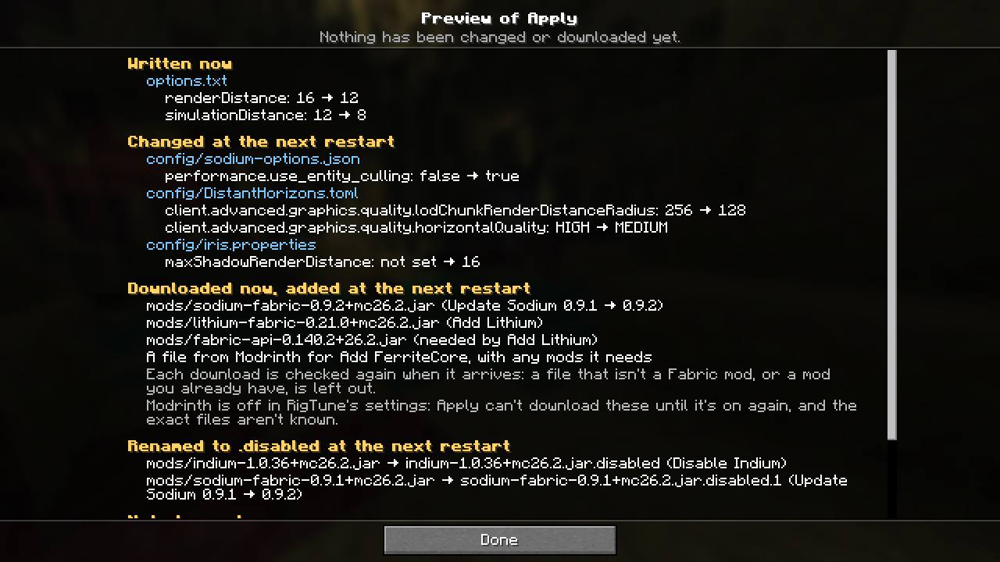 | 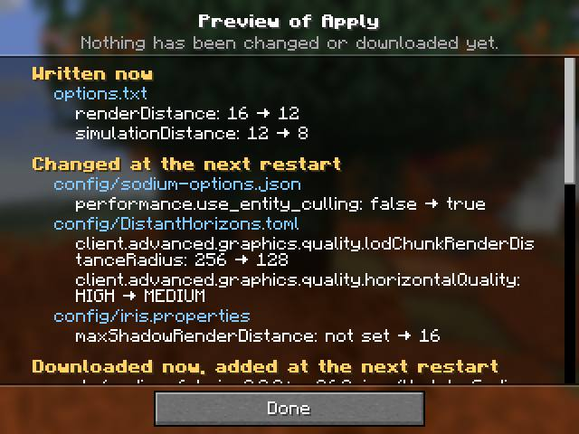 |
| 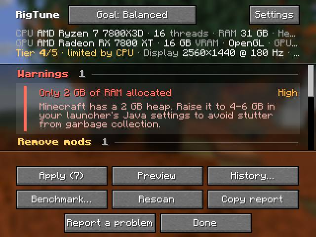 | 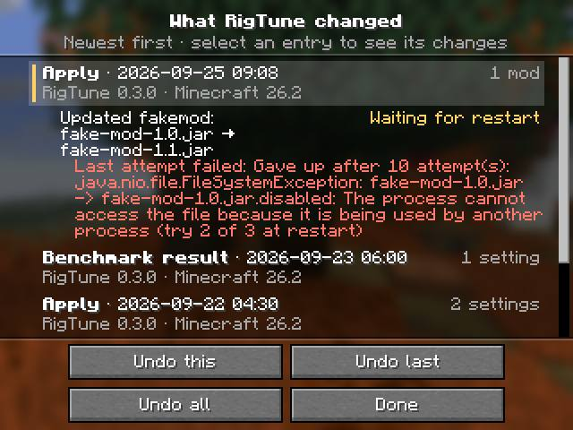 |
| 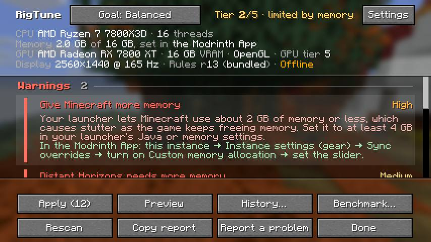 | 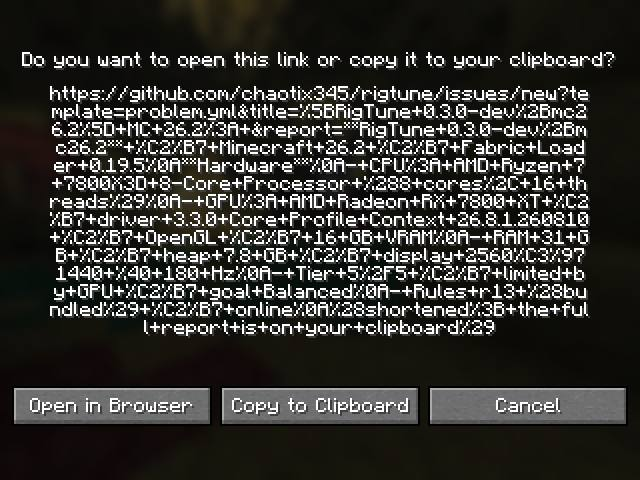 |
| 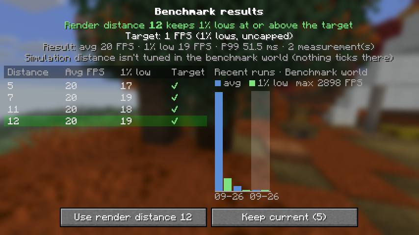 | 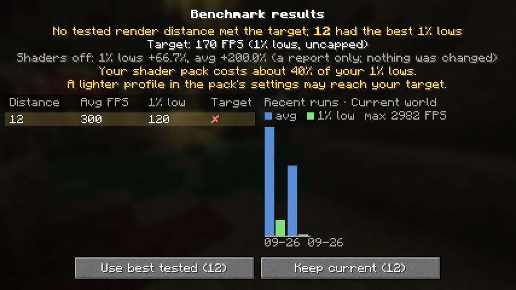 |

### Production smokes with Preview

- **S1 (26.2, user set)**: rules r13 (bundled), online, `launcher not recognised`, and 7 recommendations as in the early run (the ModernFix update is the only ticked one).
  - The footer is `Settings, Apply (1), Preview, History…, Benchmark…, Rescan, Copy report, Report a problem, Done`.
  - Preview with the default ticks shows 5 rows: download `modernfix-5.27.19-build.2.jar`, then rename `build.1` → `.disabled`.
  - Preview of every appliable item shows 12 rows: `renderDistance: 32 → 16` written now, 5 downloads and the rename.
  - All 106 files hashed (options.txt, 48 jars, config/) were identical after both previews, and no `.rigtune-pending` file appeared.
  - History reads "RigTune hasn't changed anything yet.", and Report a problem shows the confirm screen. F8 works in the world.
  - RigTune logged no WARN or ERROR.
- **S2 (26.2, `theseus`, 2 GB)**: `RigTune: launcher Modrinth App`, the header "Memory 2.0 GB of 31 GB, set in the Modrinth App", and the round-1 ram-low wording with the Modrinth App steps. The tier is 2/5, limited by memory, with `Apply (10)`. The default-ticks Preview (16 rows) shows 9 options.txt settings written now, plus the ModernFix download and rename. All 106 files were unchanged.
- **S3 (26.3, 16 jars)**: MC 26.3, rules r13, online, and 12 recommendations (10 mods, RD 32 → 16, the AMD advice) with `Apply (6)`. The default-ticks Preview (9 rows) shows 7 downloads, including `ResourcefulConfig-6.0.1.jar` "needed by Install Structure Layout Optimizer". Preview of every appliable item (16 rows) adds `renderDistance: 32 → 16` and 11 downloads. All 35 files were unchanged. History, Report a problem, F8 in the world and RigTune's log were all as on 26.2.
  - Two of the offered files carry older MC tags in their names: `fastquit-3.1.5+mc26.2.jar` and `asynclogger-2.2.2+26.1.2-fabric.jar`. Both are tagged 26.3 on Modrinth (checked through the API), so this is correct.

| | | |
|---|---|---|
| 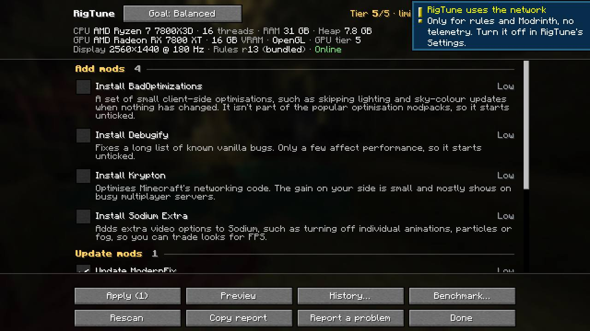 | 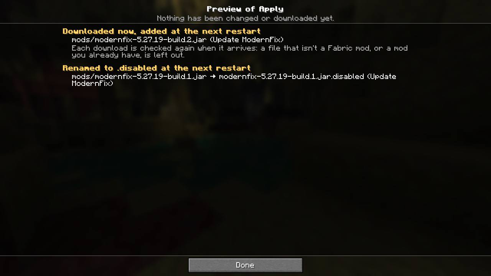 | 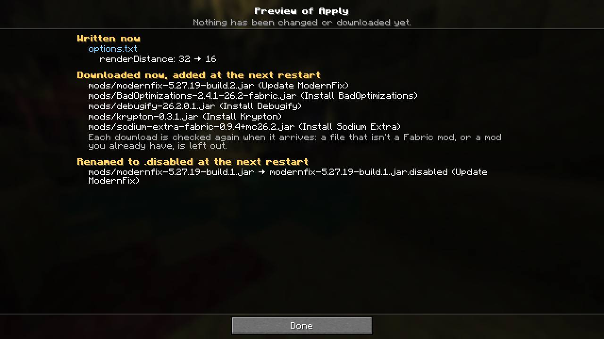 |
| 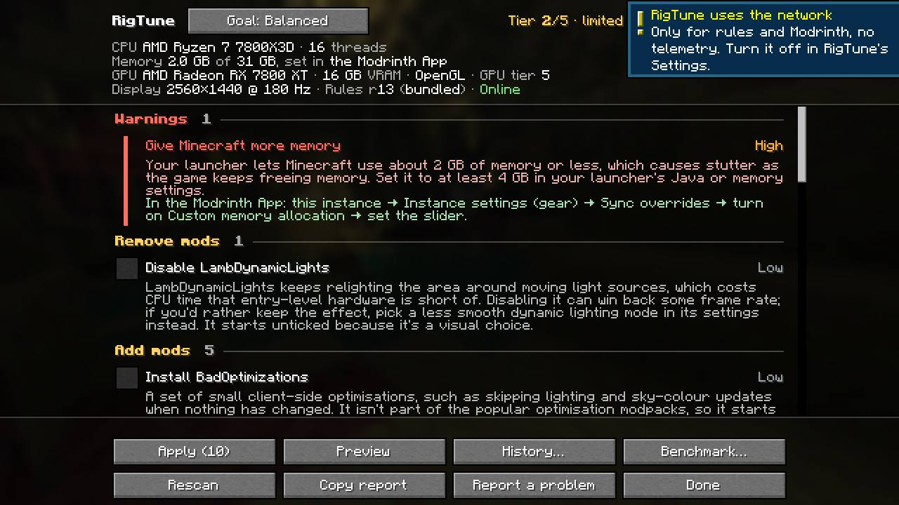 | 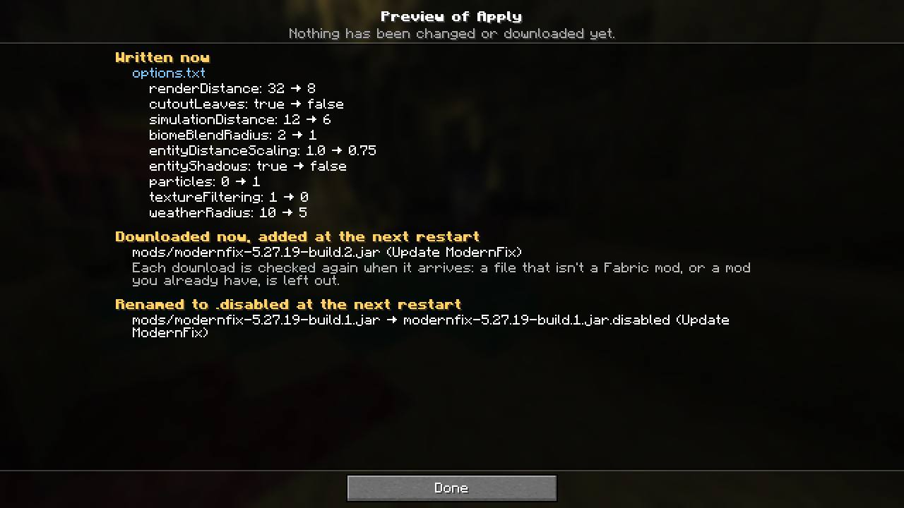 | 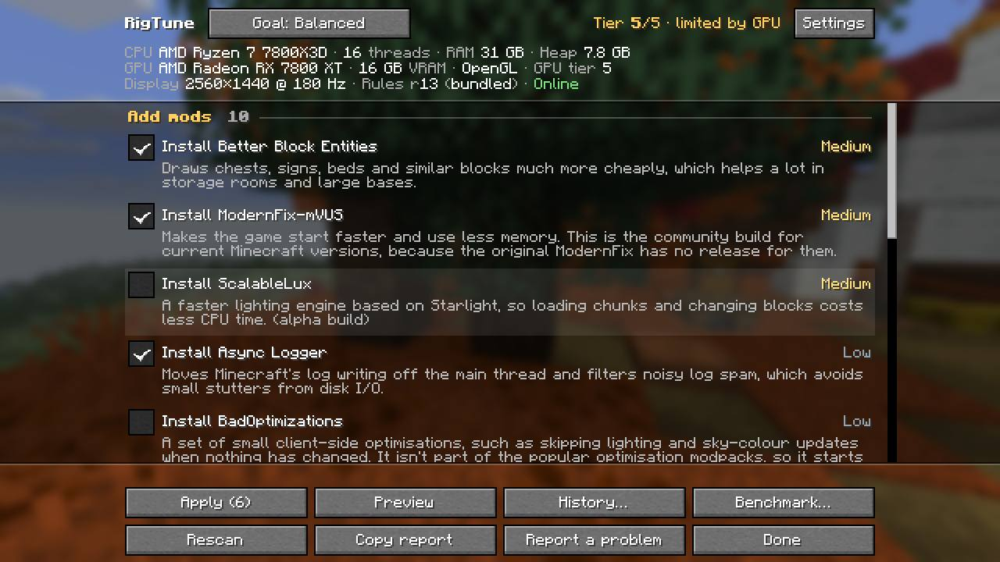 |
| 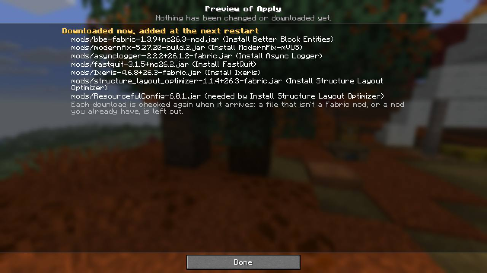 | 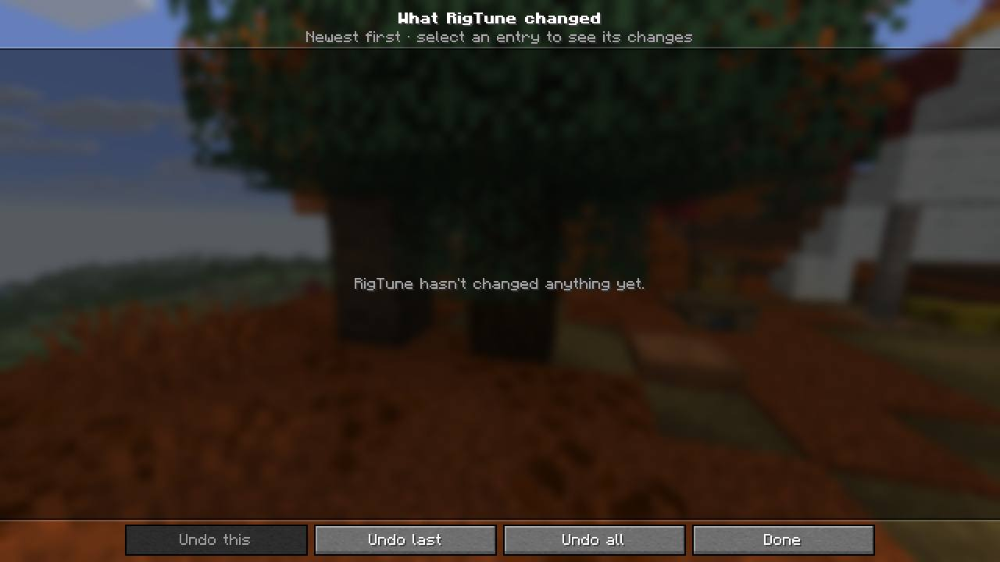 | 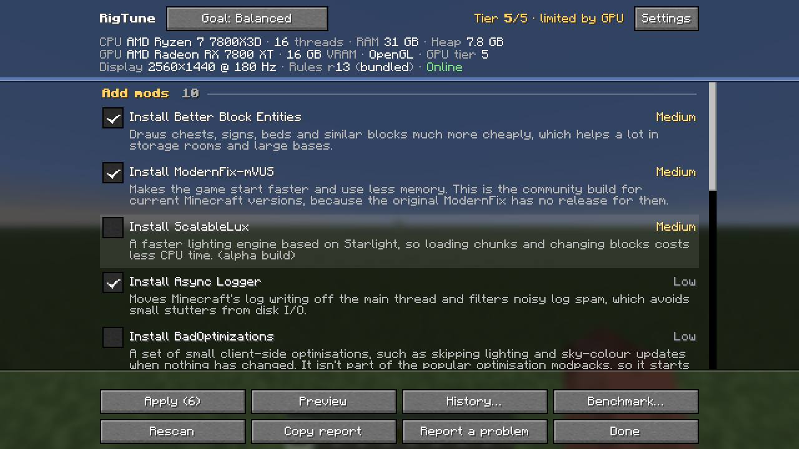 |

### Findings (final runs)

No new HIGH or MEDIUM findings, and no product bug that blocks the release.

The early run's findings, as the release candidate stands:

| early finding | status on f77af1a |
|---|---|
| 1. AC8.7 byte-identical (MEDIUM) | Not re-run (not in this run's scope). Unchanged. |
| 2. Two attempt counts in one line (LOW) | The suffix now reads "(try 2 of 3 at restart)" in History and "restart attempt 2 of 3" in latest.log. The helper's "Gave up after 10 attempt(s): " prefix is still there. |
| 3. Chart dates in UTC (LOW) | Fixed: the chart uses the local date (G1). |
| 5. Legacy-import stack traces (LOW) | Not exercised. E3's legacy import reads the `last-apply.json` the 0.1.0 helper had just written, and every file it names exists. |
| 6. 26.3 native crash (environment) | Still happens: 2 of 3 production launches crashed at the same point, and the passing launch used `ALSOFT_DRIVERS=null`. The game tests on 26.3 didn't crash. |

New in the final runs:
- **LOW (UX): History's "Undo last" and "Undo all" stay active with nothing to undo.** With an empty history ("RigTune hasn't changed anything yet.", S1 and S3), "Undo this" is greyed out but the other two buttons stay active. Pressing one opens the undo screen, which says "Nothing to undo."
  - Screenshot: `final/img/c263-history.jpg`.
  - Cause: `client/ui/HistoryScreen.java:138-141` builds both buttons without an `active` condition, while `undoThis.active` (line 136) checks the entry.
  - Suggested fix: grey them out when the journal has nothing undoable, or accept as is (0.2's main-screen buttons behaved the same way).
- **LOW (UX, as specified): Preview shows options.txt's raw keys and values.** For example it shows `particles: 0 → 1`, `textureFiltering: 1 → 0` and `biomeBlendRadius: 2 → 1` (S2), while the main list shows "Particles: All → Decreased", "Texture Filtering: RGSS → None" and "Biome Blend: 5x5 → 3x3".
  - This matches SPEC 13 ("file and key, old → new"), but numeric enum values mean little to a player.
  - Possible follow-up: add the friendly label after the raw value.
