# Local client game tests, both versions (P5-B)

2026-09-26, 20:40-21:21 AEST, on the dev machine (Ryzen 7 7800X3D, RX 7800 XT, Windows 11, JDK 25.0.4.1). The code is the RC, `feat/v0.4.0` @ 9cf84f6, on branch `test/p5-smokes`. Each launch took the machine-wide game-test lock (atomic mkdir + owner.txt) and released it in the same command. `runClientGameTest` is the dev-environment client and wipes its run dir per launch; each launch's screenshots and logs were copied out before the next.

**Test-only change** (gametest source set, not in the shipped jar): `ServerLimitsGameTest` now gives its dedicated server a free port (`server-port` from `new ServerSocket(0)`) instead of 25565. See [P5B-FINDINGS.md](../P5B-FINDINGS.md) F2.

## Results

| version | launches | result | screenshots | time of the passing launch |
|---|---|---|---|---|
| 26.2 | 2 | **PASS on launch 2**, all 16 classes. Launch 1 crashed in ServerLimitsGameTest: its test server couldn't bind 25565, which the user's own `fabric-server-launcher.jar` (PID 36592, not touched) holds ([26.2-try1-port-conflict.txt](26.2-try1-port-conflict.txt)). After the free-port change it passed. | 179 | 5m31s |
| 26.3 | 3 | **PASS on launch 3**, all 16 classes. Launches 1 and 2 ran every class up to FootprintGameTest green, then failed its local budget check (F1). Launch 1: `renderThreadInitCpuMs 156.25 > 150`, with 140 ms wall, so CPU was above wall. Launch 2: `renderThreadInitWallMs 507.79 > 368` and `clientStartedWallMs 166.69 > 141`, with only 46.88 ms of CPU. **No native crash in any of the 3 26.3 launches.** | 179 | 5m09s |

The client game-test runner runs the classes in order and stops the client at the first failure, so a green launch means every class passed. Per class, both versions, passing launch:

| class | 26.2 | 26.3 | log evidence (filtered logs) |
|---|---|---|---|
| RigTuneClientGameTest | PASS | PASS | real/stub screens, apply, benchmark screenshots 0000-0017 |
| BenchmarkGameTest | PASS | PASS | benchmark world settle and Tune, shader advice (0018-0027) |
| LauncherGameTest | PASS | PASS | none / theseus / MultiMC / GDLauncher headers and steps |
| UndoGameTest | PASS | PASS | undo last / all / restart (0040-0048) |
| UiGameTest | PASS | PASS | Tools footer and hub at 3 sizes, notices, the tier header and tooltip, network off |
| ReportGameTest | PASS | PASS | confirm screen at 3 sizes, worst case |
| HistoryGameTest | PASS | PASS | history at 3 sizes, Undo this, corrupt/newer/empty |
| PreviewGameTest | PASS | PASS | preview at 3 sizes, real preview |
| ProfilesGameTest | PASS | PASS | "AC4.11 passed"; switch, import preview, import error, battery offer |
| StutterGameTest | PASS | PASS | "capture checks passed (585 / 586 frames, GC records, phase timers complete)" |
| JvmGameTest | PASS | PASS | "passed"; the running JVM (G1, nothing to note) and the injected ZGC/Aikar findings |
| BenchmarkHistoryGameTest | PASS | PASS | "passed"; regression line, change window, rerun marker |
| ServerLimitsGameTest | PASS | PASS | "dedicated server limits, notice, cap and store checked; singleplayer shows none" |
| AwarenessGameTest | PASS | PASS | "driver notice (shown -> committed), Re-benchmark, what's new and dismissals checked" |
| FootprintGameTest | PASS | PASS (launch 3) | "23 budget(s), 0 over (mode FAIL)" ([26.2-footprint.json](26.2-footprint.json), [26.3-attempt3-footprint.json](26.3-attempt3-footprint.json)) |
| A11yGameTest | PASS | PASS | "registered; the contracts skeleton case passed". This is the skeleton only: the accessibility branch isn't merged in this RC. |

Logs: [26.2-gametest.filtered.log](26.2-gametest.filtered.log), [26.3-attempt3-gametest.filtered.log](26.3-attempt3-gametest.filtered.log), plus the failed 26.3 launches [1](26.3-attempt1-gametest.filtered.log) / [2](26.3-attempt2-gametest.filtered.log) and their footprint files ([1](26.3-attempt1-footprint.json), [2](26.3-attempt2-footprint.json)).

## Screenshots reviewed (X7: 640x480 at GUI scale 2 unless named)

I opened 27 screenshots from both versions: 21 of the 358 from the two passing launches, plus 6 from 26.3 launch 1 (the same classes and cases): Tools hub, Profiles (list, history, import preview, import error, battery offer), Stutter Doctor (empty and saved), JVM & memory (running JVM and findings, top and end), Benchmark history (regression, rerun marker), the benchmark result with the trend, notices (the line, NoticeScreen, the driver notice at 1280x720, what's new, the server limit), the estimated-tier header and its tooltip, the Tools startup line (last and median), the benchmark menu. Everything fits and is readable at 640x480@2. Details:

- **Tools hub:** the 5 entries in SPEC order, the startup line ("Last launch 11.6 s", then "Last launch 15.1 s · median of the last 10: 14.5 s" with the yellow "The mod set changed since the previous launch (may be related)."), and the advice, all above Done.
- **Profiles:** the templates and "My settings" with their Template / Your settings tags, and 8 buttons in 3 rows.
- **Profiles history:** "Profile: Battery" (RigTune 0.4.0-dev+mc26.3 · Minecraft 26.3), with 8 settings and their status ("Applied", "Waiting for restart"). The Sodium key wraps inside the column.
- **Stutter Doctor:** header lines, the "not enough data" verdict in yellow, and the frame-time histogram with bars and percentages; the list scrolls.
- **JVM & memory:** This Java / Your Java arguments / Advice. The findings wrap, and the end of the list shows the Modrinth App Java-arguments steps.
- **Benchmark history:**
  - Regression view: the context button, "5 comparable runs; 1 with different conditions not shown", "1% lows 19% below your usual 543 FPS since 2026-09-22" in red, "Changes since then (may be related):" naming the update, and the chart with the usual line.
  - Rerun view: "Needs a rerun (changed since: resolution)".
- **Estimated-tier header:** "Estimated tier 4/5 · lowest estimated component: CPU" (stub) and "5/5 · GPU, CPU, memory" (real). The tooltip reads "GPU tier 5 (table match) / CPU tier 4 (fallback estimate from 16 threads) / Memory tier 5 (6.0 GB heap)".
- **Notices:**
  - At 640x480@2 the line is the message plus "…", which opens NoticeScreen. That screen shows each notice with its actions ("Switch to Battery", "Don't offer again", ×).
  - At 1280x720@2 the actions sit inline (Re-scan, Re-benchmark, ×, "+2 more").

Seen, not blocking (details in [P5B-FINDINGS.md](../P5B-FINDINGS.md)):
- **F3:** Stutter Doctor says "1 spikes (…) in 1 hitches"; the string has no singular form ([a263-stutter-saved](img/a263-stutter-saved.jpg)).
- **F4:** the benchmark result at 640x480@2 clips most status lines with "…". Next to the trend chart the table header runs together ("DistanceAvg FPS1% low Target"). The table layout is 0.3's; v0.4 adds lines above it ([a263-bench-result](img/a263-bench-result-640x480.jpg)).
- **F5:** the driver-changed notice is clipped inline even at 1280x720@2, and with a real AMD string ("3.3.0 Core Profile Context 26.8.1.260810") it always will be. The full text is in the hover tooltip and NoticeScreen.
- Harness artefacts, not product issues:
  - Toasts from earlier steps cover screen titles (Import preview, Profiles history).
  - A hover tooltip covers two Profiles rows (cursor position).
  - The stub controller's tier tooltip says "6.0 GB heap" while its canned warning says 2 GB.

| | | |
|---|---|---|
| 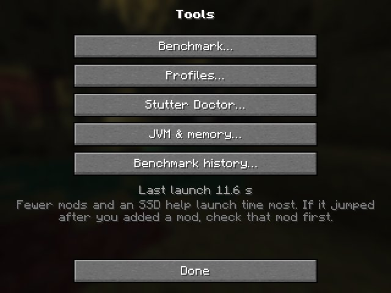 | 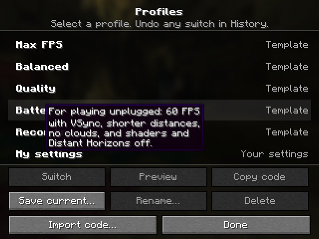 | 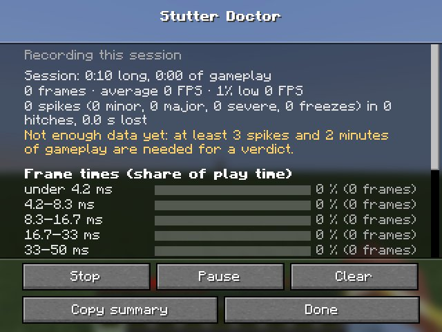 |
| 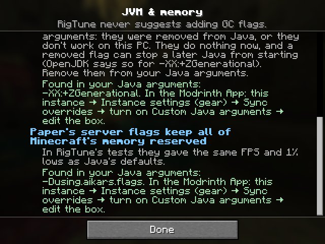 | 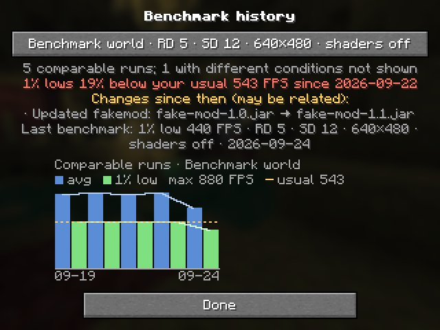 | 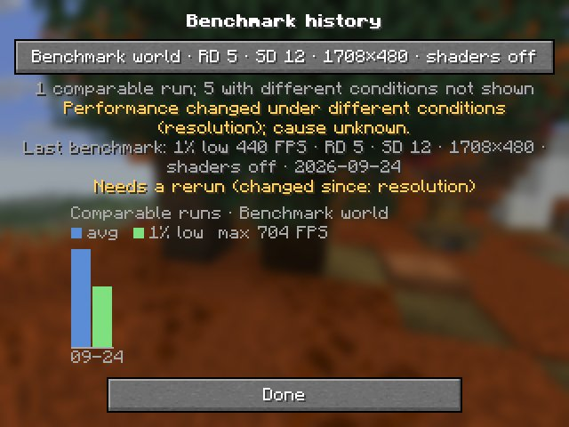 |
| 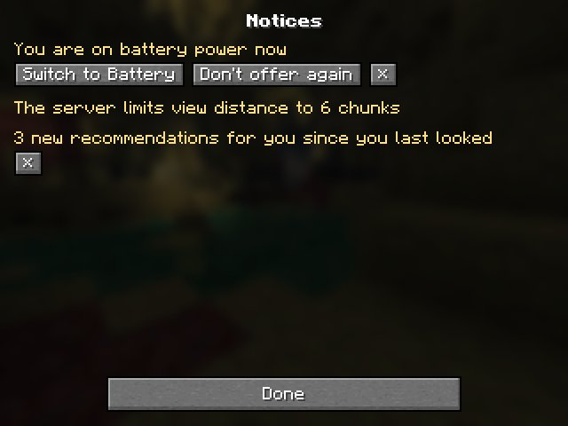 | 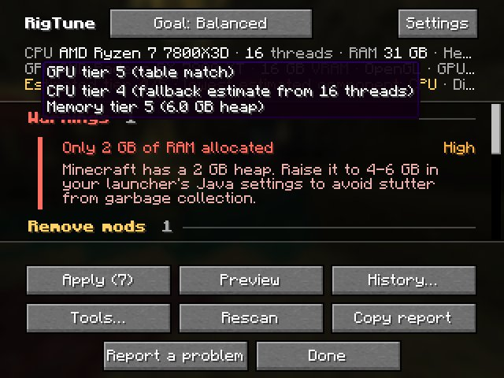 | 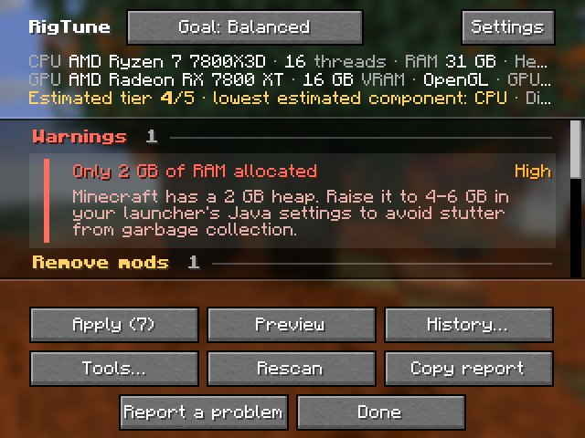 |
| 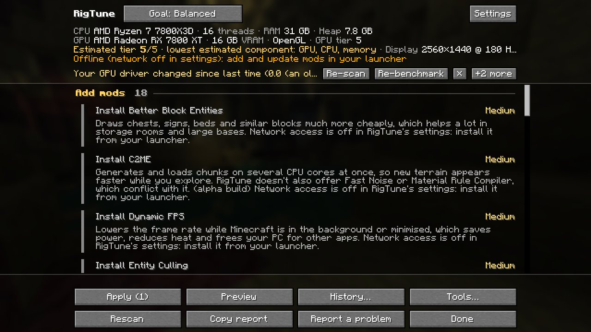 | 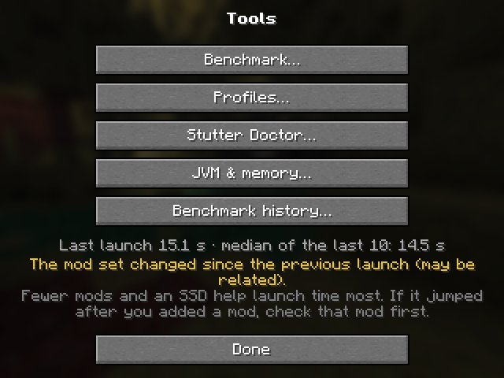 | 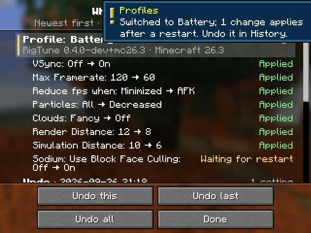 |
| 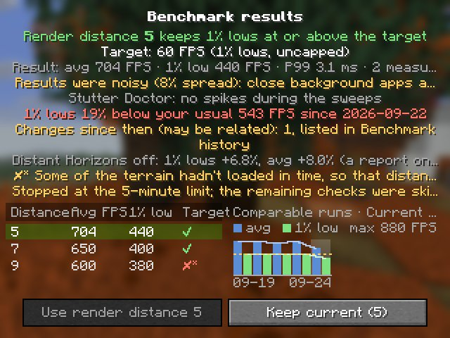 | 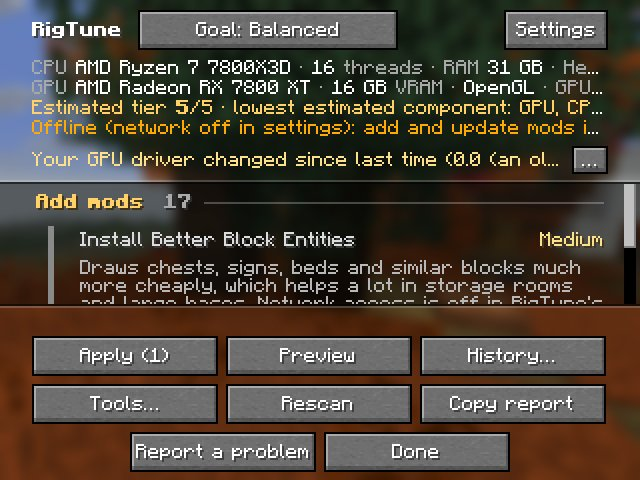 | 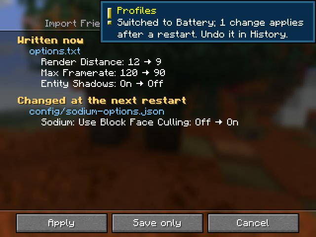 |

## Reproduce

```
export JAVA_HOME="C:/Dev/Tools/jdk/jdk-25.0.4.1+1"
L=C:/Dev/Worktrees/.gametest-lock; mkdir $L && printf 'agent: …\nworktree: …\nstarted: …\n' > $L/owner.txt && { ./gradlew :26.2:runClientGameTest; rc=$?; rm -f $L/owner.txt; rmdir $L; exit $rc; }
# the same for :26.3:runClientGameTest; retry on a native crash (none happened here) or a local footprint flake (F1)
```
