# Production smoke, 26.2, a copy of the user's mods (P5-B)

2026-09-26, 21:21-21:31 AEST. The release candidate (`feat/v0.4.0` @ 9cf84f6, product code unchanged on `test/p5-smokes`) was run with `./gradlew :26.2:runProductionSmoke`. That is a production Fabric client driven by the smoke harness (`ProductionSmoke`, gametest source set). RC jar: `rigtune-0.4.0-dev+mc26.2.jar` sha256 `149f20f9234c760ff1f446dce4cedf054d54b28ccf9f3839e48624002913dd11`. Every launch took the machine-wide game-test lock (atomic mkdir + owner.txt) and released it in the same command.

**Test-only change for this run** (gametest source set, not in the shipped jar): `ProductionSmoke.v04Tools`. After History, Report a problem and Preview, it presses **Tools…**, screenshots the hub, logs its startup line, then opens each tool in the hub's order: Benchmark, Profiles, Stutter Doctor, JVM & memory, Benchmark history. For each tool it takes a screenshot, logs the screen's buttons and goes back. It hashes options.txt, `mods/` and `config/` before and after the tour (RigTune's caches aside, as in `preview()`).

## Inputs (copied; the real instance was only read)

- **Mods:** the user's Modrinth App profile "Fabric 26.2": all 50 `mods/*.jar` except `rigtune-0.1.0.jar`. The RC jar takes its place (Loom adds it). Not included: the 4 `.disabled` jars, the `.rigtune-pending` DH download and `mods/update/`. sha256 of each copy = the source ([mods-26.2-user.sha256](mods-26.2-user.sha256)). The set includes Distant Horizons 3.3.0 (`fabric-26.2.jar`), Iris 1.11.4, Sodium 0.9.2, Lithium, C2ME, Xaero's maps, Ixeris, ModernFix, Entity Culling, ImmediatelyFast and more (56 top-level mods loaded, 171 with nested).
- **S2 ("noexit")** leaves out Xaero's World Map and Distant Horizons (48 jars). Either one deadlocks the harness at world exit (see S1).
- **Options:** their `options.txt` (render distance 32; the harness turns fullscreen off). **Config:** their `sodium-options.json`, `iris.properties` and `DistantHorizons.toml`. One line was changed in the TOML copy: `enableAutoUpdater = false`. This keeps DH's own updater from downloading 3.3.2 and starting its DeleteOnUnlock process in the scratch instance, the same as v0.3's (d) run. With the updater off, RigTune offers "Update Distant Horizons". Their `config/rigtune/` was **not** copied: its pending.json holds absolute paths into the real instance.

## Results

| run | what | result | time |
|---|---|---|---|
| S1 | full set (50 jars incl. DH + Xaero's World Map), no launcher brand | **PASS** (title → RigTune → pages → History → Report confirm → Preview ×2 → Tools + 5 tools → world → F8). The harness then hung at world exit: I killed my own client after 2.5 idle minutes, so gradle exited 1 | 1m40s to the world screenshot |
| S2 | noexit set (48 jars), `JAVA_TOOL_OPTIONS="-Dminecraft.launcher.brand=theseus -Xmx2G"` | **PASS**, exit 0 | 1m27s |

Checks, both runs unless noted:
- **Title screen and a world:** reached. F8 in the world opens RigTune (`smoke-world`).
- **Real hardware:** `AMD Ryzen 7 7800X3D 8-Core Processor, 8 cores / 16 threads`, `AMD Radeon RX 7800 XT (ATI Technologies Inc.), driver 3.3.0 Core Profile Context 26.8.1.260810, OPENGL, VRAM 16368 MB`, GPU class tier 5, 31849 MB RAM, 2560x1440 @ 180 Hz, no battery. Flags: `sodium-workaround:AMD_GAME_OPTIMIZATION_BROKEN, jvm-gc-g1, jvm-probed` ([s1-report.txt](s1-report.txt)).
- **The estimated-tier header:**
  - S1: "Estimated tier 5/5 · lowest estimated component: GPU, CPU, memory".
  - S2: "Estimated tier 2/5 · lowest estimated component: memory", with a 2 GB heap.
- **Recommendations** (rules r15 bundled, online):
  - S1: 8 recommendations. Updates to DH 3.3.2 and ModernFix build.2 (both ticked), 4 unticked add-mods, Render Distance 32 → 16, and the AMD/Sodium advice. `Apply (2)`.
  - S2: 18 recommendations, `Apply (10)`.
- **Footer:** `Settings, Apply (n), Preview, History…, Tools…, Rescan, Copy report, Report a problem, Done`. Tools… is the one new button (X3).
- **Tools hub and every tool opened without an error:**
  - Hub: "Last launch 25.3 s" (S1) / "30.6 s" (S2) and the startup advice. There's no median yet, since each smoke instance is fresh.
  - Benchmark menu: "Scene: Current world". Its actions are greyed at the title screen, as in 0.3.
  - Profiles: the 5 templates and "My settings". Save current… and Import code… are active.
  - Stutter Doctor: "The session monitor is off. No sessions recorded yet.", with Start.
  - JVM & memory: "Java 25.0.4.1 (Eclipse Adoptium) · G1, chosen by Java · Heap: up to 7.8 GB" and nothing to note. In S2 it reads "up to 2.0 GB", with the ram-low advice and the Modrinth App steps.
  - Benchmark history: "No benchmark runs yet. Run one from Tools → Benchmark…".
- **History:** "RigTune hasn't changed anything yet."; Undo this / Undo last / Undo all are all greyed out (2a fixed).
- **Launcher lines (S2, the theseus brand):**
  - latest.log: `RigTune: launcher Modrinth App`.
  - The header reads "Memory 2.0 GB of 31 GB, set in the Modrinth App".
  - "Give Minecraft more memory" (High) ends with the green "In the Modrinth App: this instance → Instance settings (gear) → Sync overrides → turn on Custom memory allocation → set the slider.". The same advice, with the same steps, appears in JVM & memory.
  - (S1: `launcher not recognised (generic memory advice)`.)
- **Preview writes nothing:** in-game SHA-256 of options.txt, `mods/` and `config/` right before and after both previews. S1: 112 files, `changed: []`. S2: 106 files, `changed: []`. No `.rigtune-pending` file appeared ([s1-preview.txt](s1-preview.txt), [s2-preview.txt](s2-preview.txt)).
- **Opening the tools writes nothing:** the same hashes around the Tools tour, `changed: []` (112 / 106 files).
- **latest.log:** no RigTune WARN or ERROR, and no stack frame from `io.github.chaotix345.rigtune.core|client` in either run. The only WARNs are the smoke harness's own ("report changed while paging", "chunks not all downloaded after 30 s"). No rotated `logs/*.log.gz` existed: fresh run directories, same day. The RigTune startup line: `preLaunch + init 37.9 ms on the render thread (CPU 46.9 ms), client start 10.9 ms; RigTune threads used 281.3 ms of CPU in the first 5 s`. That's CPU above wall, the Windows 15.625 ms quantum ([P5B-FINDINGS](../../P5B-FINDINGS.md) F1).

## The world-exit hang (S1; harness only, known)

With Distant Horizons and Xaero's World Map loaded, `TestSingleplayerContext.close()` never finished. At 21:23:07 the log stops at "World map session finalized." ([s1-exit-hang-jstack.txt](s1-exit-hang-jstack.txt)):
- the render thread waits in `IntegratedServer.halt` (from the harness's `deferDisconnect`);
- the server thread waits in the harness's phaser (`ThreadingImpl.enterPhase` from `postRunTasks`);
- the test thread waits in the same phaser from `TestSingleplayerContextImpl.close`.

No RigTune frame is involved. This is the harness quirk PLAN lists ("world-exit deadlock with Xaero's World Map or Distant Horizons loaded"). S2, without those two mods, exits cleanly. I killed only my own client, found by its command line (worktree path + `-Drigtune.smoke=true`).

## Screenshots (1280x720, GUI scale 2)

| | | |
|---|---|---|
| 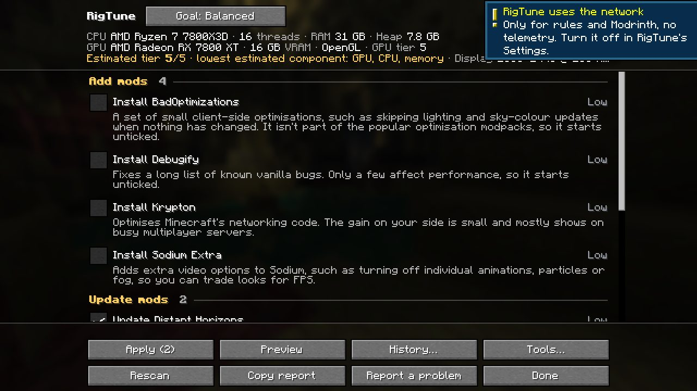 | 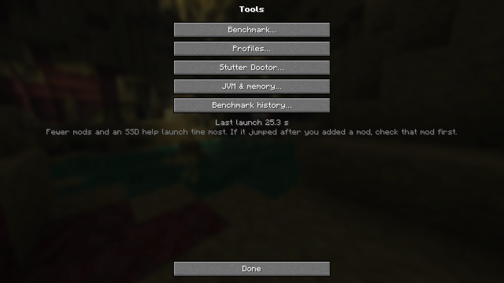 | 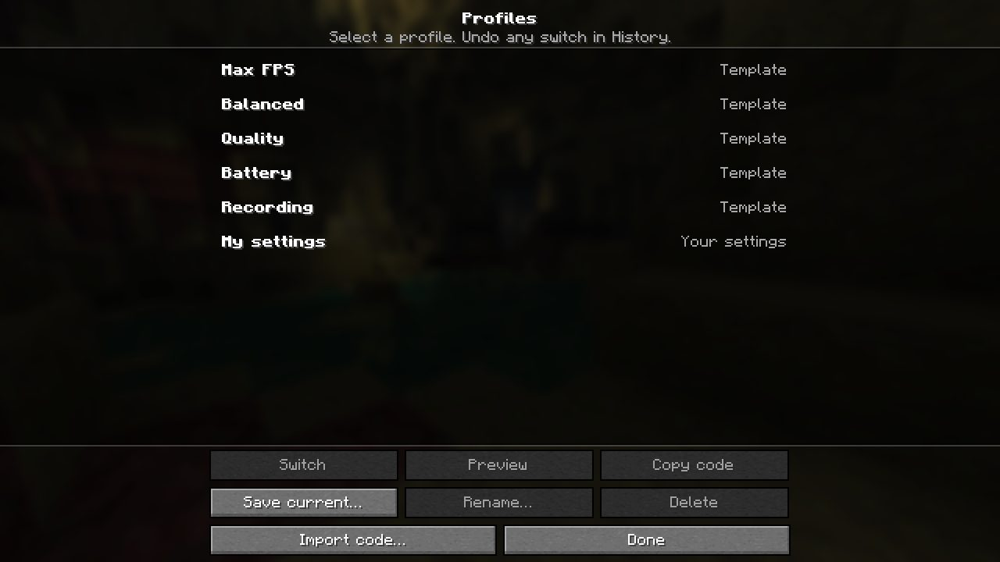 |
| 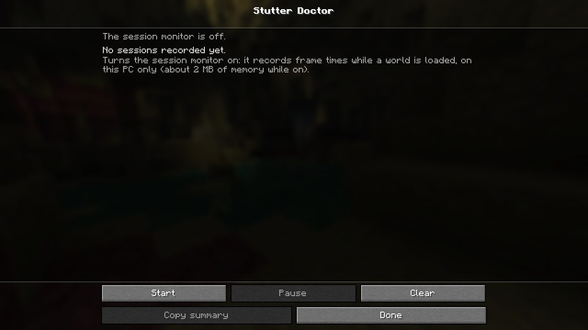 | 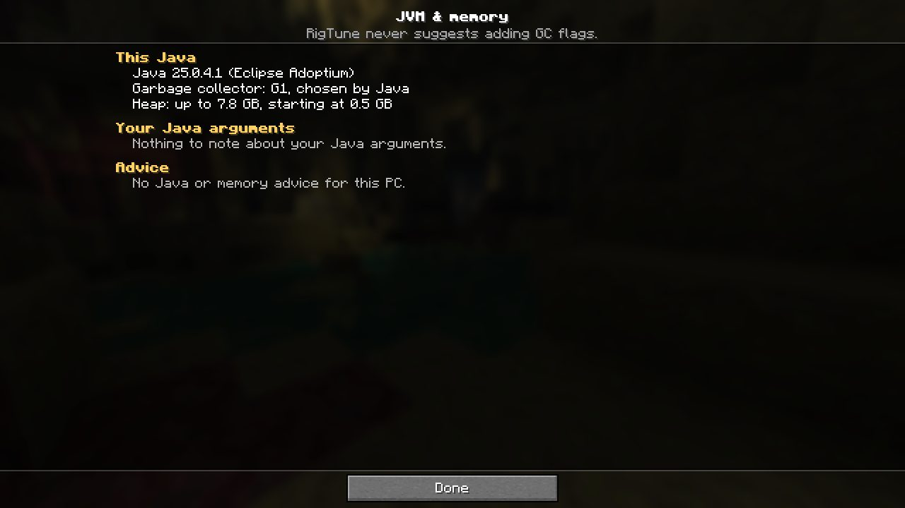 | 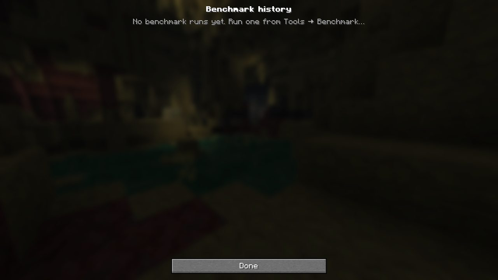 |
| 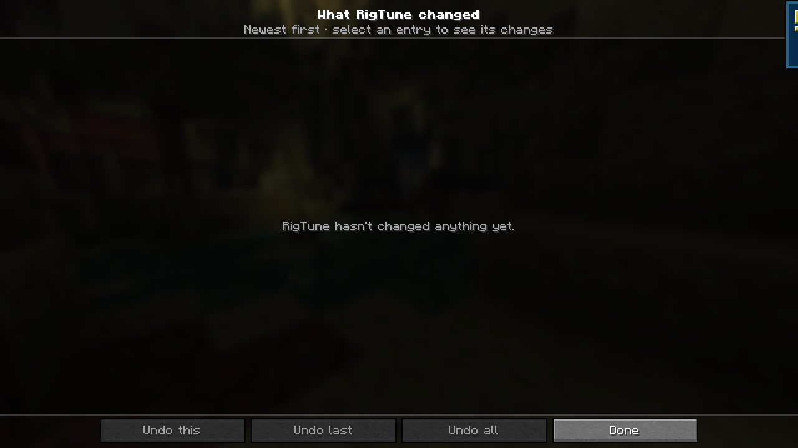 | 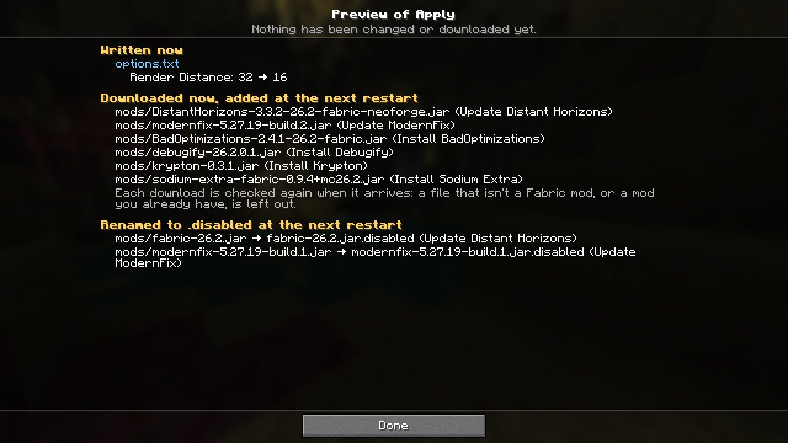 | 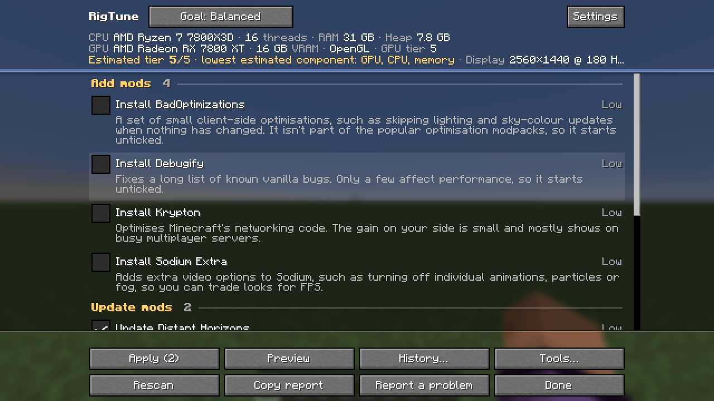 |
| 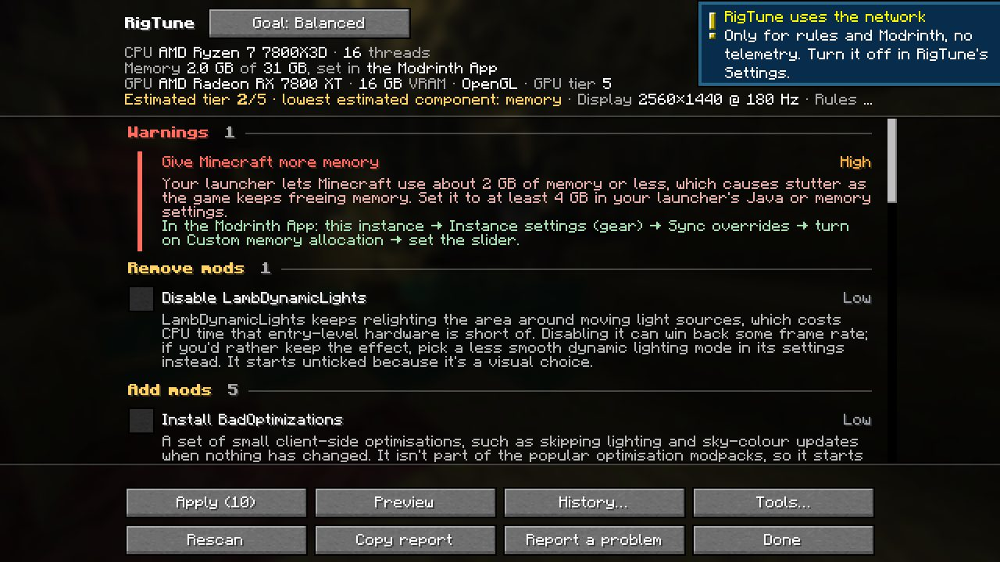 | 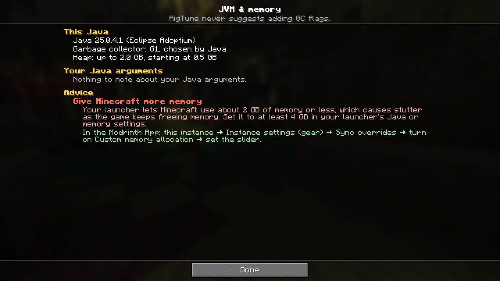 | 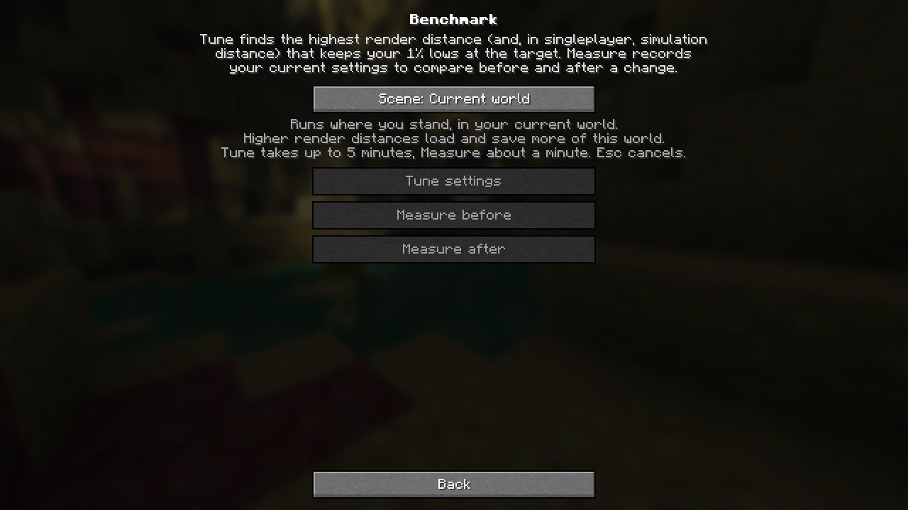 |

Every screenshot is in [img/](img/). The logs are filtered to RigTune, the smoke harness, and every ERROR line: [s1-latest.filtered.log](s1-latest.filtered.log), [s2-latest.filtered.log](s2-latest.filtered.log). The ERROR lines come from other mods and vanilla (malilib configs, Realms, the key pair).

## Reproduce

`$P` = the verifier's scratch dir. Take the lock first (`mkdir C:/Dev/Worktrees/.gametest-lock` + owner.txt), release it in the same command, and move `versions/26.2/run` away between runs.

```
./gradlew :26.2:runProductionSmoke -PextraModsDir=$P/usermods-26.2 -PuserOptions=$P/options.txt -PuserConfigDir=$P/userconfig-26.2
JAVA_TOOL_OPTIONS="-Dminecraft.launcher.brand=theseus -Xmx2G" ./gradlew :26.2:runProductionSmoke -PextraModsDir=$P/usermods-26.2-noexit -PuserOptions=$P/options.txt -PuserConfigDir=$P/userconfig-26.2
```
