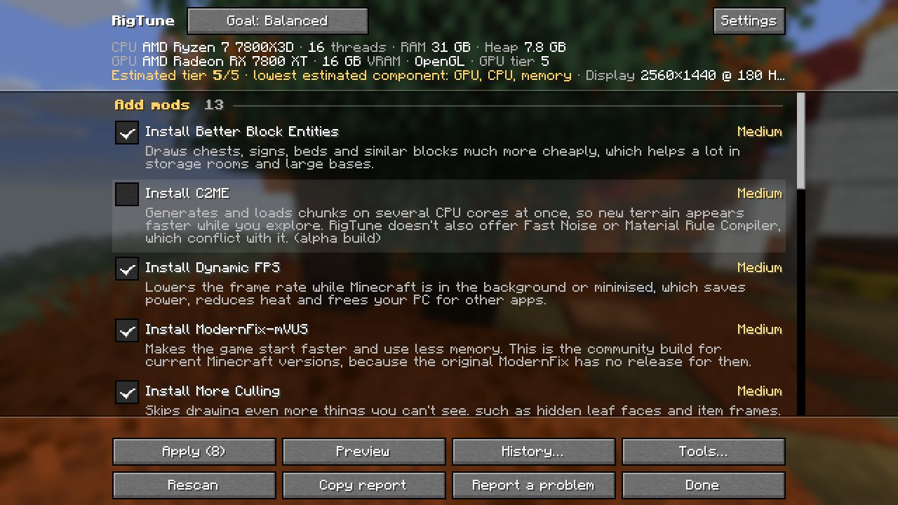
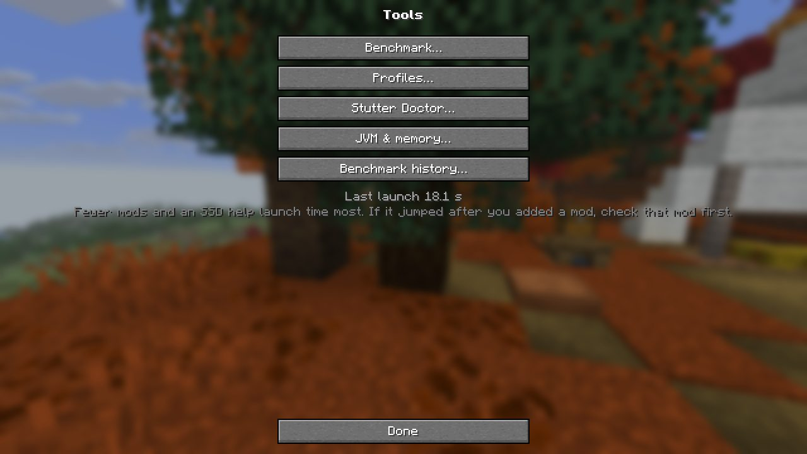
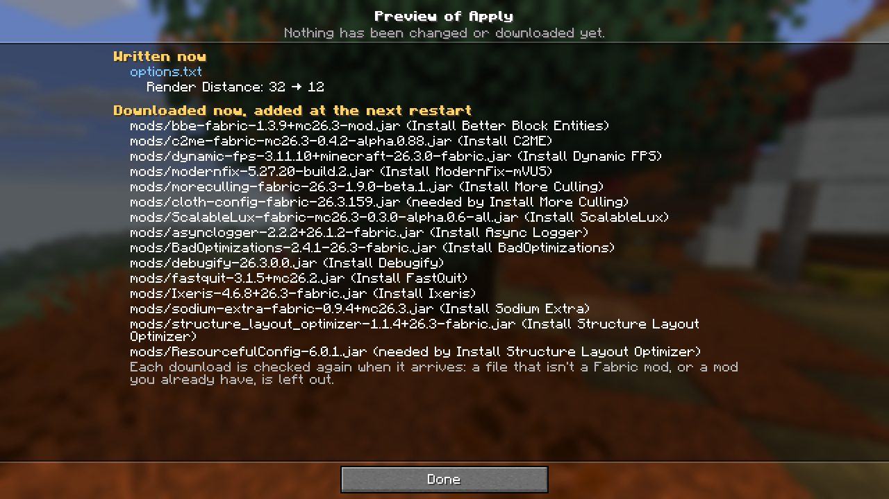
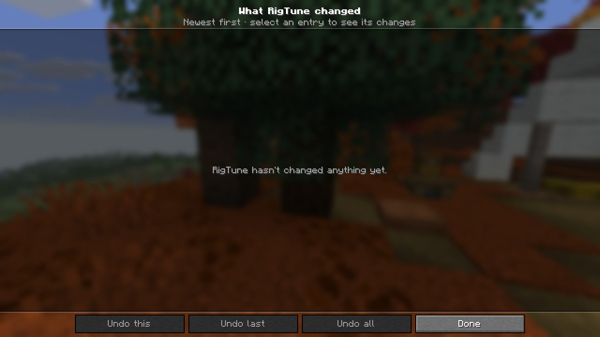
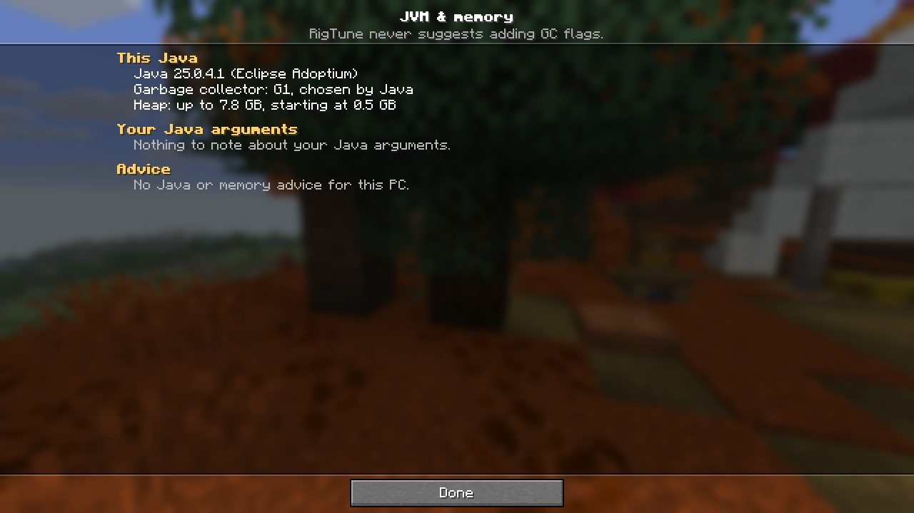
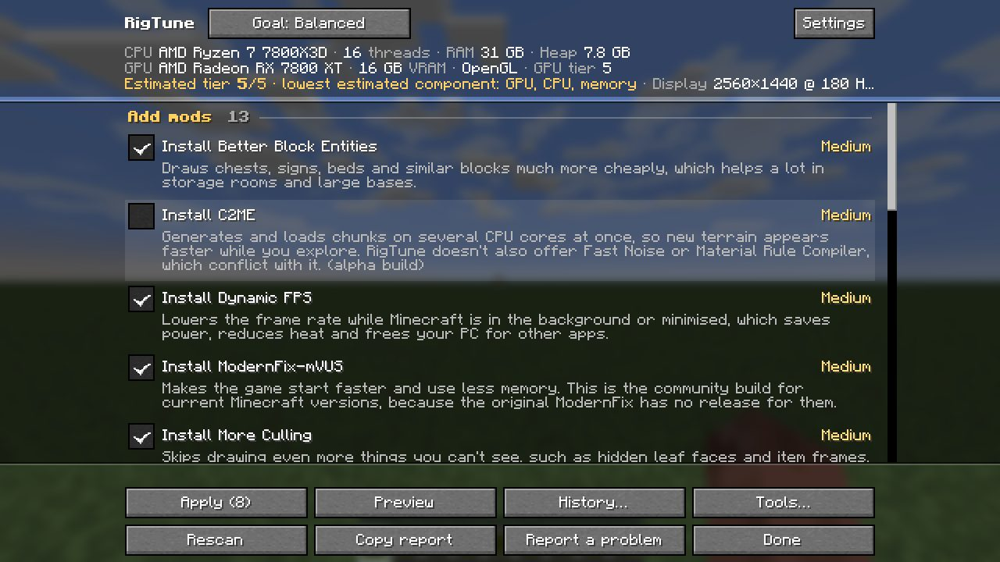
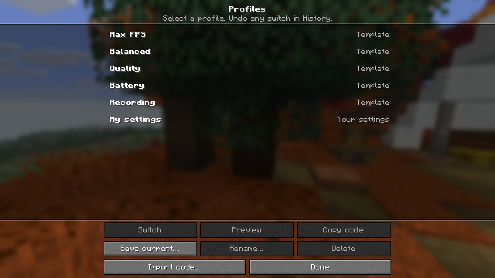
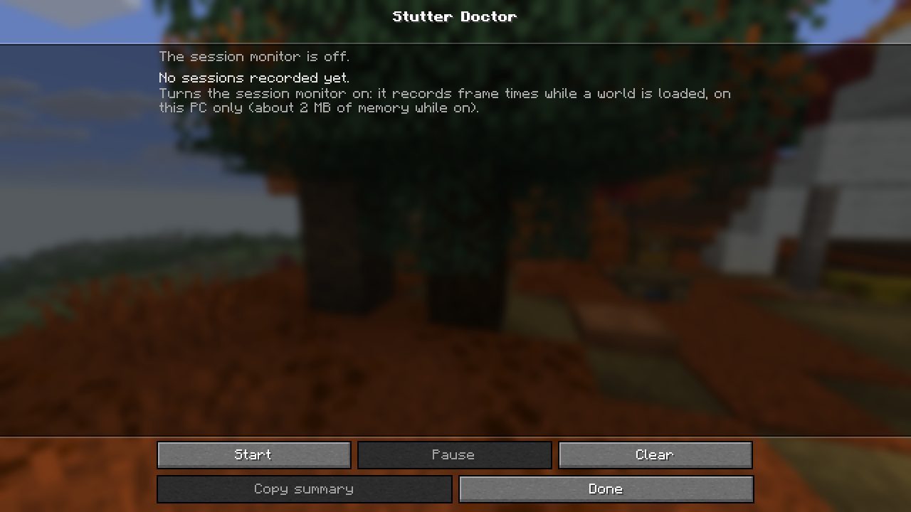
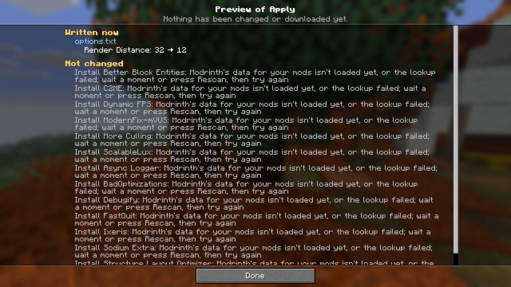

# Production smoke, 26.3, a representative Modrinth set (P5-B)

2026-09-26, 21:34-21:59 AEST. The release candidate (`feat/v0.4.0` @ 9cf84f6; product code unchanged on `test/p5-smokes`) was run with `./gradlew :26.3:runProductionSmoke`. The smoke harness is the same as on 26.2, including the test-only Tools tour (`ProductionSmoke.v04Tools`, see [../26.2-user-mods/README.md](../26.2-user-mods/README.md)). RC jar: `rigtune-0.4.0-dev+mc26.3.jar` sha256 `ada3925d8804e7a3d493eff744b898e12ce8e697932e5d144f139da6999cea15`. Each launch took the game-test lock and released it in the same command, with a gap of at least 150 s before the next take so P5-A could get in. A wrapper script killed only my own client when the harness hung at world exit (the Distant Horizons quirk).

## Mod set (fetched from Modrinth's public API; SHA-512 checked against the API's hashes)

The newest Fabric version of each project tagged 26.3, taking the newest **release** where a newer alpha exists (Sodium 0.9.3-alpha.1). Full list with project/version ids and SHA-512: [mods-26.3-manifest.json](mods-26.3-manifest.json).

| project | version | file |
|---|---|---|
| Fabric API | 0.161.0+26.3 | fabric-api-0.161.0+26.3.jar |
| Sodium | 0.9.2 (release) | sodium-fabric-0.9.2+mc26.3.jar |
| Iris | 1.11.6 | iris-fabric-1.11.6+mc26.3.jar |
| Lithium | 0.26.1 | lithium-fabric-0.26.1+mc26.3.jar |
| FerriteCore | 9.0.0 | ferritecore-9.0.0-fabric.jar |
| ImmediatelyFast | 1.17.1 | ImmediatelyFast-Fabric-1.17.1+26.3.jar |
| Entity Culling | 1.11.2 | entityculling-fabric-1.11.2-mc26.3.jar |
| Mod Menu | 21.0.0 | modmenu-21.0.0.jar |
| placeholder-api (Mod Menu dependency) | 3.2.0+26.3 | placeholder-api-3.2.0+26.3.jar |
| Distant Horizons (a 26.3 build exists) | 3.3.2-26.3 | DistantHorizons-3.3.2-26.3-fabric-neoforge.jar |

Options: the user's `options.txt` (render distance 32; fullscreen off). No config files.

## Launches (4; the pass is launch 4)

| launch | env | result |
|---|---|---|
| s3a | none | Ran through title → RigTune → History → Report → Preview ×2 → Tools + 5 tools → world → F8. **The report was offline**: Modrinth failed at 21:35 (`HttpConnectTimeoutException: HTTP connect timed out`, then `SSLHandshakeException: Remote host terminated the handshake`; curl reached the API normally at 21:43). RigTune fell back to offline data as designed: one WARN per failure, no stack trace, and "Modrinth's data … isn't loaded yet" rows in Preview. Kept as the offline-path evidence ([s3a-offline-*](s3a-offline-report.txt)). World-exit hang, killed. |
| s3b | none | **Native crash** `NTSTATUS 0xC0000005` 30 s after start, before "OpenAL initialized"; no hs_err file ([native-crashes.txt](native-crashes.txt)) |
| s3c | none | **Native crash** `0xC0000005` at the same point |
| s3d | `ALSOFT_DRIVERS=null` | **PASS** (online report). OpenAL came up on "OpenAL Soft on No Output". World-exit hang with DH loaded, killed after 2 idle minutes (harness quirk, as on 26.2) |

**The native crash** is the known 26.3 issue: PLAN's harness quirks; v0.3 Phase 5 finding 6. There, a control with no RigTune jar and no harness crashed 3 of 5 times at the same point. In both crashes here the last logged line is RigTune's worker `Hardware: …` line. That line is printed in the same ~50 ms as DH's and Iris's init, right before the sound engine starts. In the passing launches (s3a, s3d) the same line comes just before "OpenAL initialized", so it's timing, not the cause. With OpenAL's null backend the launch passed, as in v0.3. The dev-environment game tests on 26.3 didn't crash in 3 launches ([../../gametests/README.md](../../gametests/README.md)).

## Checks (s3d unless noted)

- **Title screen and a world:** reached. F8 in the world opens RigTune.
- **Real hardware:** `AMD Ryzen 7 7800X3D 8-Core Processor, 8 cores / 16 threads`, `AMD Radeon RX 7800 XT (ATI Technologies Inc.), driver 3.3.0 Core Profile Context 26.8.1.260810, OPENGL, VRAM 16368 MB`, GPU tier 5, 31849 MB RAM, 7964 MB heap, 2560x1440 @ 180 Hz, Minecraft 26.3. Flags: `sodium-workaround:AMD_GAME_OPTIMIZATION_BROKEN, jvm-gc-g1, jvm-probed` ([s3d-report.txt](s3d-report.txt)).
- **The estimated-tier header:** "Estimated tier 5/5 · lowest estimated component: GPU, CPU, memory".
- **Recommendations** (rules r15 bundled, online): 15 in all, `Apply (8)`.
  - 13 add-mods (Better Block Entities, Dynamic FPS, ModernFix-mVUS, More Culling and Async Logger ticked; C2ME and ScalableLux unticked as alphas).
  - `Render Distance: 32 → 12`, with the DH reason "Distant Horizons already draws the far terrain cheaply…". On 26.2 the user's own DH config has `rendererMode = "DISABLED"`, so the same rule correctly didn't fire there.
  - The AMD/Sodium advice.
  - No Sodium alpha update is offered.
- **Footer:** `Settings, Apply (8), Preview, History…, Tools…, Rescan, Copy report, Report a problem, Done`.
- **Tools hub and each tool** opened without an error, with the same content as on 26.2: "Last launch 18.1 s"; the Benchmark menu (current world, greyed at the title); Profiles with 5 templates + My settings; Stutter Doctor off with no sessions; JVM & memory "G1, chosen by Java · up to 7.8 GB", nothing to note; Benchmark history empty.
- **History:** "RigTune hasn't changed anything yet.", all three undo buttons greyed.
- **Preview writes nothing:** in-game SHA-256 of options.txt, `mods/` and `config/` before and after both previews, 25 files, `changed: []`.
  - Default ticks: 12 rows. Every appliable item: 20 rows, including `Render Distance: 32 → 12` written now and 15 downloads, among them `cloth-config-fabric-26.3.159.jar` "needed by Install More Culling" and `ResourcefulConfig-6.0.1.jar` "needed by Install Structure Layout Optimizer".
  - The same held in s3a (offline).
- **Opening the tools writes nothing:** the same hashes around the Tools tour, `changed: []` (25 files).
- **latest.log (no rotated logs; fresh run dirs, same day):** no RigTune ERROR and no stack frame from `io.github.chaotix345.rigtune.core|client`. The RigTune WARNs are network-only, and each is the designed offline fallback:
  - s3d, one: at world join a background lookup got `POST https://api.modrinth.com/v2/version_files/update returned HTTP 502`. The in-world report was unchanged (`smoke-world` still shows the online report).
  - s3a, two: the connect timeout and the SSL handshake failure above.

## Screenshots (1280x720, GUI scale 2)

| | | |
|---|---|---|
|  |  |  |
|  |  |  |
|  |  |  |

Filtered logs: [s3d-latest.filtered.log](s3d-latest.filtered.log), [s3a-offline-latest.filtered.log](s3a-offline-latest.filtered.log).

## Reproduce

`$P` = the verifier's scratch dir. Take the lock first and release it in the same command. Move `versions/26.3/run` away between launches. Retry on `NTSTATUS 0xC0000005`.

```
./gradlew :26.3:runProductionSmoke -PextraModsDir=$P/mods-26.3 -PuserOptions=$P/options.txt
ALSOFT_DRIVERS=null ./gradlew :26.3:runProductionSmoke -PextraModsDir=$P/mods-26.3 -PuserOptions=$P/options.txt
```
