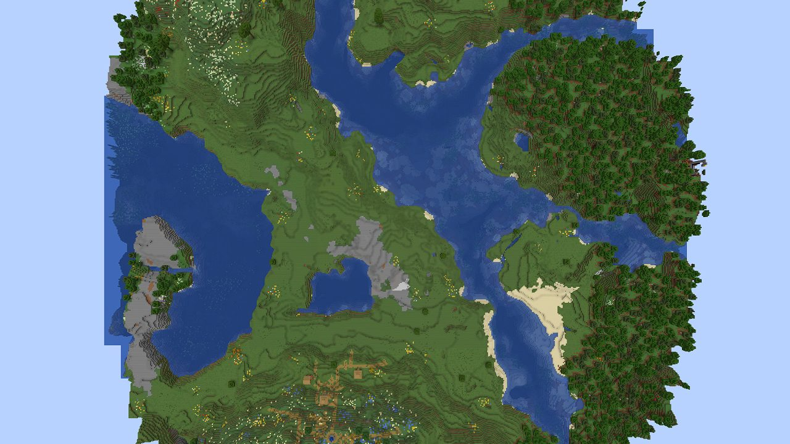
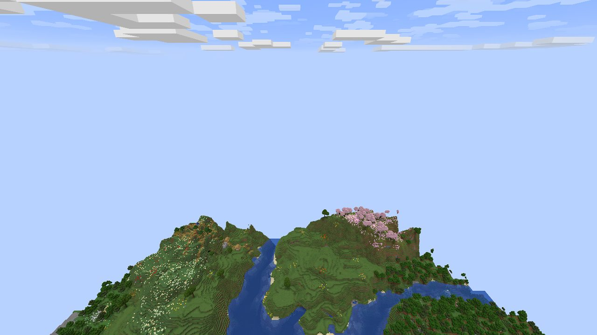
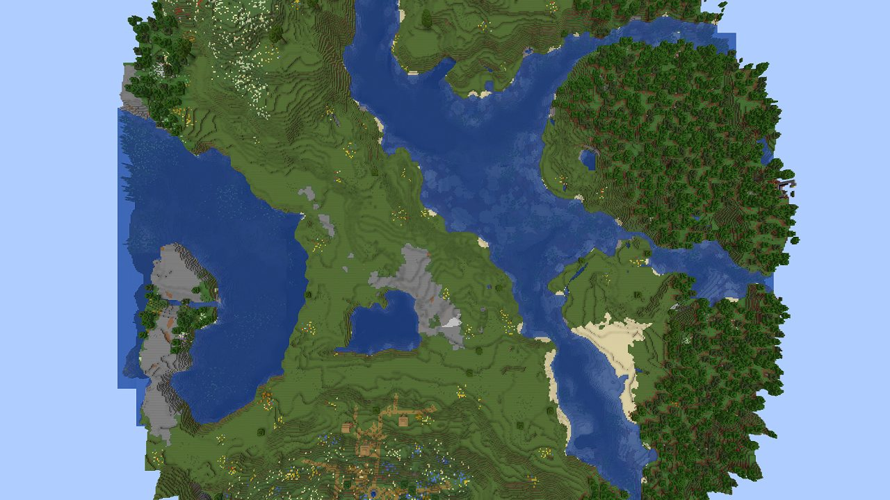
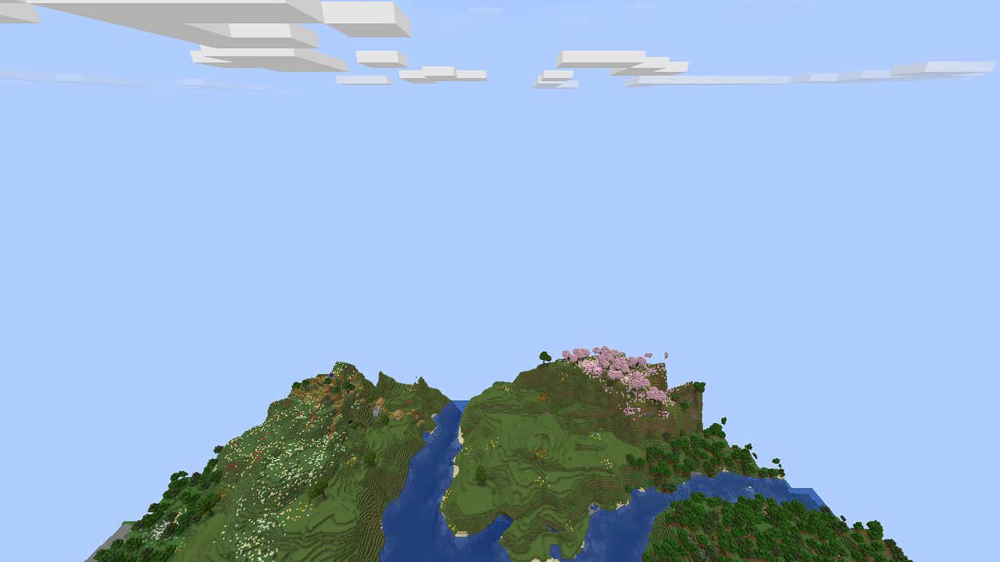
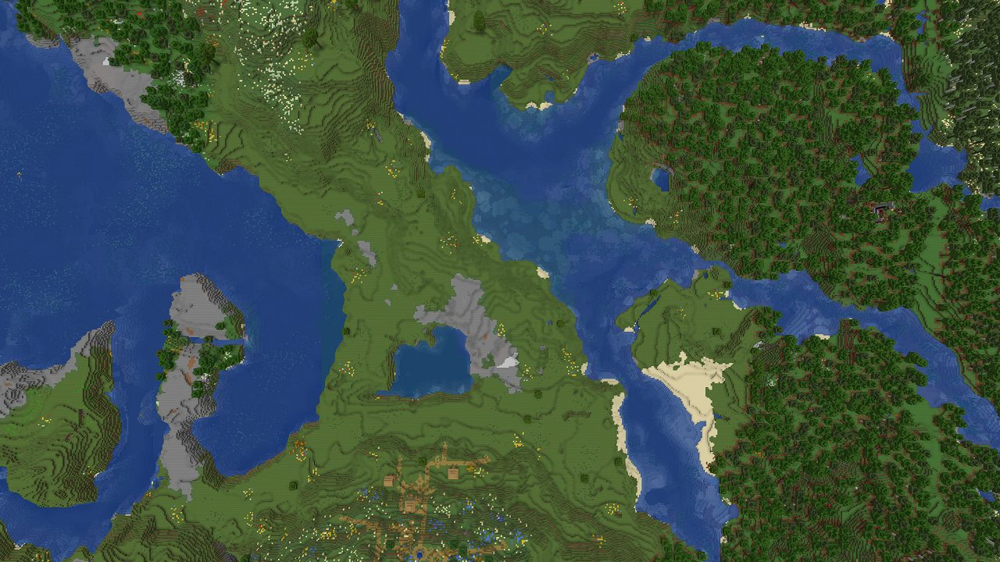
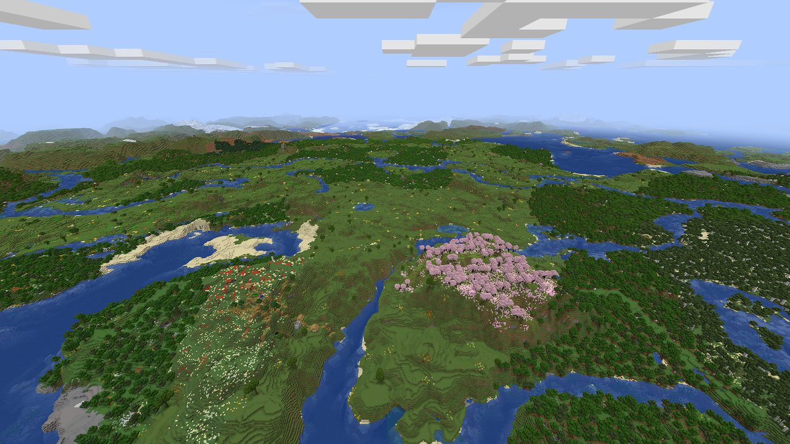

# AC3f.4: the Distant Horizons server note, one local run (WS-E)

The note in question is `rigtune.server.detail.dh`, the server-limit notice's detail when DH is loaded. It read:
"Distant Horizons may still show terrain you've already explored beyond it; generating new distant terrain may need
Distant Horizons on the server." SPEC 3f: confirmed → both "may"s go.

**Result: confirmed.** The detail now reads "Distant Horizons still shows terrain you've already explored beyond it;
generating new distant terrain needs Distant Horizons on the server."

## How (2026-09-28 15:31-15:41 AEST, this PC, Windows 11, 26.2, under the game-test lock)

- `tools/e2e/dhnote/dh_server_note.py` with the local-only init script `tools/e2e/dhnote/dh-server.init.gradle`.
  - **The server:** Loom's production server task (`ServerProductionRunTask`), fabric-api only, on 127.0.0.1:49497, a free ephemeral port (never 25565). Fixed seed, `online-mode=false`, `ops.json` naming the client's fixed user.
  - **The client:** Loom's `e2eClient` with RigTune (the CI jar of a470a489), fabric-api, Sodium 0.9.2 and Distant Horizons 3.3.2. The DH jar is a copy of the one in the player's instance, which was only read. DH's update check is off.
  - **The driver:** `src/e2eUndo`'s `DhServerDriver`.
- **One client start, three server starts on the same world.** The driver joins with render distance 16, switches to creative, sets noon and clear weather, and flies at Y=330 above spawn. It screenshots with the HUD hidden: straight down every 30 s, then at the phase's end straight down and toward the horizon (pitch 25°, four directions). It ends each phase with /stop.

| phase | server view-distance (as the client saw it) | DH on the server | time in the world |
|---|---|---|---|
| explore | 16 | no | 90 s |
| limited | 6 | no | 90 s |
| dhserver | 6 | yes (the same 3.3.2 jar) | 240 s |

## What the screenshots show (facing south; the top of a "down" image is south)

| | straight down from Y=330 | toward the horizon |
|---|---|---|
| explore (16, no DH on the server) |  |  |
| limited (6, no DH on the server) |  |  |
| dhserver (6, DH on the server) |  |  |

- **explore:** a round patch of terrain about 16 chunks across its radius, with sky beyond it. Toward the horizon, the terrain ends at the patch's edge.
- **limited:** the same round patch, detail for detail (the same coasts, the village at the bottom, the sand spit), although the server now sends 6 chunks.
  - The client started a new level on reconnecting, so the vanilla renderer has only what the server sent. The ring from 6 to 16 chunks is DH's saved LODs of the terrain explored in the first phase.
  - Past the explored patch there is still nothing: sky, the same edge as before.
  - **"Still shows terrain you've already explored beyond it": confirmed.**
- **dhserver:** the whole frame is terrain, and the patch's round edge is gone.
  - Toward the horizon, land, lakes and mountains reach far past where the explored patch ended.
  - Standing still, the client received this from the server's DH within 240 s. Without DH on the server (limited), none appeared in 90 s. DH's own wiki says clients can't generate it ("Can clients generate instead? No").
  - **"Generating new distant terrain needs Distant Horizons on the server": confirmed.**

`driver-dh.json` holds the joins (the view distance each start saw: 16, 6, 6) and every event. `dh-note.log` is the script's log. The full-resolution PNGs, the 30-second series and both sides' logs stayed in the run folder.

## Runs before the one above

- **The first run failed on DH's side.** Its folder was under the long session scratch path, and DH's SQLite couldn't open its database there: "SQLITE_CANTOPEN ... level loading failed ... LODs may not appear". Windows' MAX_PATH was the cause. The script now refuses a work folder longer than 80 characters.
- **Two more runs had views that can't decide anything.** In one, the player stood at ground level facing a hill. In the other, the game menu that a lost window focus opens covered the frame. The driver now flies and closes the menu, and the script sets `pauseOnLostFocus:false`. In those runs' blurred frames, the three phases differed the same way.

## Stays UNVERIFIED

- **Other DH versions and server configurations.** For example, a server whose DH distant generation is off, or a
  server-side LOD distance smaller than the client's.
- **A real remote server's bandwidth limits.** Here it was one machine over loopback.
- **26.3.** The local 26.3 client crashes natively (SPEC X9).
